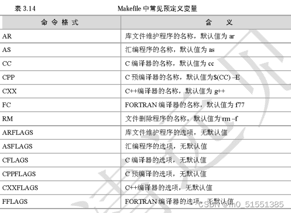

#### libgrape-lite

##### 大致工作流程

> 参考：run_app.h/.cpp，sssp.h等

- 初始化

  ```cpp
  InitMPIComm();
  // CommSpec records the mappings of fragments, workers, and the threads(tasks) in each worker.
  grape::CommSpec comm_spec;
  comm_spec.Init(MPI_COMM_WORLD);
  ```
  
- 运行

  *例如运行SSSP*

  ```cpp
  // 平行引擎参数
  grape::ParallelEngineSpec spec = MultiProcessSpec(comm_spec, __AFFINITY__);
  // 设置线程数
  spec.cpu_list.resize(spec.thread_num);
  // 所有fragment数量，可以说是节点数量
  int fnum = comm_spec.fnum();
  
  // 传入SSSP作为APP_T
  CreateAndQuery<OID_T, VID_T, VDATA_T, double, LoadStrategy::kOnlyOut, SSSP, OID_T>(comm_spec, out_prefix, fnum, spec, FLAGS_sssp_source);
  
  // 加载图的参数设置
  grape::LoadGraphSpec graph_spec = DefaultLoadGraphSpec();
  graph_spec.set_directed(FLAGS_directed);
  
  // 加载图
  std::shared_ptr<FRAG_T> fragment = grape::LoadGraph<FRAG_T>(FLAGS_efile, FLAGS_vfile, comm_spec, graph_spec);
  auto app = std::make_shared<AppType>();
  
  // 生成worker，工作
  auto worker = APP_T::CreateWorker(app, fragment);
  worker->Init(comm_spec, spec);
  worker->Query(std::forward<Args>(args)...);
  
  std::ofstream ostream;
  std::string output_path = grape::GetResultFilename(out_prefix, fragment->fid());
  ostream.open(output_path);
  worker->Output(ostream);
  ostream.close();
  
  worker->Finalize();
  ```

  worker的Query方法

  ```cpp
  // 等待所有的工作节点到达这个地方，再继续
  MPI_Barrier(comm_spec_.comm());
  // 初始化，比如存储sssp中的source_id号（在args里）
  context_->Init(messages_, std::forward<Args>(args)...);
  // 待述
  processMutation();
  int round = 0;
  
  messages_.Start();
  
  messages_.StartARound();
  // 开始PEval
  runPEval();
  processMutation();
  messages_.FinishARound();
  
  int step = 1;
  // 循环处理IncEval
  while (!messages_.ToTerminate()) {
    round++;
    messages_.StartARound();
    runIncEval();
    processMutation();
    messages_.FinishARound();
  
    ++step;
  }
  
  // 等待所有的节点过来，一起结束
  MPI_Barrier(comm_spec_.comm());
  messages_.Finalize();
  ```

  sssp的PEval和IncVal方法

  ```cpp
  /*
  * curr_modified：当前更改的点，比如接收到数据，更改了value的点
  * next_modified：下个更改的点，受当前影响到的点，比如更改了outer的点值
  */
  void PEval(const fragment_t& frag, context_t& ctx, message_manager_t& messages) {
      // 一个进程管理一个fragment，可以再分为多个线程共同处理这一个fragment
      messages.InitChannels(thread_num());
  
      // sssp中的源点
      vertex_t source;
      bool native_source = frag.GetInnerVertex(ctx.source_id, source); 
      // 清空
      ctx.next_modified.ParallelClear(GetThreadPool());
  
      // Get the channel. Messages assigned to this channel will be sent by the
      // message manager in parallel with the evaluation process.
      auto& channel_0 = messages.Channels()[0];
  
      if (native_source) {
        ctx.partial_result[source] = 0;
        auto es = frag.GetOutgoingAdjList(source);
        for (auto& e : es) {
          vertex_t v = e.get_neighbor();
          ctx.partial_result[v] =
              std::min(ctx.partial_result[v], static_cast<double>(e.get_data()));
          if (frag.IsOuterVertex(v)) {
            // put the message to the channel.
            channel_0.SyncStateOnOuterVertex<fragment_t, double>(
                frag, v, ctx.partial_result[v]);
          } else {
            ctx.next_modified.Insert(v);
          }
        }
      }
  
      // 本轮结束，推进
      messages.ForceContinue();
      // 让curr_modified存放本轮修改过的顶点
      ctx.next_modified.Swap(ctx.curr_modified);
  }
  
  void IncEval(const fragment_t& frag, context_t& ctx,
                 message_manager_t& messages) {
      auto inner_vertices = frag.InnerVertices();
      auto& channels = messages.Channels();
      ctx.next_modified.ParallelClear(GetThreadPool());
  
      // parallel process and reduce the received messages
      // u是接收点，是本frag的inner点，这里没看到发送点是哪个的
      messages.ParallelProcess<fragment_t, double>(
          thread_num(), frag, [&ctx](int tid, vertex_t u, double msg) {
            if (ctx.partial_result[u] > msg) {
              atomic_min(ctx.partial_result[u], msg);
              ctx.curr_modified.Insert(u);
            }
          });
  
      // incremental evaluation.
      // 遍历所有内部节点，更新其邻接点。邻接点可能在inner里，也可能在outer里
      // 更改的邻接点记录在next_modified内
      ForEach(ctx.curr_modified, inner_vertices,
              [&frag, &ctx](int tid, vertex_t v) {
                double distv = ctx.partial_result[v];
                auto es = frag.GetOutgoingAdjList(v);
                for (auto& e : es) {
                  vertex_t u = e.get_neighbor();
                  double ndistu = distv + e.get_data();
                  if (ndistu < ctx.partial_result[u]) {
                    atomic_min(ctx.partial_result[u], ndistu);
                    ctx.next_modified.Insert(u);
                  }
                }
              });
  
      // put messages into channels corresponding to the destination fragments.
      // 在next_modified中挑选outer点，将更改的数据同步给对应的frag
       // 即同步mirror点状态给outer点
      auto outer_vertices = frag.OuterVertices();
      ForEach(ctx.next_modified, outer_vertices,
              [&channels, &frag, &ctx](int tid, vertex_t v) {
                channels[tid].SyncStateOnOuterVertex<fragment_t, double>(
                    frag, v, ctx.partial_result[v]);
              });
  
      if (!ctx.next_modified.PartialEmpty(
            frag.Vertices().begin_value(),
            frag.Vertices().begin_value() + frag.GetInnerVerticesNum())) {
        messages.ForceContinue();
      }
  
      ctx.next_modified.Swap(ctx.curr_modified);
  }
  ```

- 结束

  ```cpp
  FinalizeMPIComm();
  ```

##### 图加载和构建

##### 从文件加载

```cpp
// loader.h
std::shared_ptr<FRAG_T> LoadGraph(efile, vfile, comm_spec, spec) {
  std::unique_ptr<EVFragmentLoader<FRAG_T, IOADAPTOR_T, LINE_PARSER_T>> loader(
      new EVFragmentLoader<FRAG_T, IOADAPTOR_T, LINE_PARSER_T>(comm_spec));
  return loader->LoadFragment(efile, vfile, spec);
}

// ev_fragment_loader.h
std::shared_ptr<fragment_t> LoadFragment(const std::string& efile,
                                           const std::string& vfile,
                                           const LoadGraphSpec& spec) {
    std::shared_ptr<fragment_t> fragment(nullptr);
    // 加载节点
    auto io_adaptor = std::unique_ptr<IOADAPTOR_T>(new IOADAPTOR_T(vfile));
    while (io_adaptor->ReadLine(line)) {
        ++line_no;
        // 解析出一行，这里只解析了vid和一个data值
        line_parser_.LineParserForVFile(line, vertex_id, v_data);	// 1
        // id_list: vfile中的vid; vdata_list: vfile中的v的data数据
        id_list.push_back(vertex_id);
        vdata_list.push_back(v_data);
    }
    io_adaptor->Close();
    // partitioner_t: fragment_t::vertex_map_t::partitioner_t
    partitioner_t partitioner(comm_spec_.fnum(), id_list);		// 1.1
    // basic_fragment_loader_: BasicFragmentLoader<fragment_t, io_adaptor_t>
    // 设置分配器
    basic_fragment_loader_.SetPartitioner(std::move(partitioner));
    // 设置平衡参数
    basic_fragment_loader_.SetRebalance(spec.rebalance,
                                        spec.rebalance_vertex_factor);
    basic_fragment_loader_.Start();			// 1.2
    // 添加点到basic_fragment_loader_中
    size_t vnum = id_list.size();
    for (size_t i = 0; i < vnum; ++i) {
    	basic_fragment_loader_.AddVertex(id_list[i], vdata_list[i]);	// 2
    }
    
    // 加载边
    auto io_adaptor = std::unique_ptr<IOADAPTOR_T>(new IOADAPTOR_T(std::string(efile)));
    // 只是设置了可以partial_read
    io_adaptor->SetPartialRead(comm_spec_.worker_id(), comm_spec_.worker_num());
    io_adaptor->Open();
    // parse出3个字段
    line_parser_.LineParserForEFile(line, src, dst, e_data);
    basic_fragment_loader_.AddEdge(src, dst, e_data);
    io_adaptor->Close();
    // 构建frag
    basic_fragment_loader_.ConstructFragment(fragment, spec.directed);	// 1.3
    return fragment;
}

// tsv_line_parser.h
void LineParserForVFile(const std::string& line, OID_T& u, VDATA_T& u_data) {	// [1]
	this->LineParserForEverything(line, u, u_data);	// F3
}
// F1
const char* LineParserForEverything(const std::string& line,
                                             Ts&... vals) {
    return this->LineParserForEverything(
        line.c_str(),
        std::forward<typename std::add_lvalue_reference<Ts>::type>(vals)...);
}
// F2, 解析head字符串，返回下一个位置
const char* LineParserForEverything(const char* head, T& val) {
    return internal::match(		// 2
        head, std::forward<typename std::add_lvalue_reference<T>::type>(val));
}
// F3
const char* LineParserForEverything(const char* head, T& val, Ts&... vals) {
    // 解析出head第一个字段（点id），向后移动一个
    const char* next_head = internal::match(
        head, std::forward<typename std::add_lvalue_reference<T>::type>(val));
    // 执行F2
    return this->LineParserForEverything(
        next_head,
        std::forward<typename std::add_lvalue_reference<Ts>::type>(vals)...);
}

// line_parser_base.h
// 提取出str最前面一个元素存入r，并移动str到下一个位置
/* @T: 支持多种类型:
   整数，浮点
   std::string
   grape::EmptyType
*/
const char* match(char const* str, T& r, char const* end = nullptr);
// r为string的解析方法。分隔符：' ', '\t'
const char* match<std::string>(char const* str, std::string& r, char const* end) {
    int nlen1 = 0, nlen2 = 0;
	// t去头部杂乱符号，相当于trim
    while (str + nlen1 != end && str[nlen1] &&
         (str[nlen1] == '\n' || str[nlen1] == ' ' || str[nlen1] == '\t')) {
    	nlen1 += 1;
    }
    nlen2 = nlen1;
    while (str + nlen2 != end && str[nlen2] &&
         (str[nlen2] != '\n' && str[nlen2] != ' ' && str[nlen2] != '\t')) {
    	nlen2 += 1;
    }
    // nlen1: 头元素的起始位置；nlen2：头元素的结束位置 + 1
    r = std::string(str + nlen1, nlen2 - nlen1);
    return str + nlen2;
}

// partitioner.h
void SegmentedPartitioner(size_t frag_num, std::vector<OID_T>& oid_list) {	// [1.1]
    fnum_ = frag_num;
    size_t vnum = oid_list.size();
    // 平均分，至少分一个
    size_t frag_vnum = (vnum + fnum_ - 1) / fnum_;
    o2f_.reserve(vnum);
    for (size_t i = 0; i < vnum; ++i) {
        fid_t fid = static_cast<fid_t>(i / frag_vnum);
        o2f_.emplace(oid_list[i], fid);
    }
}

// basic_fragment_loader.h
void BasicFragmentLoader::AddVertex(const oid_t& id, const vdata_t& data) {	// [2]
    // internal_oid_t: InternalOID<oid_t>::type
    internal_oid_t internal_id(id);		// 3
    auto& partitioner = vm_ptr_->GetPartitioner();
    fid_t fid = partitioner.GetPartitionId(internal_id);
    // vertices_to_frag_: std::vector<ShuffleOut<internal_oid_t, vdata_t>>
    // fid: [ShuffleOut]; 将内部格式的{vid, data}发给对应的worker
    vertices_to_frag_[fid].Emplace(internal_id, data);		// 2.1
}
// 开启点和边的接收线程
void Start() {			// [1.2]
    vertex_recv_thread_ = std::thread(&BasicFragmentLoader::vertexRecvRoutine, this);
    edge_recv_thread_ = std::thread(&BasicFragmentLoader::edgeRecvRoutine, this);
    recv_thread_running_ = true;
}
// 接收点信息，点和边信息是多个节点一起解析的，互相同步
void vertexRecvRoutine() {
    ShuffleIn<internal_oid_t, vdata_t> data_in;
    data_in.Init(comm_spec_.fnum(), comm_spec_.comm(), vertex_tag);
    fid_t dst_fid;
    int src_worker_id;
    while (!data_in.Finished()) {
        src_worker_id = data_in.Recv(dst_fid);
        if (src_worker_id == -1) {
        	break;
        }
        got_vertices_.emplace_back(std::move(data_in.buffers()));
        data_in.Clear();
    }
}
void edgeRecvRoutine() {
    ShuffleIn<internal_oid_t, internal_oid_t, edata_t> data_in;
    data_in.Init(comm_spec_.fnum(), comm_spec_.comm(), edge_tag);
    fid_t dst_fid;
    int src_worker_id;
    while (!data_in.Finished()) {
        src_worker_id = data_in.Recv(dst_fid);
        if (src_worker_id == -1) {
        	break;
        }
        CHECK_EQ(dst_fid, comm_spec_.fid());
        got_edges_.emplace_back(std::move(data_in.buffers()));
        data_in.Clear();
    }
}

// shuffle.h
// 将解析出的点和frag的对应关系同步出去
void Emplace(const TYPES&... rest) {		// [2.1]
    buffers_.Emplace(rest...);
    ++current_size_;
    if (comm_disabled_) {
		return;
    }
    if (current_size_ >= chunk_size_) {
        issue();
        Clear();
    }
}
void issue() {
    frag_shuffle_header header(current_size_, dst_frag_id_);
    sync_comm::Send<frag_shuffle_header>(header, dst_worker_id_, tag_, comm_);

    if (current_size_) {
		buffers_.SendTo(dst_worker_id_, tag_, comm_);
    }
}

// types.h
struct InternalOID {		// [3]
    using type = T;
    static type ToInternal(const T& val) { return val; }
    static T FromInternal(const type& val) { return val; }
};
// 看起来只是对string类型进行了转换
struct InternalOID<std::string> {
    using type = nonstd::string_view;
    static type ToInternal(const std::string& val) {
    	return nonstd::string_view(val.data(), val.size());
    }
	static std::string FromInternal(const type& val) { return std::string(val); }
};

// basic_fragment_loader.h
void ConstructFragment(std::shared_ptr<fragment_t>& fragment, bool directed) {	// [1.3]
	// 将待发送的点信息发出去
    for (auto& va : vertices_to_frag_) {
		va.Flush();
    }
    for (auto& ea : edges_to_frag_) {
		ea.Flush();
    }
    // 等接收线程结束
    vertex_recv_thread_.join();
    edge_recv_thread_.join();
    recv_thread_running_ = false;

    MPI_Barrier(comm_spec_.comm());
    // got_vertices_存放的是接收到的点信息；这里再将本frag里的点信息放进去
    got_vertices_.emplace_back(
        std::move(vertices_to_frag_[comm_spec_.fid()].buffers()));
    vertices_to_frag_[comm_spec_.fid()].Clear();
    got_edges_.emplace_back(
        std::move(edges_to_frag_[comm_spec_.fid()].buffers()));
    
    vm_ptr_->Init();
    // builder: GlobalVertexMapBuilder
    auto builder = vm_ptr_->GetLocalBuilder();
    // 将本frag的点加进来，用IdIndexer存
    for (auto& buffers : got_vertices_) {
        foreach_helper(
            buffers,
            [&builder](const internal_oid_t& id) { builder.add_vertex(id); },
            make_index_sequence<1>{});
    }
    // 边的
    for (auto& buffers : got_edges_) {
        foreach_helper(
            buffers,
            [&builder](const internal_oid_t& src, const internal_oid_t& dst) {
                builder.add_vertex(src);
                builder.add_vertex(dst);
            },
            make_index_sequence<2>{});
    }
    // 同步点边信息
    builder.finish(*vm_ptr_);
    
    // 存点的vdata进processed_vertices_
    // processed_vertices_: std::vector<internal::Vertex<vid_t, vdata_t>>
    if (!std::is_same<vdata_t, EmptyType>::value) {
        for (auto& buffers : got_vertices_) {
            foreach_rval(buffers, [this](internal_oid_t&& id, vdata_t&& data) {
                vid_t gid;
                CHECK(vm_ptr_->_GetGid(id, gid));
                processed_vertices_.emplace_back(gid, std::move(data));
            });
        }
    }
    // 边的
    for (auto& buffers : got_edges_) {
        foreach_rval(buffers, [this](internal_oid_t&& src, internal_oid_t&& dst,
                                   edata_t&& data) {
            vid_t src_gid, dst_gid;
            CHECK(vm_ptr_->_GetGid(src, src_gid));
            CHECK(vm_ptr_->_GetGid(dst, dst_gid));
            processed_edges_.emplace_back(src_gid, dst_gid, std::move(data));
        });
    }
    // 初始化本frag
    fragment = std::shared_ptr<fragment_t>(new fragment_t(vm_ptr_));
    fragment->Init(comm_spec_.fid(), 
                   directed, 
                   processed_vertices_, 
                   processed_edges_);
    // 初始化outer的点的data
    if (!std::is_same<vdata_t, EmptyType>::value) {
		initOuterVertexData(fragment);
    }
}


```

- `std::forward`：通常是用于完美转发的，它会将输入的参数原封不动地传递到下一个函数中，这个“原封不动”指的是，如果输入的参数是左值，那么传递给下一个函数的参数的也是左值；如果输入的参数是右值，那么传递给下一个函数的参数的也是右值。

##### 零碎

- `Vertex<VID_T>`: 其value成员存放的是id，是local id

- `frag.GetOuterVertexGid(v) / GetInnerVertexGid(v)`: 获取外部/内部节点的全局id

- local id和gid都不是oid（文件里的）

  - vid = gid = `[fid][local id]`；位数等于`sizeof(VID_T) * 8`

- ```cpp
  fnum_ = worker_num_;
  fid_ = worker_id_;
  ```

#### core dump

```sh
# core dump文件输出
ulimit -S -c 1024
echo -e "\n# enable coredump whith unlimited file-size for all users\n* soft core unlimited" >> /etc/security/limits.conf

mkdir -p /tmp/coredump && chmod 777 /tmp/coredump

echo '/tmp/coredump/%t-%e-%p-%c.core' > /proc/sys/kernel/core_pattern

echo -e "/tmp/coredump/%t-%e-%p-%c.core" > /etc/sysctl.conf

echo -e "1" > /proc/sys/kernel/core_uses_pid

# 永久保存
## 在 /etc/security/limits.conf里添加
@root soft core unlimited
@root hard core unlimited
## 重启
## 在 /proc/sys/kernel/core_pattern里添加
kernel.core_pattern = /var/core_log/%t-%e-%p-%c.core
kernel.core_uses_pid = 0
```

#### cmake

- 添加编译器选项

  ```cmake
  set(CMAKE_CXX_FLAGS "$ENV{CXXFLAGS} -rdynamic -O3 -fPIC -ggdb -std=c++11 -Wall -Wno-unused-function -Wno-builtin-macro-redefined -Wno-deprecated-declarations")
  ```

  - ‘CMAKE_CXX_FLAGS’

    - add_compile_options：命令添加的编译选项是针对所有编译器的(包括c和c++编译器)
    - CMAKE_C_FLAGS或CMAKE_CXX_FLAGS变量则是分别只针对c和c++编译器

  - ‘CXXFLAGS’

    是C++编译器的编译选项。

    

  - `-rdynamic`

    是一个 连接选项 ，它将指示连接器把所有符号（而不仅仅只是程序已使用到的外部符号）都添加到动态符号表（即.dynsym表）里，以便那些通过 dlopen() 或 backtrace() （这一系列函数使用.dynsym表内符号）这样的函数使用。

  - `-O3`

    [优化选项](https://blog.csdn.net/qq_31108501/article/details/51842166?ops_request_misc=%257B%2522request%255Fid%2522%253A%2522165406764516780357253666%2522%252C%2522scm%2522%253A%252220140713.130102334..%2522%257D&request_id=165406764516780357253666&biz_id=0&utm_medium=distribute.pc_search_result.none-task-blog-2~all~baidu_landing_v2~default-1-51842166-null-null.142%5Ev11%5Epc_search_result_control_group,157%5Ev12%5Econtrol&utm_term=-O3%E9%80%89%E9%A1%B9&spm=1018.2226.3001.4187)

  - `-fPIC`

    作用于编译阶段，告诉编译器产生与位置无关代码，即，产生的代码中，没有绝对地址，全部使用相对地址，故而代码可以被加载器加载到内存的任意位置，都可以正确的执行。这正是共享库所要求的，共享库被加载时，在内存的位置不是固定的。

  - `-ggdb`

    -ggdb选项使编译器生成gdb专用的更为丰富的调试信息。

  - `-Wall`

    选项告诉编译器 编译后显示所有警告。

  - `-Wno-deprecated`

    不要警告使用已弃用的功能。

  - `-Werror`

    告诉编译器视所有警告为错误，出现任何警告立即放弃编译。

  - `-Wno-unused-function`

    关闭函数被定义了但没有被使用 而产生的警告，即，不使用的函数不警告。

  - `-Wno-builtin-macro-redefined`

    如果某些内置宏被重新定义，请不要警告。这抑制了警告的重新定义\__TIMESTAMP\__，TIME，DATE，FILE，和\__BASE_FILE\__。

  - `-Wno-deprecated-declarations`

    关闭使用废弃API的警告
  
  - `-Wl -Bsymbolic`
    - `-Wl`：将紧跟其后的参数，传递给连接器ld。
    - `-Bsymbolic`：强制采用本地的全局变量定义，这样就不会出现动态链接库的全局变量定义被应用程序/动态链接库中的同名定义给覆盖了

#### kafka

```sh
# 获取kafka某个topic的所有partition的offset
kafka-run-class.sh kafka.tools.GetOffsetShell --bootstrap-server localhost:9092 --topic tess-trace
# 从指定offset开始消费
kafka-console-consumer.bat --bootstrap-server localhost:9092 --topic tess-trace --offset 105671 --partition 0

# kafka从指定时间开始消费
## 指定某个group的offset到某个时间点
kafka-consumer-groups.sh \
--bootstrap-server 127.0.0.1:9092 \
--group group_test \
--topic test_topic \
--reset-offsets \
--to-datetime 2022-07-02T12:00:00.000 \
-execute
## 通过该group进行消费
kafka-console-consumer.sh \
-topic test_topic \
--bootstrap-server 127.0.0.1:9092 \
--group group_test 
# 打印其他属性
--property print.offset=true \
--property print.partition=true \
--property print.headers=true \
--property print.timestamp=true \
--property print.key=true
# 指定序列化与反序列化方式
--key-deserializer "org.apache.kafka.common.serialization.LongDeserializer"	\
--value-deserializer "org.apache.kafka.common.serialization.DoubleDeserializer"

# 创建topic
./kafka-topics.sh --create --topic tess-trace --replication-factor 1 --partitions 10 --bootstrap-server localhost:9092
# 删除topic
./kafka-topics.sh --delete --topic tess-trace --bootstrap-server localhost:9092
# 列出topic
./kafka-topics.sh --list --topic tess-trace --bootstrap-server localhost:9092
```

#### mpi容灾

> [How do I make mpirun continue despite node failures? · Issue #9882 · open-mpi/ompi (github.com)](https://github.com/open-mpi/ompi/issues/9882)

- 使用 Open MPI v5.0.0

  `mpirun --with-ft mpi`

#### Qt编译安装

- 下载：`https://mirrors.aliyun.com/qt/official_releases/qt/5.15/5.15.2/single/qt-everywhere-src-5.15.2.tar.xz?spm=a2c6h.25603864.0.0.1396238euHTqrq`
- 解压：`tar xJvf qt-everywhere-src-5.15.2.tar.xz`
- 配置：`./configure -prefix /opt/Qt5.15 -skip qtconnectivity -skip qt3d -skip qtandroidextras -skip qtgamepad -skip qtdoc -skip qtwinextras -skip qtvirtualkeyboard -skip qtx11extras -skip qtquick3d -skip qtquickcontrols -skip qtquickcontrols2 -skip qtquicktimeline -skip qtmacextras -skip qtscript -skip qtpurchasing -skip qtsensors -skip qtspeech -skip qtwebchannel -skip qtwayland -skip qtactiveqt -skip qtremoteobjects -skip qtgraphicaleffects -skip qtserialbus -skip qtserialport -skip qtwebview -skip qttools -no-feature-dbus -no-feature-d3d12 -qt-zlib -qt-freetype -platform linux-g++`
  - module即目录下的qt文件夹
  - 显示所有的feature：`./configure -list-features`
    - 禁用feature：`-no-feature-XXX`

##### 使用docker安装

- 启动

  ```sh
  docker run -d --privileged=true --name qt_dev --entrypoint /sbin/init -v "D:\GraphScope\qemu-aarch64-static:/usr/bin/qemu-aarch64-static" carlonluca/qt-dev:5.15.2
  
  docker run -d --privileged=true --name tess_worker1 --entrypoint /sbin/init -v "D:\GraphScope\qemu-aarch64-static:/usr/bin/qemu-aarch64-static" -v "F:\Tess_docker_arm\share":"/home/huth/share" -p 22226:22 -p 57790:7788 tess_dev_env:qt5.15.4
  
  docker run -d --privileged=true --name tess_worker4 --entrypoint /sbin/init  -v "D:\GraphScope\qemu-aarch64-static:/usr/bin/qemu-aarch64-static" -v "F:\Tess_docker_arm\share":"/home/huth/share" -p 22228:22 -p 57792:7788 tess_dev_env:qt5.15.2_2
  ```

#### Clion

##### 控制台中文乱码

> [【C语言】CLion中文乱码问题的解决方案_星拱北辰的博客-CSDN博客_clion乱码](https://blankspace.blog.csdn.net/article/details/104700306?spm=1001.2101.3001.6650.1&utm_medium=distribute.pc_relevant.none-task-blog-2~default~BlogCommendFromBaidu~Rate-1-104700306-blog-124817739.pc_relevant_3mothn_strategy_and_data_recovery&depth_1-utm_source=distribute.pc_relevant.none-task-blog-2~default~BlogCommendFromBaidu~Rate-1-104700306-blog-124817739.pc_relevant_3mothn_strategy_and_data_recovery&utm_relevant_index=1)

#### protobuf安装

> [Protobuf 安装及使用](https://www.jianshu.com/p/00be93ed230c)

#### Ubuntu

##### apt换源

```sh
cp /etc/apt/sources.list /etc/apt/sources.list.bak
vi /etc/apt/sources.list

# arm源
deb http://mirrors.tuna.tsinghua.edu.cn/ubuntu-ports/ xenial main multiverse restricted universe
deb http://mirrors.tuna.tsinghua.edu.cn/ubuntu-ports/ xenial-security main multiverse restricted universe
deb http://mirrors.tuna.tsinghua.edu.cn/ubuntu-ports/ xenial-updates main multiverse restricted universe
deb http://mirrors.tuna.tsinghua.edu.cn/ubuntu-ports/ xenial-backports main multiverse restricted universe
deb-src http://mirrors.tuna.tsinghua.edu.cn/ubuntu-ports/ xenial main multiverse restricted universe
deb-src http://mirrors.tuna.tsinghua.edu.cn/ubuntu-ports/ xenial-security main multiverse restricted universe
deb-src http://m

# x64
## 默认注释了源码镜像以提高 apt update 速度，如有需要可自行取消注释
deb https://mirrors.tuna.tsinghua.edu.cn/ubuntu/ bionic main restricted universe multiverse
## deb-src https://mirrors.tuna.tsinghua.edu.cn/ubuntu/ bionic main restricted universe multiverse
deb https://mirrors.tuna.tsinghua.edu.cn/ubuntu/ bionic-updates main restricted universe multiverse
## deb-src https://mirrors.tuna.tsinghua.edu.cn/ubuntu/ bionic-updates main restricted universe multiverse
deb https://mirrors.tuna.tsinghua.edu.cn/ubuntu/ bionic-backports main restricted universe multiverse
## deb-src https://mirrors.tuna.tsinghua.edu.cn/ubuntu/ bionic-backports main restricted universe multiverse
deb https://mirrors.tuna.tsinghua.edu.cn/ubuntu/ bionic-security main restricted universe multiverse
## deb-src https://mirrors.tuna.tsinghua.edu.cn/ubuntu/ bionic-security main restricted universe multiverse

apt-get update
```

#### Git

##### LF和CRLF问题

`git config core.autocrlf false`

#### gdb

```sh
# 查看对应地址的函数名 
info symbol [addr]
# 线程信息
info thread
# 进入某个线程
thread [num]
```

#### TESS分布式

##### libgrape-lite版

| TESS                                                         | DS                                                           |
| :----------------------------------------------------------- | :----------------------------------------------------------- |
| **1：**`PcNet::afterLoadNet()`加载完路网                     |                                                              |
|                                                              | **2：**`DistributedManager::CreateAndQuery(...)`加载路图     |
| **3：**`PcSimulator::beforeStart(...)`开启仿真前             |                                                              |
|                                                              | **4：**`DistributedManager::DoQuery(...)`Grape开始工作       |
|                                                              | **5：**`WorkerJob::IncEval(...)`处理0批次信息                |
| **6：**`PcSimulator::beforeStart(...)`开始仿真               |                                                              |
| **7：**`PcSimulator::afterOneStep(...)`计算完，将本批次驶出信息存放 |                                                              |
|                                                              | **8：**`WorkerJob::IncEval(...)`将驶出信息发送出去           |
| **4：**`PcSimulator::afterOneStep(...)`结束批次              |                                                              |
|                                                              | **5：**`WorkerJob::IncEval(...)`开始接收处理收到的上一批次信息 |
| **6：**`PcSimulator::afterOneStep(...)`开始下一批次          |                                                              |

==循环：7——>8——>4——>5——>6==

- 运行：

  `mpirun -N 1 --allow-run-as-root --hostfile host_info ./TESSNG_Console_linux`

##### 自写版：Worker流程

| TESS                                                         | DS                                                           |
| :----------------------------------------------------------- | :----------------------------------------------------------- |
| **1：**`PcNet::afterLoadNet()`构建基础路图                   |                                                              |
|                                                              | **2：**`DistributedThread::doOnInitialing()`接收和确定子路图 |
| **3：**`PcSimulator::beforeStart(...)`开启仿真前             |                                                              |
|                                                              | **4：**`DistributedThread::doOnWorking()::doOneBatch()`开始工作 |
| **5：**`PcSimulator::beforeStart(...)`开始仿真               |                                                              |
| **6：**`PcSimulator::afterOneStep(...)`计算完，将本批次驶出信息存放 |                                                              |
|                                                              | **7：**`DistributedThread::doOnWorking()::doOneBatch()`一批次结束，发送驶出信息 |
|                                                              | **3：**`DistributedThread::doOnWaitting()`邻接点信息接收完成 |
|                                                              | **4：**`DistributedThread::doOnWorking()::doOneBatch()`激活下一批次 |
| **5：**`PcSimulator::afterOneStep(...)`开始下一批次仿真      |                                                              |

==循环：7——>3——>4——>5——>6==
