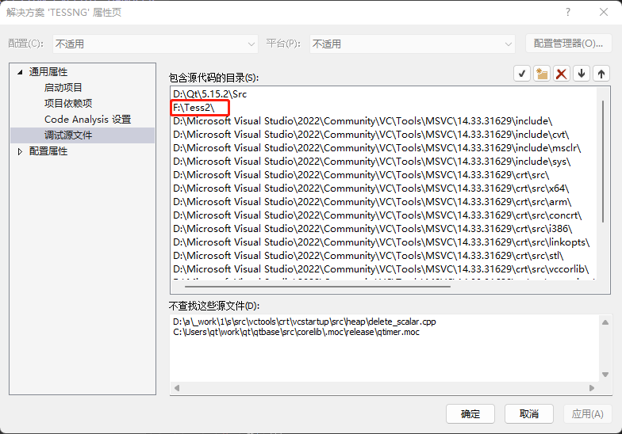
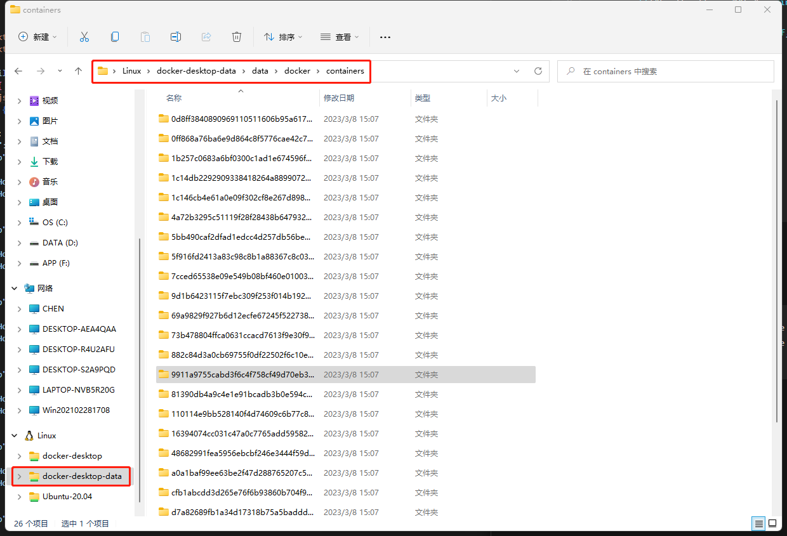

#### 捕获错误信号

##### Windows

> [Windows下C++异常处理 - 啊毕 - 博客园 (cnblogs.com)](https://www.cnblogs.com/biyaxiong/archive/2013/03/28/2986777.html)
>
> [Windows异常捕获之VEH 和SEH - 知乎 (zhihu.com)](https://zhuanlan.zhihu.com/p/349519553)
>
> [Qt 使用DbgHelp和SetUnhandledExceptionFilter来获取Crash log/dump文件 - 一杯清酒邀明月 - 博客园 (cnblogs.com)](https://www.cnblogs.com/ybqjymy/p/13049295.html)
>
> [ windows系统利用vs 分析DMP文件、pdb文件定位异常崩溃_vs dmp文件_小飞侠hello的博客-CSDN博客](https://blog.csdn.net/baidu_16370559/article/details/121100979)

- 配置结构化异常处理(SEH)函数，生成dmp文件

  ```cpp
  #include <windows.h>
  #include <Minidumpapiset.h>
  
  typedef PVOID(NTAPI* FnAddVectoredExceptionHandler)(ULONG, _EXCEPTION_POINTERS*);
  FnAddVectoredExceptionHandler MyAddVectoredExceptionHandler;
  
  long __stdcall DBHelper::callback(_EXCEPTION_POINTERS* excp)
  {
      HANDLE lhDumpFile = CreateFile(L"tess.dmp", GENERIC_WRITE, 0, NULL, CREATE_ALWAYS, FILE_ATTRIBUTE_NORMAL, NULL);
      MINIDUMP_EXCEPTION_INFORMATION loExceptionInfo;
  
      loExceptionInfo.ExceptionPointers = excp;
  
      loExceptionInfo.ThreadId = GetCurrentThreadId();
  
      loExceptionInfo.ClientPointers = TRUE;
  
      // MiniDumpWithFullMemory包括所有内存数据，所以有堆数据
      MiniDumpWriteDump(GetCurrentProcess(), GetCurrentProcessId(), lhDumpFile, MiniDumpWithFullMemory, &loExceptionInfo, NULL, NULL);
  
      CloseHandle(lhDumpFile);
  
      return EXCEPTION_EXECUTE_HANDLER;
  }
  
  void DBHelper::setupDump() {
  	SetUnhandledExceptionFilter(callback);
  }
  ```

- VS配置

  - 对每个项目进行操作：

    - 属性页 -> C/C++ -> 常规 -> 调试信息格式 -> 用于”编辑并继续“ 的程序数据库

      

      > **用于“编辑并继续”的程序库**：vs就会在你修改过源文件，并且执行下一步（无论是单步还是运行） 的时候，重新编译你的程序，保证了你的调试过程不会中断。

    - 设置生成调试信息

      

- 使用dmp文件调试

  - 配置源码路径（方案路径）

    

  - 用VS打开dmp文件

    - 设置pdb符号文件路径
  
      
  
    - 点击“使用 仅限本机 进行调试”
  

##### Linux

> [第一时间捕获段错误(segment fault)的详细信息_dog250的博客-CSDN博客](https://blog.csdn.net/dog250/article/details/6703750)

```cpp
#include <signal.h>
#include <execinfo.h>
#define BT_SIZE 1000
void *bt_buf[BT_SIZE];

void fault_trap(int n,struct siginfo *siginfo,void *myact) {
    int i, num;
    char **calls;
    printf("Fault address:%X\n",siginfo->si_addr);   
    num = backtrace(bt_buf, SIZE);
    calls = backtrace_symbols(bt_buf, num);
    for (i = 0; i < num; i++)
        printf("%s\n", calls[i]);
    exit(1);
}
void setuptrap() {
    struct sigaction act;
    sigemptyset(&act.sa_mask);   
    act.sa_flags=SA_SIGINFO;    
    act.sa_sigaction=fault_trap;
    sigaction(SIGSEGV,&act,NULL);
}
```

#### 虚拟机

- hyper-v

  ```sh
  bcdedit /set hypervisorlaunchtype auto
  bcdedit /set hypervisorlaunchtype off
  # 重启
  ```


#### Docker

##### 修改已存在的容器

1. 修改config.v2.json和hostconfig.json

   - Windows下：

     

     - 例如：增加挂载

       

       

2. 重启Docker

#### 跨平台构建

> [Docker Buildx使用教程：使用Buildx构建多平台镜像_东北小狐狸-Hellxz的博客-CSDN博客](https://blog.csdn.net/u012586326/article/details/125589644)

- 先装好qemu-static

- 创建构建器

  `docker buildx create --use --name mybuilder`

- 启动构建器

  `docker buildx inspect mybuilder --bootstrap`

- 使用构建器创建镜像

  ` docker buildx build -t tessng --platform linux/arm64 .`

#### kafka

- 错误

  ```sh
  [2023-03-09 11:48:44.400682]ERR KafkaProducer[e227173a-50261bf0] FAIL | [thrd:123.60.14.186:9092/bootstrap]: 123.60.14.186:9092/0: 2 request(s) timed out: disconnect (after 1001ms in state UP)
  == Message delivery failed: Local: Message timed out
  ```

  - 修改参数：

    ```json
    { "message.max.bytes", "200000000" },
    { "batch.num.messages", "1000000" },
    { "batch.size", "2147483647" }
    ```

    将参数限制增大

- Topic命名规范

  - 不能点"." 或者下划线"_"

  - 不要创建字母相同，仅大小写不同的topic

#### Git

##### .gitignore不生效

> [.gitignore不生效问题解决方法](https://blog.csdn.net/Saintmm/article/details/120847019)

- 清除缓存

  ```sh
  git rm -r --cached .
  git add .
  ```

- 手动添加忽略路径

  ```sh
  # 在PATH处输入要忽略的文件
  git update-index --assume-unchanged [PATH]
  ```


#### Win命令

##### 比较文件不同

- `fc file1 file2`
- 软件：Beyond Compare

#### Qt

##### 跨线程调用

- signal/slot中注意事项
  - 自定义类型需要：
    - 继承QObject
    - 并添加宏Q_Object
    - 并添加`qRegisterMetaType`
      - 注册位置：在第一次使用此类链接跨线程的signal/slot之前，一般在当前类的构造函数中进行注册；
      - 注册方法：在当前类的顶部包含：#include <QMetaType>，构造函数中加入代码：`qRegisterMetaType<MyClass>("Myclass")；`
      - Myclass的引用类型需单独注册：`qRegisterMetaType<MyClass>("Myclass&")；`

##### QMetaType问题

问题描述：

```cpp
// 有以下使用
QVariant::fromValue<GraphicsBaseItem::ShapeType>(GraphicsBaseItem::RECTANGLE);

// GraphicsBaseItem是自定义类型，必须要经过以下宏处理
Q_DECLARE_METATYPE(GraphicsBaseItem);
/*  该宏里会调用qRegisterMetaType<T>()方法，该方法需要T拥有：
	default constructor,
	copy constructor,	[1]
	public destructor
*/

// 但是GraphicsBaseItem继承了QGraphicsItem
class GraphicsBaseItem : public QGraphicsItem {}
// 并且QGraphicsItem里删除了拷贝，拷贝赋值函数	<1>
Q_DISABLE_COPY(QGraphicsItem)

// 所以会报错，也无法通过添加拷贝构造函数等来解决
```

解决：
`Q_DECLARE_METATYPE(GraphicsBaseItem::ShapeType)`，它只需要ShapeType被声明就可以了

#### Tess

##### 批次信息发送逻辑

###### 一些要点

- w1完成批次x，意味着：
  - 对方已收到x-1
  - 己方已收全x-1
- w1收到对方的批次x，意味着：
  - 对方已收全x-1，所以一定收到了己方发去的x-1
  - 己方可能只完成了x-1，x还没开始
- w1要求对方重发，满足条件：
  - 己方已仿真完的批次x >= 对方已知仿真的最新批次
  - 己方已仿真完的批次x 已发送过一次，或者说满足超时条件、重发次数条件等。

###### 判断流程

1. 先处理对方要求重发的批次
   - 如果，对方批次 > 己方批次，在处理信息时，直接忽略
   - 否则，重发对方批次号对应的信息，后续流程不再处理
2. 己方主动发送信息
   - 如果，是刚产生的批次x（或者还未满足重发超时条件等），发送，并不要求对方回复
   - 否则，发送，并要求对方回复
