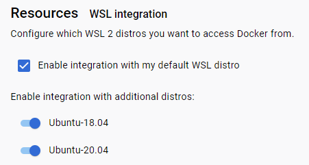

## 安装

### 流程

#### WSL环境配置（可选）

##### 开启WSL

启动或关闭windows功能 **——>** 适用于Linux的Windows子系统

再重启

#### 安装Docker

##### 安装（略）

##### 配置源

```sh
"registry-mirrors": [
    "https://docker.mirrors.ustc.edu.cn",
    "https://registry.docker-cn.com"
]
```

##### 移动WSL数据位置

```sh
# 查看
wsl -l -v
# 导出
wsl --export docker-desktop-data D:\docker\docker-desktop-data.tar
wsl --export docker-desktop D:\docker\docker-desktop.tar
# 注销已有
wsl --unregister docker-desktop-data
wsl --unregister docker-desktop
# 导入
wsl --import docker-desktop-data D:\docker\data D:\docker\docker-desktop-data.tar
wsl --import docker-desktop D:\docker\desktop D:\docker\docker-desktop.tar
```

#### 安装Ubuntu18

并将其添加到Docker的配置中



#### 安装Apollo的环境

> [apollo.baidu.com/community/Apollo-Homepage-Document](https://apollo.baidu.com/community/Apollo-Homepage-Document?doc=BYFxAcGcC4HpYIbgPYBtXIHQCMEEsATAV0wGNkBbWA5UyRFdZWVBEAU0hFgoIH0adPgCY%2BADwCiAVnEBBCeIAcATnETFcgMxKZkgGxKAwkoDsa3YoAi45WdGSLxsYt0SzY%2BXICMa98oAMSgYALF7%2B2NhemsLBJsrCYZqKwors7AikBIp6miYmpFJSXpigFKhAA)

##### WSL安装显卡驱动

> [40系列显卡使用Apollo指南_Apollo开发者社区 (baidu.com)](https://apollo.baidu.com/community/article/1201)

- 驱动下载地址

  https://www.nvidia.cn/geforce/drivers/results/202351/

- 通过命令`nvidia-smi `查看驱动

- 安装 Nvidia container toolkit

  - 执行脚本

    ```sh
    distribution=$(. /etc/os-release;echo $ID$VERSION_ID)
    curl -s -L https://nvidia.github.io/nvidia-docker/gpgkey | sudo apt-key add -
    curl -s -L https://nvidia.github.io/nvidia-docker/$distribution/nvidia-docker.list | sudo tee /etc/apt/sources.list.d/nvidia-docker.list
    sudo apt-get -y update
    sudo apt-get install -y nvidia-docker2
    ```

  - 重启docker

    ```sh
    sudo systemctl restart docker
    ```

#### 安装和启动Apollo

##### 安装依赖

```sh
sudo apt-get update
sudo apt-get install ca-certificates curl gnupg
```

##### 添加Apollo软件源

```sh
# 添加 gpg key
sudo install -m 0755 -d /etc/apt/keyrings
curl -fsSL https://apollo-pkg-beta.cdn.bcebos.com/neo/beta/key/deb.gpg.key | sudo gpg --dearmor -o /etc/apt/keyrings/apolloauto.gpg
sudo chmod a+r /etc/apt/keyrings/apolloauto.gpg
 
# 设置源并更新
echo \
    "deb [arch="$(dpkg --print-architecture)" signed-by=/etc/apt/keyrings/apolloauto.gpg] https://apollo-pkg-beta.cdn.bcebos.com/apollo/core"\
    $(. /etc/os-release && echo "$VERSION_CODENAME") "main" | \
    sudo tee /etc/apt/sources.list.d/apolloauto.list
sudo apt-get update
```

##### 安装

```sh
sudo apt install apollo-neo-env-manager-dev --reinstall
```

##### 拉取core示例工程

```sh
git clone https://github.com/ApolloAuto/application-core.git application-core
```

##### 启动容器

```sh
# 先进入工程目录
cd application-core
# 环境设置：识别主机系统是x86_64还是aarch64, 并修改对应的.env和.workspace.json配置
bash setup.sh
# 启动容器
aem start_gpu -m [挂载目录]:[容器目录]
```

##### 进入容器

```sh
# 先进入工程目录
cd application-core
# 进入容器
aem enter
```

##### 启动Dreamview+

```sh
aem bootstrap start --plus
```

### 额外参考

#### 配置vpn

1. 在`~/.proxyrc`中写入：

   ```sh
   host_ip=[本地ip地址（通过ifconfig获取）]
   export all_proxy="socks5://$host_ip:7890"
   export https_proxy="http://${host_ip}:7890"
   export http_proxy="http://${host_ip}:7890"
   ```

2. `source ~/.proxyrc`


### 随记

#### aem docker启动的指令

```sh
docker run -itd --privileged --name apollo_neo_dev_9.0.0_rc_r13_core --label owner=root -e DISPLAY=:0 -e CROSS_PLATFORM=0 -e DOCKER_USER=root -e USER=root -e DOCKER_USER_ID=0 -e HISTFILE=/apollo_workspace/.cache/.bash_history -e DOCKER_GRP=root -e DOCKER_GRP_ID=0 -e DOCKER_IMG=registry.baidubce.com/apollo/apollo-env-gpu:9.0-latest -e USE_GPU_HOST=0 -e NVIDIA_VISIBLE_DEVICES=all -e NVIDIA_DRIVER_CAPABILITIES=compute,video,graphics,utility -e APOLLO_ENV_CONTAINER_IMAGE=registry.baidubce.com/apollo/apollo-env-gpu:9.0-latest -e APOLLO_ENV_CONTAINER_PREFIX=apollo_neo_dev_ -e APOLLO_ENV_CONTAINER_REPO=registry.baidubce.com/apollo/apollo-env-gpu -e APOLLO_ENV_CONTAINER_REPO_ARM=registry.baidubce.com/apollo/apollo-env-arm -e APOLLO_ENV_CONTAINER_REPO_X86=registry.baidubce.com/apollo/apollo-env-gpu -e APOLLO_ENV_CONTAINER_TAG=9.0-latest -e APOLLO_ENV_NAME=9.0.0_rc_r13_core -e APOLLO_ENV_WORKLOCAL=1 -e APOLLO_ENV_WORKROOT=/apollo_workspace -e APOLLO_ENV_WORKSPACE=/root/Develop/application-core -v /root/.apollo:/root/.apollo -v /dev:/dev -v /media:/media -v /tmp/.X11-unix:/tmp/.X11-unix:rw -v /etc/localtime:/etc/localtime:ro -v /usr/src:/usr/src -v /lib/modules:/lib/modules -v apollo_neo_dev_9.0.0_rc_r13_core_apollo:/apollo -v apollo_neo_dev_9.0.0_rc_r13_core_opt:/opt -v /root/Develop/application-core:/apollo_workspace -v /root/Develop/application-core/data:/apollo/data -v /root/Develop/application-core/output:/apollo/output -v /root/Develop/application-core/data/log:/opt/apollo/neo/data/log -v /root/Develop/application-core/data/calibration_data:/apollo/modules/calibration/data -v /root/Develop/application-core/data/map_data:/apollo/modules/map/data -v /opt/apollo/neo/packages/env-manager-dev/9.0.0-rc1-r3:/opt/apollo/neo/packages/env-manager-dev/9.0.0-rc1-r3 -p 1 -w /apollo_workspace --add-host in-dev-docker:127.0.0.1 --add-host Huth-Jida2:127.0.0.1 --hostname in-dev-docker --shm-size 2G --pid=host -v /dev/null:/dev/raw1394 registry.baidubce.com/apollo/apollo-env-gpu:9.0-latest /bin/bash
```

#### 引入第三方库

[Apollo: 包管理 (baidu.com)](https://apollo.baidu.com/docs/apollo/latest/md_docs_2_xE6_xA1_x86_xE6_x9E_xB6_xE8_xAE_xBE_xE8_xAE_xA1_2_xE6_x9E_x84_xE5_xBB_xBA_xE5_x8F_x8A_97311a29460ed7a2e37df630fa855f4f.html)
