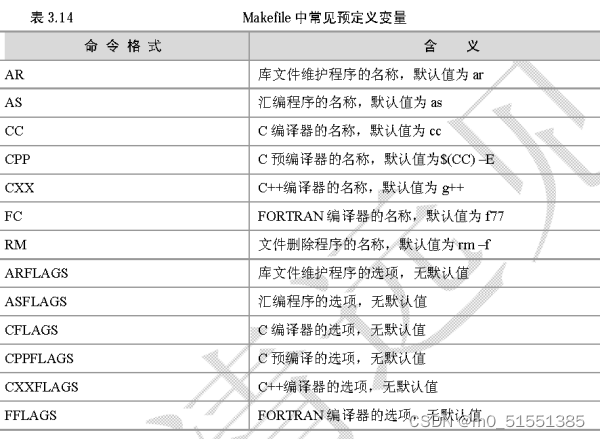

#### cmake

- 添加编译器选项

  ```cmake
  set(CMAKE_CXX_FLAGS "$ENV{CXXFLAGS} -rdynamic -O3 -fPIC -ggdb -std=c++11 -Wall -Wno-unused-function -Wno-builtin-macro-redefined -Wno-deprecated-declarations")
  ```

  - ‘CMAKE_CXX_FLAGS’

    - add_compile_options：命令添加的编译选项是针对所有编译器的(包括c和c++编译器)
    - CMAKE_C_FLAGS或CMAKE_CXX_FLAGS变量则是分别只针对c和c++编译器

  - ‘CXXFLAGS’

    是C++编译器的编译选项。

    

  - `-rdynamic`

    是一个 连接选项 ，它将指示连接器把所有符号（而不仅仅只是程序已使用到的外部符号）都添加到动态符号表（即.dynsym表）里，以便那些通过 dlopen() 或 backtrace() （这一系列函数使用.dynsym表内符号）这样的函数使用。

  - `-O3`

    [优化选项](https://blog.csdn.net/qq_31108501/article/details/51842166?ops_request_misc=%257B%2522request%255Fid%2522%253A%2522165406764516780357253666%2522%252C%2522scm%2522%253A%252220140713.130102334..%2522%257D&request_id=165406764516780357253666&biz_id=0&utm_medium=distribute.pc_search_result.none-task-blog-2~all~baidu_landing_v2~default-1-51842166-null-null.142%5Ev11%5Epc_search_result_control_group,157%5Ev12%5Econtrol&utm_term=-O3%E9%80%89%E9%A1%B9&spm=1018.2226.3001.4187)

  - `-fPIC`

    作用于编译阶段，告诉编译器产生与位置无关代码，即，产生的代码中，没有绝对地址，全部使用相对地址，故而代码可以被加载器加载到内存的任意位置，都可以正确的执行。这正是共享库所要求的，共享库被加载时，在内存的位置不是固定的。

  - `-ggdb`

    -ggdb选项使编译器生成gdb专用的更为丰富的调试信息。

  - `-Wall`

    选项告诉编译器 编译后显示所有警告。

  - `-Wno-deprecated`

    不要警告使用已弃用的功能。

  - `-Werror`

    告诉编译器视所有警告为错误，出现任何警告立即放弃编译。

  - `-Wno-unused-function`

    关闭函数被定义了但没有被使用 而产生的警告，即，不使用的函数不警告。

  - `-Wno-builtin-macro-redefined`

    如果某些内置宏被重新定义，请不要警告。这抑制了警告的重新定义\__TIMESTAMP\__，TIME，DATE，FILE，和\__BASE_FILE\__。

  - `-Wno-deprecated-declarations`

    关闭使用废弃API的警告

  - `-Wl -Bsymbolic`

    - `-Wl`：将紧跟其后的参数，传递给连接器ld。
    - `-Bsymbolic`：强制采用本地的全局变量定义，这样就不会出现动态链接库的全局变量定义被应用程序/动态链接库中的同名定义给覆盖了