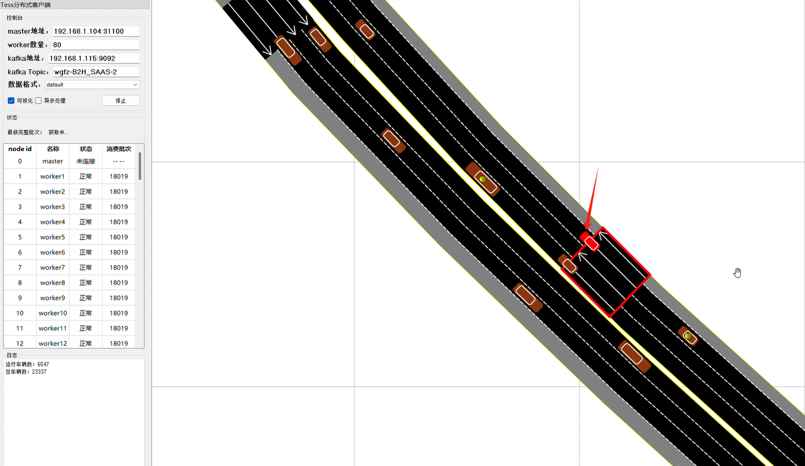

- 车辆异常停住——测试5

  - C2064

    - 卡住

      

    - B2H_SAAS:2:tail_vehis:1818

    

    ​	1. simuTime：480s > 300s

    - B2H_SAAS:2:in_vehis:1818

    
  
    - 18019批次：车辆驶出
  
      
  
      而且该车辆在连接处减速
  
    
  
- 车辆异常停住——测试4

  - C832

    - 卡住

      

    - B2H_SAAS:2:stop_vehi:10000832:1000482

      

    - 

- 车辆异常停住——测试3

  - C2056

    - 300s

      

    - 1800s

      

    - 卡住

    

  - B2H_SAAS:2:tail_vehis:1812

    

  - B2H_SAAS:2:stop_vehi:10002056:1000898

    

  - B2H_SAAS:2:virt_vehis_update:1812

    

  - 

- 车辆异常停住——测试2

  - 2099

  - 1944

    

  - B2H_SAAS:2:stop_vehi:10002099:1001073

    

  - B2H_SAAS:2:tail_vehis:1731

    

  - B2H_SAAS:2:virt_vehis_update:1731

    

    

- 车辆异常停住——测试1

  - B2H_SAAS:3:recover_vehi_failed

    

  - 停车connector

    - 2060，2065

  - B2H_SAAS:3:virt_vehis_update:1817

    

  - B2H_SAAS:3:tail_vehis:1817

    

