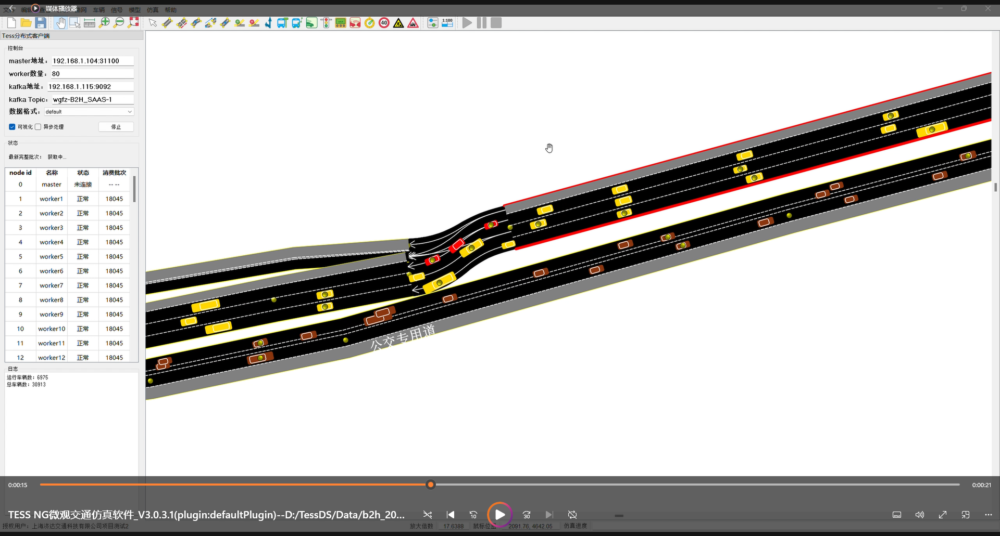

- b2h topic

  - wgfz-B2H_SAAS-0

    测试用（目前saas trace）

  - wgfz-B2H_SAAS-1

    无删除车辆（default trace）

  - wgfz-B2H_SAAS-2

    有删除车辆（default trace）

  - wgfz-B2H_SAAS-3

    有删除车辆（saas trace）

- 车异常停住的故障
  - 1800s
    - link：1824
      - tail：3000:582200182:0.055260:5.424737
      - virt：3000:-92200004:582200182:0.492008
      - in：17971:600305

- 无删除车辆4
  - 1800s
    - link: 1816
    - connector: 2060
- 无删除车辆4
  - 1800s
    - connector: 264, 2033

- 无删除车辆3，1800s
  - link: 824
  - connector: 310 311

- 有删除车辆，1800s

  车辆卡住位置（link id）

  |                 |  节点内  |       跨节点       |
  | :-------------: | :------: | :----------------: |
  | 连接段长度 > 0  | 720，877 |      246，215      |
  | 连接段长度 == 0 |          | 774，836，756，816 |

- 无删除车辆，1800s

  - link 877

    - 300s

      

    - 1800s

      

  - link 720

    - 300s

      

    - 300.9s

      

    - 结束瞬间：1800s

      
      
    - 应该还是恢复前：1800.1s

      
      
    - 恢复的瞬间：1800.3s
    
      应该是处于上一轮结尾和该轮交替的瞬间，上一轮车辆还未从路网上移除
      
      
    
    - 恢复后的瞬间：1800.6s
    
      
    
    - 1800.9s
    
      
    
    - 卡死瞬间：1804.5s
    
      

  - link 816

    - 300.1s

      

    - 1800.1s

      

    - 恢复瞬间

      

    - 卡死瞬间

      

- 无删除车辆2，1800s

  - 情形

    |                 |  节点内  |  跨节点  |
    | :-------------: | :------: | :------: |
    | 连接段长度 > 0  |          |          |
    | 连接段长度 == 0 | 836，794 | 774，816 |