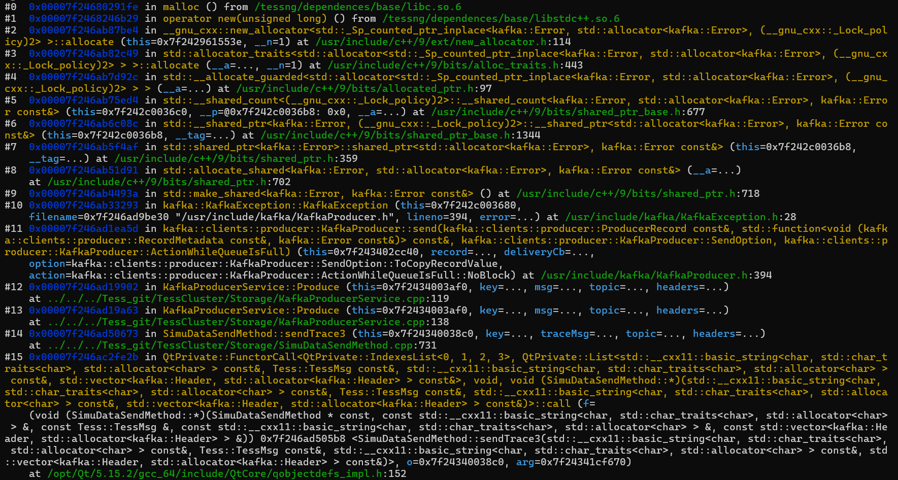

### 分布式以及北二环

#### 【已解决】bug1：启动了60个worker，但在线指令指定了1个分区数，然后master分配给了worker28，worker28会将其轨迹发送至28号分区。但master只创建了2个分区

- 分析
  - 可能需要主动告诉worker其发送的分区号，不能默认按照node id去取

#### bug2: kafka 崩溃

- 描述

  - malloc处崩溃，恢复后（第一次崩溃情况未知），发第一帧数据就崩溃

  - 现场

    - coredump

      

#### bug3：快照会保存mStopFlag，恢复后，并没有对其进行相关的处理，导致状态获取混乱。mStopFlag一定要保存快照吗？

- 描述
  - simuinterface->isRunning()：是false
    - 因为有`mStopFlag == 1`
  - pDSMgr->isWorking()：是true
    - 因为，恢复了`lastTessBatch = 0`，

#### bug4：路网划分，b2h0614_ca.tess路网上，20个分区，划分失败