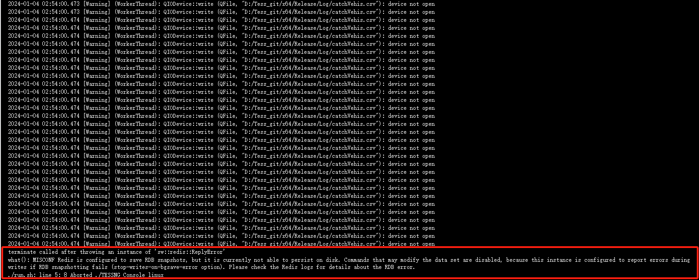
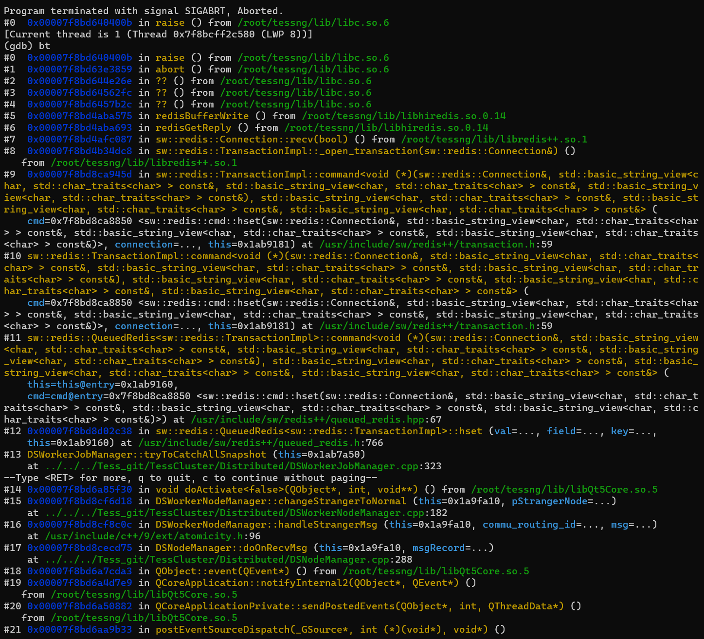
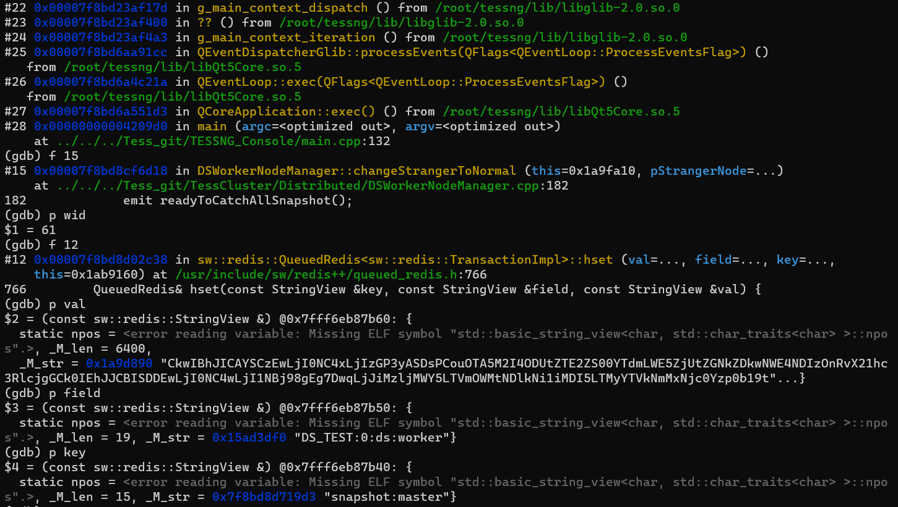

### Plan

- TessDS V2.0测试

  - ~~4台机器，搭建K8S的环境~~

    ```sh
    kubeadm init \
      --apiserver-advertise-address=192.168.1.104 \
      --image-repository registry.aliyuncs.com/google_containers \
      --kubernetes-version v1.23.0 \
      --service-cidr=10.96.0.0/12 \
      --pod-network-cidr=10.244.0.0/16 \
      --ignore-preflight-errors=all
    ```

    ```sh
    kubeadm join 192.168.1.104:6443 --token endplu.my4597nt6tl4v4k7 \
            --discovery-token-ca-cert-hash sha256:e364e2f531aa309a331b9608ad8303778f8a614a32f081c03c9e19a4be37fc63
    ```

    ```sh
    # dashboard token
    eyJhbGciOiJSUzI1NiIsImtpZCI6Ink3bG5ibDBQZloxbjhNdUJBVnFUa19LVHhyTV9wUTVOZ0ZFZ0NERldvRTgifQ.eyJpc3MiOiJrdWJlcm5ldGVzL3NlcnZpY2VhY2NvdW50Iiwia3ViZXJuZXRlcy5pby9zZXJ2aWNlYWNjb3VudC9uYW1lc3BhY2UiOiJrdWJlcm5ldGVzLWRhc2hib2FyZCIsImt1YmVybmV0ZXMuaW8vc2VydmljZWFjY291bnQvc2VjcmV0Lm5hbWUiOiJhZG1pbi11c2VyLXRva2VuLWI0czU2Iiwia3ViZXJuZXRlcy5pby9zZXJ2aWNlYWNjb3VudC9zZXJ2aWNlLWFjY291bnQubmFtZSI6ImFkbWluLXVzZXIiLCJrdWJlcm5ldGVzLmlvL3NlcnZpY2VhY2NvdW50L3NlcnZpY2UtYWNjb3VudC51aWQiOiJhYWExODgzNS04YWNkLTRlZGYtYjMxZS1hM2I2NzUyMjJjYjMiLCJzdWIiOiJzeXN0ZW06c2VydmljZWFjY291bnQ6a3ViZXJuZXRlcy1kYXNoYm9hcmQ6YWRtaW4tdXNlciJ9.fH4RTE4WAubuqIPGTUlMuk_8Z-01DYJSgCz4OYGzi7ALoWGIDtswW4qU8DCOhrAizVbbwDs3uk2h3UuFuVVESntcfQ58y6yHOHS0zzVa0bXcvNAr0L9glpfHVsrVF-4PHN8KIHqa3hsJrNOQkCCOQ2Ay_UzKfxKGq-bOZ3F0u8x4zQN-yE-3QefJjPQRFsLJpsjb88FixfLSFyOwlr_Qvd25FJQtUa1JazzsZIx4OVhiFzWAu5ylwYQGXfi65ZbKWfk5YdX1gO7b1xAGsyzLPPGrD7c9bxR7YCJckcQiL5fUSNyn33tXSX5zpLcb3_FbvXXzSbrbMxjMDUTXeBB57Q
    ```

    > [k8s dashboard 证书安装](https://www.cnblogs.com/xiajq/p/11322568.html)

    > StatefulSet 中每个 Pod 的 DNS 格式：
    >
    > 为 statefulSetName-{0..N-1}.serviceName.namespace.svc.cluster.local

  - 在K8S中安装日志收集工具：fluentd，elasticsearch，kibana

  - 在K8S中安装监控：Prometheus，Grafana

    > [10分钟在K8s中部署目前最热门的监控系统-51CTO.COM](https://www.51cto.com/article/777434.html)

  - 在K8S环境下测试：

    - ~~不带容灾，不带心跳，持久测试~~

    - 带容灾备份，不带心跳，不模拟故障，持久测试

      - ~~bug: worker syncing阶段故障~~

        ```sh
         [Critical] (NbrHandlerOf38): nbr handle of Graph Node  31  failed:  CHECK failed: (new_num_buckets) >= (kMinTableSize)
         job id: 14
         worker id: 15
        ```

      - bug: redis问题

        

        - 尝试解决：
          - redis设置：
            - `appendonly yes`
            - `maxmemory 160GB`
            - `stop-writes-on-bgsave-error no`
    
      - bug: 当新的worker（第61个）连上后，保存快照至redis时，报错
    
        
    
        **分析：**master在之前挂了（这个bug要另外查），然后该worker重连（或断连）该master时，可能发生了对socket的线程竞争
    
    - 带容灾备份，带心跳，不模拟故障，持久测试
    
    - 使用chaosblade，编写随机测试代码
    
    - 带容灾，带心跳，模拟故障，持久测试

- PengCheng

  - ~~global bug修复~~
  - 仿真前，发送global，之后发送启动/停止指令，无响应

    - 复现：

      ```json
      {"type2":"global","type1":"down"}
      
      {
          "type2": "loadNet",
          "param": [
              {
                  "projId": "297",
                  "netKey": "sz",
                  "time": "1683289777182",
                  "fromFile": "true"
              }
          ],
          "type1": "up"
      }
      
      {"type3":"1","type2":"global","type1":"down","timestamp":"1704271327166"}
      
      {"type2":"net","type1":"load"}
      
      {"type2":"bgmapsize","param":[{"width":"6120","height":"5090"}],"type1":"up"}
      
      {"type2":"net","type1":"load"}
      
      {"type2":"global","type1":"down","timestamp":"1704271329974"}
      
      {"type2":"global","type1":"down"}
      ......
      ```

      **没有复现出问题**

- TessDS V2.0完善

  - 对在线路网编辑的支持
    - ~~不要在afterLoadNet那里buildGraph，移动到开始仿真后~~
  - 对指定切分数的支持
    - 添加参数：最小切分数，最大切分数
    - 继续使用已有的part_cnt参数，作为强制指定切分数的设置
  - 在线指令对分布式的支持
    - 目前来看，还行，可能需要添加“ds”标识，对这样的指令，将其分发给分布式模块处理；
      对通常的指令，添加对分布式环境下的考虑，考虑是否要分发给分布式模块等。
  - 对局部路网仿真的支持
    - 指定需要仿真的部分路段
    - 额外：指定每个worker的划分

  - 额外需求：路网的快照，以及master保存，worker读取