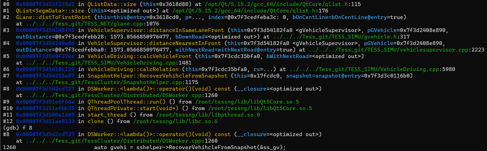
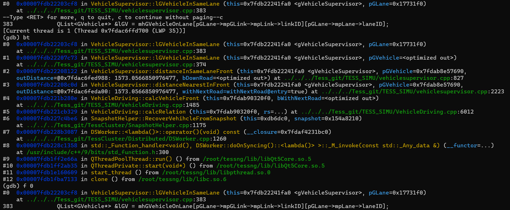
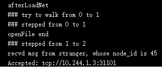

### Plan

#### TessDS V2.0

##### 容灾测试

- ~~**bug-1**: 修复worker中连接master的socket，两个线程分别发送和使用poll接收数据，导致的线程竞争问题~~

- **~~开启心跳（或master对worker的检测），持久测试~~**
  
  - ~~可能需要重新设计检测，不一定用心跳~~
    - 可能使用redis watch
    - 也可以使用ws长连接检测
    - 也可以使用原来的zmq的心跳，但是心跳时长缩短（比如1s内）
    - 或者针对k8s环境，特别设计，比如检测对应的pod是否挂掉
  
- **基本的故障测试**
  - 手动关掉某几个worker；多进行些组合测试
  
    - bug-2: 恢复后，正常仿真时，恢复驶入车辆时，Tess里报错
      
    
    - bug-3: 每台机器上，分别关闭一个容器，重启后，有一个worker运行失败
    
      ```sh
      newId : oldId
      # 没有newId : oldId的数据，因为还没连接上这些node
      Connected: tcp://10.244.1.187:31101
      Connected: tcp://10.244.2.221:31101
      Connected: tcp://10.244.1.183:31101
      Connected: tcp://10.244.3.28:31101
      Accepted: tcp://10.244.0.132:31101
      Connected: tcp://10.244.0.132:31101
      after node ids updated: node ids and ptr:
      28, b9e8040
      # 指针很多都是空的
      10, 0
      24, 0
      57, 0
      31, 0
      34, 0
      # 还有一个多余的，该id特别大，看指针，是28的
      27628064, b9e8040
      0, 1a87370
      Connected: tcp://10.244.0.127:31101
      after relations updated:
      job_num node_id
      51 57
      25 34
      22 28
      10 10
      18 31
      24 24
      ```
    
      - 现象：在update nodes后，很多node变成了空指针
      - 原因：还没有连接邻接点，pNode都还没创建，这时候就收到了update nodes指令，所以读取的pNode为空指针
    
    - bug-4: 和bug-2类似，也是出在Tess里，但位置略微不同
    
      
    
      - 分析：应该是恢复时加速仿真导致的，加速仿真并不能保证一致性，所以加速过程中会产生已经发出的车辆，而该车辆并没有在恢复完成前跨节点（在恢复仿真时，驶出车辆会忽略），而是迟了若干批次后再跨节点，这时邻接点接收到该驶入车辆，进行恢复时，会和在运行的车辆重复。
    
    - bug-5: 重启4个后，有一个worker卡在`stepped from 1 to 2`之后
    
      
    
      
  
  
  - 手动关掉master，进行测试
  - 用TessClientWin检查一下恢复后的车流是否正常
  
- **利用chaos blade编写随机或针对性的测试脚本，进行大量次数的测试**

- 将新加的特性测试一下（包括build graph的时机更改，part_cnt的范围设定和特别指定）

##### 开发

- master删除旧的inc data和snapshot
- redis: 
  - ~~添加`[proj_id:plan_id]`的namespace~~
  - 考虑redis未连接和重连等问题
    - 测试中，出现过`Not in valid state`的问题

#### K8S

- ELK日志收集系统搭建