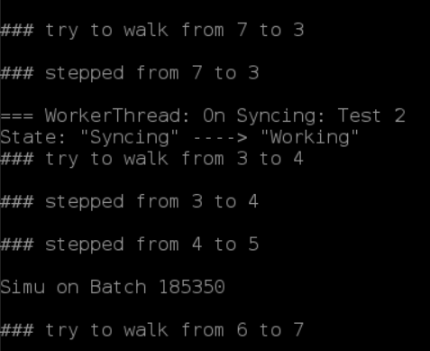
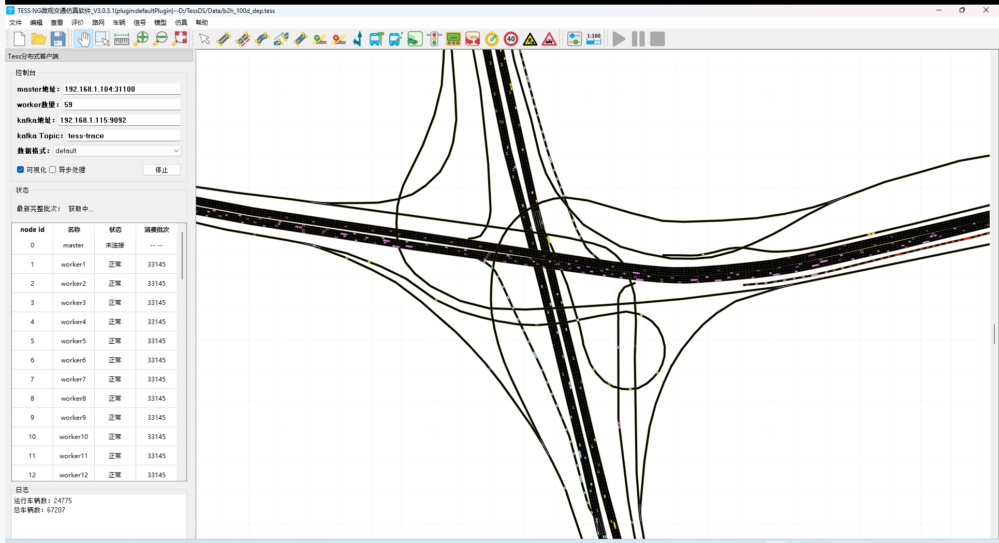
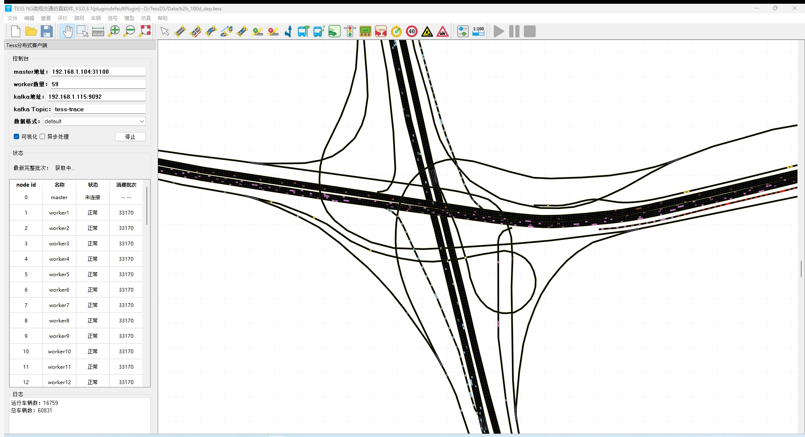
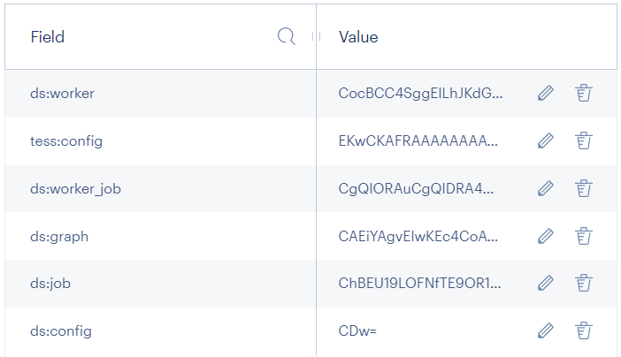

## Plan

### TessDS V2.0

#### 测试重构同步逻辑后的版本

- ~~bug-1：在Test 17处卡住~~
  [日志](D:\TessDS\Log\k8s\logs-from-tess-ds-worker-container-in-tess-ds-workers-sts-57.log)

- ~~bug-2：删掉一个worker的pod，其重启，在worker收到recover之前，master挂掉，重启，之后，worker卡住~~

- ~~bug-3：conj中handleOutVehi中，virtual_vehi是空的~~

  - [日志]("D:\Downloads\logs-from-tess-ds-master-container-in-tess-ds-master (10).log")
    - 所在sec id为427，lane id为894
    - 从323802行开始
    - master分配的from和to的ids中有错误，427车道出现在多个节点中，甚至在from和to中都出现了

  - 分析：可能是DSMaster:cpp中的发送任务里，from和to里的ids没清理干净，导致的残留

- bug-4：online msg发送失败
  - 须完善online部分

- ~~bug-5：worker恢复后，master给worker发送了RECOVERING指令，job状态也设成了Doing，但还没来得及发送startSimu online指令，master挂了，又重启，worker连上了，worker会一直等master的startSimu，而master却要一直等worker的消息。~~

  取消发送startSimu online msg，worker收到RECOVERING或START，就开始仿真

- bug-6：yx平台：卡在仿真阶段，没继续

  

  - 描述：卡在6->7，因为5->6没发生——即当前批次仿真没结束

- ~~bug-7：恢复后，车辆有很多丢失~~

  - 实例：
    
    
    - 运行车辆少了8k多辆，图2中，少了黄车

- ~~bug-8：assign job，上一次Assinged+Doing的总和还是59，下一次就变成了58（注：worker一共59个）~~

  - 日志：

    [master](..\..\TessDS\Log\k8s\logs-from-tess-ds-master-container-in-tess-ds-master (20).log)

    - 15526和16031行：总和一个59，一个58
    - 15530行：SimuJob:59生成了failed，但是没有reassign给worker51，该job就一直是failed状态，所以Assinged+Doing的总和少了一个

     [tess-ds-workers-sts-58](..\..\TessDS\Log\k8s\logs-from-tess-ds-worker-container-in-tess-ds-workers-sts-58 (1).log) 

  - 复盘：

    - 背景：worker重连上master，并发送WORKER_NEW
    - master执行顺序依次如下：

    1. [MasterThread] tryAssignAllJobsToWorkers：**获取Assigned的jobs**，其中worker 51对应的SimuJob:59也在其中

    2. [MainThread] 收到worker 51的WORKER_NEW，job的status改为FAILED，worker的状态改为IDLE，mbSent设为false （2.1）
    3. [MasterThread] 发送任务：因为mbSent为false，所以会发送SimuJob:59给worker 51， **并将worker 51的状态改为INITING**
    4. [MasterThread] 下一次tryAssignAllJobsToWorkers：其会获取IDLE状态的worker，分配FAILED的jobs，但是worker 51已经是INITING了，所以**分配不了**，所以其返回的mAssginedJobs中就不包括SimuJob:59（因为没分配，SimuJob:59的状态一直是FAILED）

- ~~bug-9：恢复时，worker缺少section的基础快照，并且在恢复时，报错~~

  - log

    ```sh
    node id: 3
    
    # 分配的link
    258, 263, 487, 651, 261, 317, 652, 423, 267, 293
    
    # 邻接点
    node: 49 Connected: tcp://tess-ds-workers-sts-20.tess-ds-worker-svc.tess.svc.cluster.local:31101
    node: 8 Connected: tcp://tess-ds-workers-sts-12.tess-ds-worker-svc.tess.svc.cluster.local:31101
    node: 18 Connected: tcp://tess-ds-workers-sts-30.tess-ds-worker-svc.tess.svc.cluster.local:31101
    node: 46 Connected: tcp://tess-ds-workers-sts-49.tess-ds-worker-svc.tess.svc.cluster.local:31101
    node: 15 Connected: tcp://tess-ds-workers-sts-2.tess-ds-worker-svc.tess.svc.cluster.local:31101
    node: 43 Connected: tcp://tess-ds-workers-sts-16.tess-ds-worker-svc.tess.svc.cluster.local:31101
    
    snapshot of section:258:base is null
    snapshot of section:10000539:base is null
    snapshot of section:263:base is null
    snapshot of section:10000540:base is null
    snapshot of section:10000708:base is null
    snapshot of section:10000709:base is null
    snapshot of section:651:base is null
    snapshot of section:10000535:base is null
    snapshot of section:10000536:base is null
    snapshot of section:261:base is null
    snapshot of section:10000549:base is null
    snapshot of section:10000560:base is null
    snapshot of section:423:base is null
    snapshot of section:10000550:base is null
    snapshot of section:267:base is null
    snapshot of section:10000561:base is null
    snapshot of section:10000553:base is null
    snapshot of section:10000554:base is null
    ```


  - 原因：和log里的无关，是link 317的发车点中，有的未开始车辆的数据为空
  - 解决：若为空，创建车辆会返回空指针，对空指针做了保护
  - ==为什么未开始车辆的数据为空，尚不知道==

- bug-10：有时候，有几个worker的连接信息长时间不处理，最后就绪的worker就少了几个，少一个的概率最大。但等待长时间，基本都能就绪。

- bug-11：master snapshot部分快照丢失？ds:config貌似丢失了

  - 完整的应该包括以下几种：
    
    - 注：ds:config，60个worker的base64: `CDw=`


```sh
"http://192.168.1.104:9988/chaosblade?cmd=create%20k8s%20pod-cpu%20fullload%20--climb-time%209%20--names%20tess-ds-workers-sts-3%20--cpu-percent%2095%20--evict-count%201%20--namespace%20tess%20--kubeconfig%20/root/.kube/config"

"http://192.168.1.104:9988/chaosblade?cmd=create%20k8s%20pod-network%20delay%20--time%2030000%20--remote-port%2031101%20--interface%20eth0%20--namespace%20tess%20--evict-count%2012%20--names%20tess-ds-workers-sts-45,tess-ds-workers-sts-2,tess-ds-workers-sts-21,tess-ds-workers-sts-26,tess-ds-workers-sts-55,tess-ds-workers-sts-48,tess-ds-workers-sts-29,tess-ds-workers-sts-5,tess-ds-workers-sts-47,tess-ds-workers-sts-52,tess-ds-workers-sts-58,tess-ds-workers-sts-10%20--kubeconfig%20/root/.kube/config"

"http://192.168.1.104:9988/chaosblade?cmd=create%20k8s%20pod-process%20kill%20--signal%2011%20--names%20tess-ds-master,tess-ds-workers-sts-42,tess-ds-workers-sts-26,tess-ds-workers-sts-58,tess-ds-workers-sts-39,tess-ds-workers-sts-49,tess-ds-workers-sts-30,tess-ds-workers-sts-37,tess-ds-workers-sts-51,tess-ds-workers-sts-7,tess-ds-workers-sts-48,tess-ds-workers-sts-50,tess-ds-workers-sts-46%20--process-cmd%20run.sh%20--namespace%20tess%20--kubeconfig%20/root/.kube/config"

blade destroy 144eb1ea376d4641 bb3c5a01ecee8fba 2a750d02bcbf12f8 c1ec0d9737c6e7b5 3a2ab54dc0b2b87f 7fd3e1f004345d68 168c5a1190f4b64f f5e5dd8f229483e3

```

