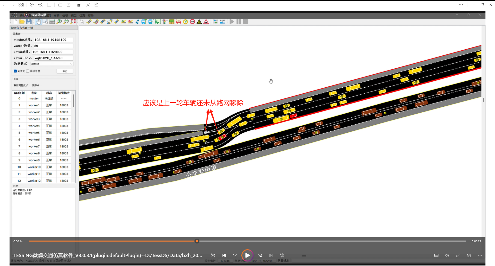

- 路网：b2h_20240522_1km_conn.tess

- 卡死的上游路段：720，卡死所处连接段：854

- 第一轮仿真300s的瞬间

  

- 第一轮仿真结束瞬间

  

- 恢复300s的瞬间

  

- 恢复300s后的瞬间

  

- 第二轮仿真中的卡死状态

  

​	**连接段上第一辆红车停住，好像前面还有一辆车：并且它的位置差不多跟上一轮中移除车辆的位置一样**