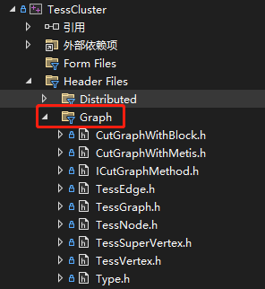

## 同步逻辑

### libgrape-lite版

| TESS                                                         | DS                                                           |
| :----------------------------------------------------------- | :----------------------------------------------------------- |
| **1：**`PcNet::afterLoadNet()`加载完路网                     |                                                              |
|                                                              | **2：**`DistributedManager::CreateAndQuery(...)`加载路图     |
| **3：**`PcSimulator::beforeStart(...)`开启仿真前             |                                                              |
|                                                              | **4：**`DistributedManager::DoQuery(...)`Grape开始工作       |
|                                                              | **5：**`WorkerJob::IncEval(...)`处理0批次信息                |
| **6：**`PcSimulator::beforeStart(...)`开始仿真               |                                                              |
| **7：**`PcSimulator::afterOneStep(...)`计算完，将本批次驶出信息存放 |                                                              |
|                                                              | **8：**`WorkerJob::IncEval(...)`将驶出信息发送出去           |
| **4：**`PcSimulator::afterOneStep(...)`结束批次              |                                                              |
|                                                              | **5：**`WorkerJob::IncEval(...)`开始接收处理收到的上一批次信息 |
| **6：**`PcSimulator::afterOneStep(...)`开始下一批次          |                                                              |

==循环：7——>8——>4——>5——>6==

- 运行：

  `mpirun -N 1 --allow-run-as-root --hostfile host_info ./TESSNG_Console_linux`

### 自写版：Worker流程

| TESS                                                         | DS                                                           |
| :----------------------------------------------------------- | :----------------------------------------------------------- |
| **1：**`PcNet::afterLoadNet() #end`构建基础路图              |                                                              |
|                                                              | **2：**`DistributedThread::doOnInitialing() #start`接收和确定子路图 |
| **3：**`PcSimulator::beforeStart(...) #start`开启仿真前      |                                                              |
|                                                              | **4：**`DistributedThread::doOnWorking()::doOneBatch() #start`开始工作 |
| **5：**`PcSimulator::beforeStart(...) #end`开始仿真          |                                                              |
| **6：**`PcSimulator::afterOneStep(...) #start`计算完一批次   |                                                              |
|                                                              | **7：**`DistributedThread::doOneBatch() #end`一批次结束。接下来`doOnWorking`发送out和tail车辆 |
|                                                              | **3：**`DistributedThread::doOnWaitting() #end`邻接点信息接收完成。此时一批次信息才算完整 |
|                                                              | **4：**`DistributedThread::doOneBatch() #start`激活下一批次  |
| **5：**`PcSimulator::afterOneStep(...) #end`开始下一批次仿真 |                                                              |

==循环：7——>3——>4——>5——>6==

## 批次信息发送逻辑

### 一些要点

- w1完成批次x，意味着：
  - 对方已收到x-1
  - 己方已收全x-1
- w1收到对方的批次x，意味着：
  - 对方已收全x-1，所以一定收到了己方发去的x-1
  - 己方可能只完成了x-1，x还没开始
- w1要求对方重发，满足条件：
  - 己方已仿真完的批次x >= 对方已知仿真的最新批次
  - 己方已仿真完的批次x 已发送过一次，或者说满足超时条件、重发次数条件等。

### 判断流程

1. 先处理对方要求重发的批次
   - 如果，对方批次 > 己方批次，在处理信息时，直接忽略
   - 否则，重发对方批次号对应的信息，后续流程不再处理
2. 己方主动发送信息
   - 如果，是刚产生的批次x（或者还未满足重发超时条件等），发送，并不要求对方回复
   - 否则，分以下几种场景进行发送
     - 批次数据之前**已发送**，并**发送失败**。发送后，将其设为**need_resp**（该数据在历史数据容器中的）
     - 当前循环里，**没收到该邻接点的数据**，并且**超时（超过一批次仿真时间）**，那么设为**need_resp**，再发送。
       ==意味着：当前批次，己方已经发送了，但没收到对方的数据==

### Tess客户端

#### TessClient启动流程：

- 设置数据源：

  - 通过master获取：

    1. `startConn2Master()`：向master连接

    2. `onConnected()`：连接上后，调用`sendInitReq()`，请求初始化信息

    3. `onRecMessage(...)`：收到master信息，若收到完整的init信息，则调用`init()`，否则调用`sendInitReq()`继续请求

  - 由上层用户提供配置信息：

    1. 设置gClientConfig里的mDataSrcType

    2. 设置相关的参数。如kafka：需要设置`mKafkaAddr`和`mKafkaTopic`
    3. 手动调用`init()`

- `init()`：

  1. 根据数据源类型，绑定数据源，初始化

  2. 绑定信号槽：`newestBatch`和`doOnNewestBatch`

  3. `emit inited()`，由上层用户决定何时开始

- `start()`：

  1. 启动数据源，开始获取数据

  2. 根据同步或异步，分别处理：

     - 若是异步

       - 设置每个run的起始批次

       - `emit started(batch)`

     - 若是同步：

       方法结束后，开始时机由`doOnNewestBatch`决定：当获取到某个完整批次时，便开始：

       - 设置起始批次

       - `emit started(batch)`

#### TessClient获取数据：

TessClient不会按照仿真频率。自动提供批次数据，而是由上层用户手动推进批次。需要使用`TessClient::getNextFullBatchMsgs()`来获取下一批次的所有run获得的数据。

**注意：`getNextFullBatchMsgs()`在同步情况下，获取的是完整的下一个批次数据，每个run产生的数据都是相同批次的；在异步情况下，每个数据的批次都不一定相同**

## TessClientWin运行流程


## 图划分

### Metis

#### 划分步骤

- 根据需要，在TessGraph的基础上，生成GraphLayer

  主要是为了将一些点合在一起，分在一个Tess中。

  - DefaultLayer2：

    - 将面域中的链接段的src路段合成一个TessSuperVertex（继承自TessVertex）。

      - super vertex的id设为`-areaId`

      - super vertex对应的in edge和out edge，是其所包含的原始vertex的edge的合集

    - 没有纳入super vertex的原始vertex不变
    - 更改edge的连接信息，主要将src或dst变更为super vertex的id

- 将GraphLayer key传入`CutGraphWithMetis::initGraphWithLayer(string layer_key)`，将TessVertex，TessEdge，都转为MetisVertex

  - layer中的所有的layer_vertex，layer_edge，都转为图结点MetisVertex对象（**metis_vid**等于layer中的vid或eid）
  - 计算MetisVertex的权重：
    - 若是原始vertex或edge，等于 **对应的路段/连接段的长度 * 其车道数**
    - 若是super vertex，等于 **其所包含的vertex的权重之和**
  - 再用MetisEdge对象连接（edge id从0开始）

- 划分图：`CutGraphWithMetis::cutGraph()`

  - 将MetisVertex，MetisEdge的数据信息，转为metis使用的csr压缩图格式，此时，图结点的id是从0开始的，需要做好映射（与metis_vid的对应关系）。再准备好其它参数，调用其api
  - 返回结果parts数组，等价于kv对：`{vidx: part_id}`

- 根据划分结果parts，返回至Tess

  - 通过vidx确定metis_vid，接着判断其在layer中是什么：
    - 是layer_vertex：
      - 是原始vertex，直接将其分配给对应的node（node_id = part_id + 1）
      - 是super vertex，递归处理其包含的vertex（其也可能是个super vertex）
    - 是layer_edge：
      - 不分配，忽略；存进临时的layer_edge容器中 **[1]**
  - 最后遍历layer_edge容器[1]，根据其对应的原始edge的src/dst id去算连接关系：nbr信息；node的出边，入边信息等

#### 数据结构变化顺序
```cpp
TessGraph{ TessVertex, TessEdge }	
TessGraphLayer{ TessVertex*(TessVertex, TessSuperVertex), TessEdge* }
CutGraphWithMetis{ MetisVertex, MetisEdge }
Metis数据结构
```

#### 划分Api使用说明

##### 路网划分，可以使用Graph下的接口：



```cpp
auto pTessGraph = TessGraph::BuildTessGraph();
auto cutWithMetis = new CutGraphWithMetis();
pTessGraph->setCutGraphMethod(cutWithMetis);
// pTessGraph->buildDefaultLayer();
pTessGraph->buildDefaultLayer2();
// cutWithMetis->initGraphWithLayer("default");
cutWithMetis->initGraphWithLayer("default2");
ok = pTessGraph->cutGraph();
```

- `buildDefaultLayer()`

  一个基本路段为图节点，构造的图层

- `buildDefaultLayer2()`

  一个面域中的连接段的`src`路段为一个super点，构造的图层

#### 划分结果

保存在`pTessGraph->mhNodesMap`中，每个node都记录了点和邻接点信息：

```cpp
class TessNode {
public:
	// 结点所对应的子图中的结点
	std::unordered_set<long> mVertexSet;
    // 邻接点id
	std::unordered_set<int> mNbrIdSet;

	// 下游Tess结点id: 下游Tess结点中的边界点ids
	std::unordered_map<long, std::unordered_set<long>> mhToNodeId2LinkId;
	// 上游Tess结点id: 本结点中作为下游的边界点ids
	std::unordered_map<long, std::unordered_set<long>> mhFromNodeId2LinkId;

	int mNodeId;
};
```

## 路由发现

### 方案一：通过HostName环境变量

> 适用于Docker，k8s部署环境

Dell本机HostName：Huth-Dell.mshome.net


## 检测器，采集器等计算

### 车辆需要提供的数据

```cpp
pResult->pos();
vehiID;
pResult->mpVehicle->mVehicleType.vehicleTypeCode;
pResult->mpVehicle->mVehicleType.vehicleTypeName;
pResult->mpVehicle->desirSpeed;
pResult->mpVehicle->Length;
pResult->mpVehicleDriving->mrStartSimuDateTime;
pResult->mpVehicleDriving->mrSimuDateTime;
pResult->speed();
pResult->mpVehicleDriving->mrAcce;
pResult->mpVehicle->Length;
pResult->mpVehicleDriving->mNeighborVehicle.vehiDistFront;
VehicleDriving::RoadAndSegmIndex::mpRoad;
```

### 方案：并发计算再回溯

#### master准备

- 处理跨结点的排队计数器
  - 用dfs算出所有路径：
    - 路径key的编号为：`[lane_id]-...-[lane_id]`
    - 按跨界点的顺序记录信息：`{lane_id, to_lane_id, node_id}`。to_lane_id是与本结点相连的lane id。将跨结点的lane_id记录，放入：`mhWorkerConcernQCLaneIds<long, vector<long>>`，即每个worker对于跨界点的排队器应当关心的lane id。
  - resp_new：
    - 将排队计数器和路径信息，key和mhWorkerConcernQCLaneIds发给每个结点。

#### worker工作

##### doOnNotStarted:

- 记录`mhQCData<long, QCData>`：排队计数器对应的所有信息。

  ```cpp
  // qc_id: qc_data
  hash<long, QCData> mhQCData;
  
  struct QCData {
      // 源头的qc_id
      long mId;
      // 若qc在本结点，则不为空
      GVehicleQueueCounter* mpOriQC;
      // inner_lane_id: front_data*
      hash<long, QCFrontData*> mhFrontData;
      // outer_lane_id: back_data
      hash<long, QCBackData*> mhBackData;
      // routing_key: routing_info
      hash<string, QCRoutingData> mhRoutingData;
  };
  
  struct QCRoutingData {
      long mRoutingKey;
      // 本worker与队伍上游相连的lane的相关数据
      // inner_lane_id
      set<long> mhRoutingId2FrontDataIds;
      // 本worker与队伍下游相连的lane的相关数据
      // outer_lane_id
      set<long> mhRoutingId2BackDataIds;
  };
  
  // 本worker与队伍上游相连的lane的相关数据
  struct QCFrontData {
  	long mSelfLaneId;
      // 相邻worker的lane_id
      long mToLaneId;
      // 虚拟qc
      GVehicleQueueCounter* mpVirtualQC;
  };
  
  // 本worker与队伍下游相连的lane的相关数据
  struct QCBackData {
  	long mSelfLaneId;
      // 相邻worker的lane_id
      long mFromLaneId;
  };
  ```

  

##### doOnWorking:

- 计算本结点的qc
- 

