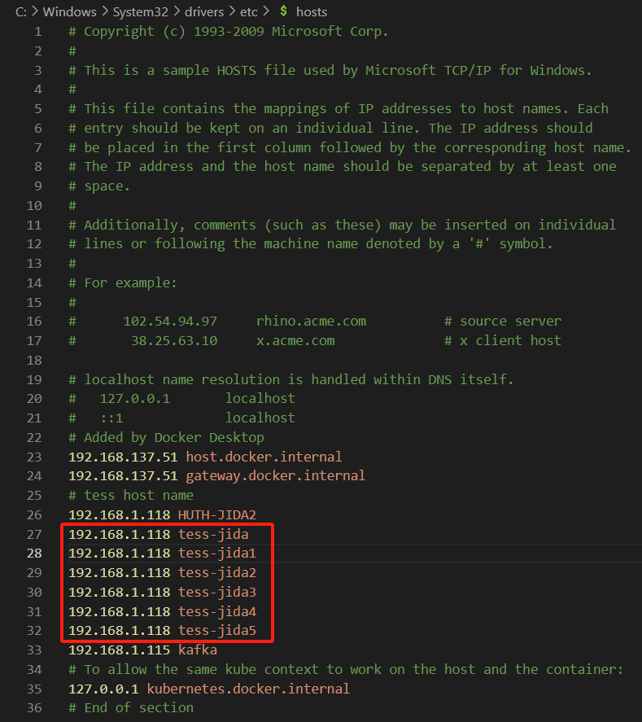
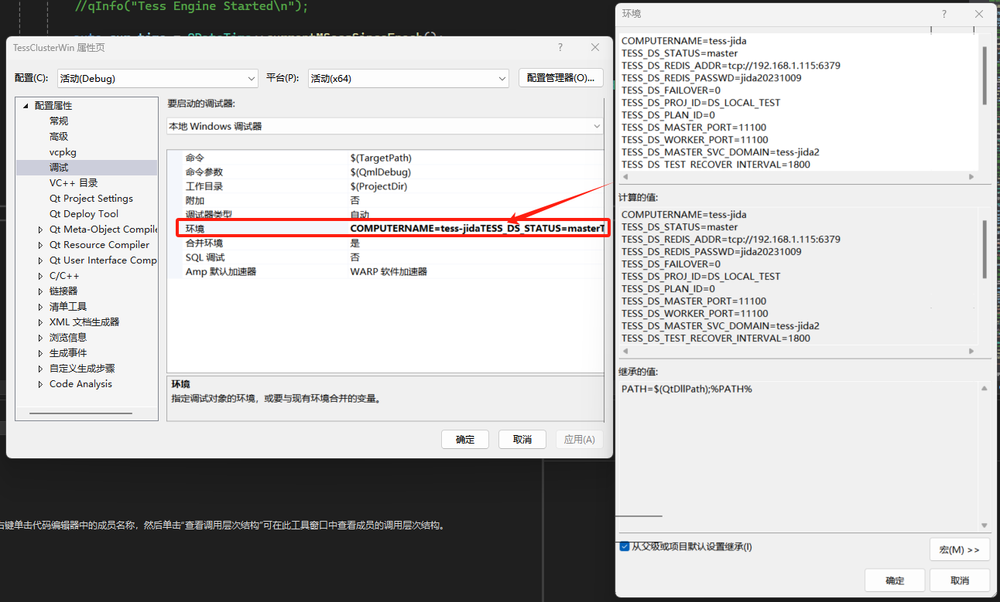
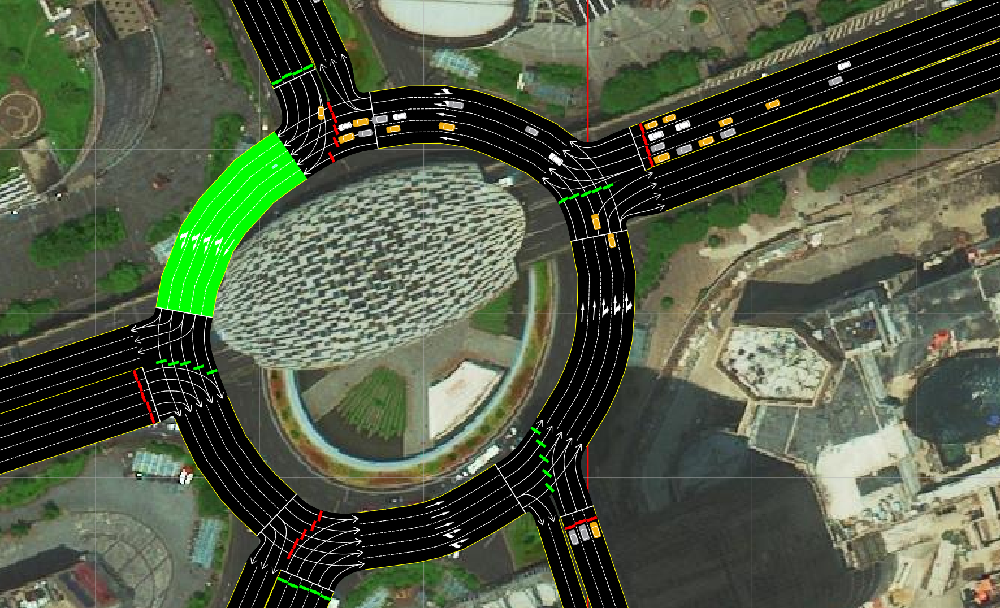
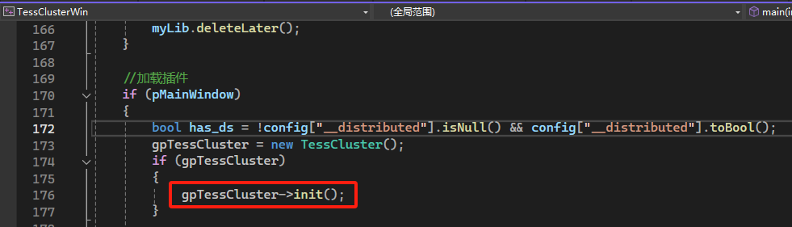

#### VS中debug测试步骤

> 说明：v2.0_k8s*的分支针对k8s开发，本地测试，要临时改动

- 配置多个host
  例如，一个master和5个worker：
  

- VS工程

  - 有界面的启动项目：TessClusterWin

  - 依赖项目：

    > 拉取仓库：https://codeup.aliyun.com/64448f85020eabef3107dd10/cplus_cluster/TessDSDev.git

    - TessCluster：v2.0_k8s_dev分支
    - TessData
    - TessClient
    - TESS_DB, TESS_NET, TESS_SIMU：v3.0.x分支
    - TESS_WIN: master分支

  - TessClusterWin调试配置位置
    

- 配置

  - 配置文件

    - config.json
      - 更改路网地址，*暂时建议使用**没有排队计数器**的路网测试*
    - distributed_config.json
      - 字段`cut_method`设为”custom”，可自定义划分方法；设为“metis”，则使用原有的metis划分方法

  - 环境变量配置

    - 配置位置

      - 脚本中配置

        run_console_*.bat文件

      - VS调试中配置

    - 配置内容

      > 没有注释的部分，不用改

      - master

        ```bash
        # 改成之前配置的host
        COMPUTERNAME=tess-jida
        # master或者worker，这里例子是master，改成worker的话，配置参考后面的worker的配置说明
        TESS_DS_STATUS=master
        TESS_DS_REDIS_ADDR=tcp://192.168.1.115:6379
        TESS_DS_REDIS_PASSWD=jida20231009
        TESS_DS_FAILOVER=0
        TESS_DS_PROJ_ID=DS_LOCAL_TEST
        TESS_DS_PLAN_ID=0
        # master和worker的port写一样的
        TESS_DS_MASTER_PORT=11100
        TESS_DS_WORKER_PORT=11100
        # 写成域名
        TESS_DS_MASTER_SVC_DOMAIN=tess-jida
        TESS_DS_TEST_RECOVER_INTERVAL=1800
        TESS_DS_TEST_RECOVER_BACK_DELTA=1500
        TESS_DS_SNAPSHOT_INTERVAL=80
        TESS_DS_MASTER_MIN_PART_CNT=1
        TESS_DS_MASTER_MAX_PART_CNT=100
        TESS_DS_MASTER_SPEC_PART_CNT=2
        TESS_DS_MASTER_MAKE_GRAPH_CONNECTED=1
        # 在线指令的端口，暂时用不到
        TESS_DS_ONLINE_PORT=7788
        TESS_DS_PART_CNT=80
        ```

      - worker 1

        ```bash
        # 改成之前配置的host
        set COMPUTERNAME=tess-jida1
        set TESS_DS_FAILOVER=0
        set TESS_DS_STATUS=worker
        set TESS_DS_REDIS_ADDR=tcp://192.168.1.115:6379
        set TESS_DS_REDIS_PASSWD=jida20231009
        # 和master中配置的保持一样
        set TESS_DS_MASTER_PORT=11100
        # 在master中配置的TESS_DS_WORKER_PORT基础上递增（worker1就加1，worker就加2）
        set TESS_DS_WORKER_PORT=11101
        set TESS_DS_PROJ_ID=DS_LOCAL_TEST
        set TESS_DS_PLAN_ID=0
        set TESS_DS_TEST_RECOVER_INTERVAL=1800
        set TESS_DS_TEST_RECOVER_BACK_DELTA=1500
        set TESS_DS_SNAPSHOT_INTERVAL=60
        # 写成域名
        set TESS_DS_MASTER_SVC_DOMAIN=tess-jida1
        # 在master中配置的TESS_DS_ONLINE_PORT基础上递增（worker1就加1，worker就加2）
        set TESS_DS_ONLINE_PORT=7789
        ```

- 启动流程

  - 开启master，例如在VS中启动master
    - 启动TessClusterWin
  - 启动worker，例如启动2个
    - 分别运行：run_win_worker.bat和run_win_worker2.bat
      **依次启动，完全打开路网，再运行下一个**

  - 都就绪后，master中点击开始仿真
    

    启动后，可看到划分后不同颜色标记的分割图：

    

  - worker各自仿真其部分：
    
    

#### 开发说明

- 加载自己的二次开发插件（TessClusterWin中已有MyPlugin），其中net和simulator两个对象类型为：TessCluster/Distributed/DSDevApi.h中的DSCustomerNet和DSCustomerSimulator

  ```cpp
  class MyNet : public DSCustomerNet {
  public:
      //加载完路网后的行为
  	void dsAfterLoadNet() override;
      // ... ...
  }
  
  class MySimulator : public DSCustomerSimulator {
  public:
      //仿真前的准备
      void dsBeforeStart(bool& keepOn) override;
      //仿真结束后的处理
      void dsAfterStop() override;
      // ... ...
  }
  ```

- 路网快照

  - 在NetSnapshot.proto中写**NetSnapshot**的定义

  - 继承TessCluster/SnapshotHelper类，重写以下方法：

    ```cpp
    virtual bool createNetSnapshot(google::protobuf::Message* snapshot);
    virtual bool recoverNetSnapshot(const google::protobuf::Message* snapshot);
    ```

  - 赋值给gpSnapshotHelper

    - 在gpTessCluster初始化之前赋值：

      

- 路网划分
  - 继承TessCluster/Graph/ICutGraphMethod类，重写相关方法
    - 将CutGraphWithMetis类源码复制一份，重命名类名即可
  - 在`dsAfterLoadNet()`方法中，调用`gpConjDsWithTess->mpTessGraph->setCutGraphMethod(new 自己重命名的方法类);`