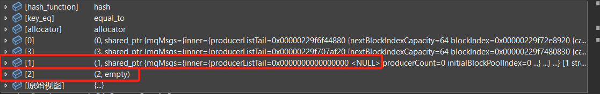

#### Plan

- master, worker容灾测试

  - ~~bug1：master启动，worker1启动，worker2启动，启动仿真，master关闭，master恢复，worker3启动，worker1关闭。~~

    - 问题：worker2恢复后，不能继续仿真。worker2恢复后，master成功添加了worker2，但是没有发送任务~~
      - 原因：master重启后，Tess引擎没有启动
      - 若干bugs，**已解决**
    - 问题：worker3崩溃（偶发）

  - ~~bug2：master启动，worker1启动，worker2启动，启动仿真，master关闭，master恢复，worker3启动，worker1关闭，worker2关闭，再恢复一个worker。~~

    - 问题：worker2崩溃：

      - conj->mOutgoingGraphNodeId2Vehi中有**空指针**数据

      - ```cpp
        // handleVehiOutSection中的virtual_vehi为空
        auto virtual_vehi = mhVirtualVehicles[outSecId][lane_id];
        // outSecId=17，lane_id=51，17应该是内部结点
        ```

      - 错误点：graph node信息不对

        ```json
        // 正确的信息：
        graph_node_map {
            key: 1
            value {
              graph_node_id: 1
              vertex_ids: 1
              vertex_ids: 5
              vertex_ids: 4
              vertex_ids: 15
              vertex_ids: 7
              vertex_ids: 6
              vertex_ids: 14
              vertex_ids: 3
              vertex_ids: 8
              to_node_id_2_link_id {
                key: 2
                value {
                  vids: 13
                  vids: 9
                }
              }
            }
          }
        
        // 错误的信息
        graph_node_map {
            key: 1
            value {
                graph_node_id: 1
            	// link id不对
                //vertex_ids: 9
                //vertex_ids: 17
                //vertex_ids: 16
                //vertex_ids: 2
                //vertex_ids: 10
                //vertex_ids: 12
                //vertex_ids: 11
                //vertex_ids: 13
                vertex_ids: 1
                vertex_ids: 5
                vertex_ids: 4
                vertex_ids: 15
                vertex_ids: 7
                vertex_ids: 6
                vertex_ids: 14
                vertex_ids: 3
                vertex_ids: 8
                to_node_id_2_link_id {
                    key: 2
                    value {
                        vids: 13
                        vids: 9
                    }
                }
        		// 多余
                from_node_id_2_link_id {
                	key: 1
                    value {
                        vids: 13
                        vids: 9
                    }
                }
            }
        }
        ```

  - ~~bug3：master启动，worker1启动，worker2启动，启动仿真，master关闭，master恢复，worker3启动，worker1关闭，worker2关闭，再恢复一个worker，再关掉worker3，再启动一个worker。~~

    - 问题：另一个worker崩溃了
      描述：

      1. update node id结果不对
         ```sh
         after node ids updated: node ids:
         0
         3 # 不应该存在
         1
         2
         ```

      2. 调用`DSNodeManager::getNodeByCommuId("DS_TEST:0:worker:1")`时：
         
         1和2刚好是被更新的，数据都有问题，一个是nullptr，一个empty

    - 看起来修复了

  - ~~bug4：master启动，worker1启动，worker2启动，worker3启动，启动仿真，master关闭，worker1关闭，master恢复，worker1恢复~~

    - 问题：master启动后没有区分是否是恢复，将redis数据全删了。

  - bug5：master启动，worker1启动，worker2启动，master关闭，master恢复，启动仿真

    - 问题：启动失败，没反应

    - 原因：启动前，没有保存已连接的worker，恢复后，连接的worker，也没有记录它们；即使记录了它们，可能也无法继续，因为worker的req_new已经发过了（见改进2）

    - ~~？解决方法1：不对worker拍快照，连上的有确定node id的结点（日后可以做加密认证之类的），记录为worker。~~

    - ？解决方法2：不对worker拍快照，让worker重发req_new，再从stranger转为worker。

      这个方法，在这里没问题，在已经开始仿真运行的阶段，worker重连上master，是不一定会发送消息的，即使发了消息，会走由stranger转worker的方法，这肯定会造成错误。
    
    - 解决方法2改进：保留现有的对worker拍快照的地方，那么参与进任务的worker都有快照，其它未分配任务的worker，不保存其信息，让其从stranger开始。（有问题，可能worker new已发送，已被分配worker node id，若不保存，之后有新worker进来会重复分配id，导致有两个worker在发信息）
    
    - 解决方法3：只要workers记录有变动，就拍快照（但也有可能会拍失败，漏掉一次记录）。
    
      **worker_mgr，job_mgr，worker_job_mgr所有有改动的地方：**
    
      - DSWorkerNodeManager::==doOnHbTimeout==: 
        - worker_mgr:
          - removeNode: 删除一个node
          - afterRemoveNode-->recycleWorkerNodeId: 回收一个node id
        - worker_job_mgr:
          - signal nodeEdited-->包含DSNodeJobManager::==removeRelationByNodeId==: worker和job的关系删除
          - mhJobExtraInfo更新
        - job_mgr:
          - **包含**afterRemoveRelationByNodeId
      - JobManager: addJob:
        - job_mgr: 增加job
      - JobManager: updateJob:
        - job_mgr: job更新
        - **包含**：clearRelationsOfJob
      - JobManager: updateJobStatus
        - job_mgr: job状态更新
      - JobManager: removeJob
        - **包含**：removeJobPrivate
      - JobManager: clearJobs
        - **包含**：removeJobPrivate
      - JobManager: addRelation
        - job_mgr: job的相关联信息更新
      - JobManager: removeRelation、clearRelationsOfJob
        - job_mgr: 移除关系
      - JobManager: assignGraphNodeIdToSimuJob
        - job_mgr: job的graph node id更新
      - JobManager: genRelationsOfSimuJobs
        - **包含**addRelation
      - JobManager::removeJobPrivate：
        - **包含**clearRelationsOfJob
        - 移除job
        - signal: jobEdited-->DSNodeJobManager::doOnJobEdited-->**包含**removeRelationByJobNum
      - DSNodeJobManager::addRelation
        - node_job_mgr: 添加job和node的关系
      - DSNodeJobManager::removeRelationByJobNum
        - node_job_mgr: 移除任务关系
      - DSWorkerNodeManager::==changeStrangerToNormal==:
        - worker_mgr:
          - 使用一个node id
          - 添加一个node
      - DSWorkerJobManager::assignJobToWorker:
        - **包含**addRelation
        - job_mgr：job状态更新
        - worker_mgr：【可能】worker设置bNeedRecover
      - DSWorkerJobManager::tryAssignAllJobsToWorkers:
        - **包含**assignJobToWorker
      - DSWorkerJobManager::updateWorkerStatusAndAffectJobs：
        - job_mgr: 若干job的状态更新
        - worker_mgr: 一个worker的状态更新
      - DSWorkerJobManager::afterRemoveRelationByNodeId：
        - worker_job_mgr: JobExtraInfo更新
        - job_mgr: job状态更新
      - DSMaster::run:
        - `gDSConfig.mPartCnt==0`时，成功执行代码段时：
          - JobManager:
            - **包含**==assignGraphNodeIdToSimuJob==
            - **包含**==addJob==
            - **包含**==genRelationsOfSimuJobs==
          - worker_job_mgr: 
            - ==JobExtraInfo更新==
              **（这个所有的地方都要考虑吗？）**
        - 尝试分配任务：
          - worker_job_mgr:
            - **包含**==tryAssignAllJobsToWorkers==
        - 收到WORKER_READY时：
          - worker_job_mgr:
            - **包含**==updateWorkerStatusAndAffectJobs==

- 保存master的kafka消费者的client id；设置手动保存offset
  - 修改TessClient？
    - 取消掉本地缓存：consumer拉一次，读一次，处理完，提交一次offset

- ~~改进1：保证线程安全，解决一下数据竞争的问题~~

- 改进2：类似于changeStrangerToNormal()，存在俩阶段的地方，若进行到一半的时候挂掉，再恢复，那么这个stranger可能一直是stranger，因为stranger的req_new不会再发。
  - ？改正：stranger迟迟未收到resp_new，再重发
  
- 改进3：恢复仿真时，不存在的batch inc data，可否略过它，不报错。
  可允许丢失批次的增量数据，对以后的redis异步备份可能有利。

- 备份：快照异步抓取
  - 方法：
    - linux下使用fork，另起进程抓取
    - batch inc data在抓快照的同时，也要保存。
      因为异步拍快照时，仿真在进行，这时快照要是没拍完成就挂了，恢复时会少一帧。

- health check

  ```sh
  docker run -it --rm -v /mnt/d/TessDS/Data/sz.tess:/root/tessng/Data/UserNets/roadnet.tess --net=host --env TESS_DS_REDIS_ADDR="tcp://127.0.0.1:6380" --health-cmd="./health-check" --health-interval=10s tess_ds2:x86_healthcheck_test_20231215
  ```

  - worker的健康的判断逻辑
    1. 检查与master是否通信顺畅：比如检测其端口是否可连
    2. 检查与nbr的通信，同上
  - master的健康判断逻辑
    1. 在线接口的通信是否通畅：比如检测其端口是否可连

#### Before 12.30 Plan:

- 专利

  - 添加检索关键词
  - 权利要求说明书，分几条说明关键的**技术**和**方法**，细分几点说明其**步骤**或**更细的关键点**
  - 说明书
    - 修改说法，确保准确
    - 背景里，说明：需求（为什么要有这个），这个有什么不同之处。
  - 说明书配图
    - 边缘道路再弄的准确一些：两个子图中都要有
    - 添加容灾、负载均衡的图
  - 具体措施
    - 负载均衡中的子图的权值还未添加
    - 添加措施：实际项目的说明，不用具体到图划分等，描述**大的步骤**以及**效果**。
      实际项目可以选南京路网，添加一些**二次开发逻辑**的表现。

  - 相似专利和论文对比
    - 专利可以搜一下
    - 论文不好搜

- 软著？

  - 对1.0代码进行整理

- TessDS V2.0测试

  - 继续测不带容灾的版本，复现偶发bug
  - 搭建k8s，初步测试下容灾？

- TessDS V2.0完善

  - 对在线路网编辑的支持
    - 不要在afterLoadNet那里buildGraph，移动到开始仿真前
  - 对指定切分数的支持
    - 添加参数：最小切分数，最大切分数
    - 继续使用已有的part_cnt参数
  - 在线指令对分布式的支持
    - 目前来看，还行，可能需要添加“ds”标识，对这样的指令，将其分发给分布式模块处理；
      对通常的指令，添加对分布式环境下的考虑，考虑是否要分发给分布式模块等。
  - 对局部路网仿真的支持
    - 指定需要仿真的部分路段
    - 额外：指定每个worker的划分

  - 额外需求：路网的快照，以及master保存，worker读取
  
  - master对worker的旧快照做统一删除