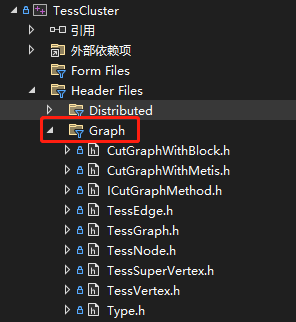

#### 路网划分，可以使用Graph下的接口：



```cpp
auto pTessGraph = TessGraph::BuildTessGraph();
auto cutWithMetis = new CutGraphWithMetis();
pTessGraph->setCutGraphMethod(cutWithMetis);
// pTessGraph->buildDefaultLayer();
pTessGraph->buildDefaultLayer2();
// cutWithMetis->initGraphWithLayer("default");
cutWithMetis->initGraphWithLayer("default2");
ok = pTessGraph->cutGraph();
```

- `buildDefaultLayer()`

  一个基本路段为图节点，构造的图层

- `buildDefaultLayer2()`

  一个面域中的连接段的`src`路段为一个super点，构造的图层

#### 划分结果

保存在`pTessGraph->mhNodesMap`中，每个node都记录了点和邻接点信息：
```cpp
class TessNode {
public:
	// 结点所对应的子图中的结点
	std::unordered_set<long> mVertexSet;
    // 邻接点id
	std::unordered_set<int> mNbrIdSet;

	// 下游Tess结点id: 下游Tess结点中的边界点ids
	std::unordered_map<long, std::unordered_set<long>> mhToNodeId2LinkId;
	// 上游Tess结点id: 本结点中作为下游的边界点ids
	std::unordered_map<long, std::unordered_set<long>> mhFromNodeId2LinkId;

	int mNodeId;
};
```


```sh
-no-feature-dnslookup -no-feature-dom -no-feature-ftp -no-feature-getifaddrs -no-feature-gssapi -no-feature-http -no-feature-ipv6ifname -no-feature-itemmodeltester -no-feature-linuxfb -no-feature-openssl -no-feature-openssl-runtime -no-feature-printer -no-feature-printpreviewwidget -no-feature-system-proxies -no-feature-system-zlib -no-feature-testlib -no-feature-udpsocket -no-pch -skip qt3d -skip qtactiveqt -skip
```

-feature-xcb-glx -feature-xcb-glx-plugin -feature-egl -feature-egl_x11 -feature-xcb-egl-plugin 

-feature-xkbcommon-x11  -feature-thread

```sh
./configure -confirm-license -opensource -release  -prefix /root/QT5.15.4/build -xcb -feature-xkbcommon -feature-xkbcommon-x11 -feature-xcb-xlib -feature-xlib  -feature-thread -no-zlib -nomake examples -no-pch -skip qt3d -skip qtactiveqt -nomake tests -skip qtandroidextras -skip qtcanvas3d -skip qtcharts -skip qtcoap -skip qtconnectivity -skip qtdatavis3d -skip qtdeclarative -skip qtdoc -skip qtfeedback -skip qtgamepad -skip qtgraphicaleffects -skip qtimageformats -skip qtknx -skip qtlocation -skip qtlottie -skip qtmacextras -skip qtmqtt -skip qtmultimedia -skip qtnetworkauth -skip qtopcua -skip qtpim -skip qtpurchasing -skip qtqa -skip qtquick3d -skip qtquickcontrols -skip qtquickcontrols2 -skip qtquicktimeline -skip qtremoteobjects -skip qtrepotools -skip qtscript -skip qtscxml -skip qtsensors -skip qtserialbus -skip qtserialport -skip qtspeech -skip qtsvg -skip qtsystems -skip qttools -skip qttranslations -skip qtvirtualkeyboard -skip qtwayland -skip qtwebchannel -skip qtwebengine -skip qtwebglplugin -skip qtwebsockets -skip qtwebview -skip qtwinextras -skip qtx11extras -skip qtxmlpatterns
```


```sh
./configure -confirm-license -opensource -release  -prefix /root/QT5.15.4/build  -system-libjpeg -xcb -xkbcommon -feature-xcb-glx -qt-zlib -nomake examples -nomake tests -nomake tools -skip qt3d -skip qtactiveqt -skip qtandroidextras -skip qtcanvas3d -skip qtcharts -skip qtcoap -skip qtconnectivity -skip qtdatavis3d -skip qtdeclarative -skip qtdoc -skip qtfeedback -skip qtgamepad -skip qtgraphicaleffects -skip qtimageformats -skip qtknx -skip qtlocation -skip qtlottie -skip qtmacextras -skip qtmqtt -skip qtmultimedia -skip qtnetworkauth -skip qtopcua -skip qtpim -skip qtpurchasing -skip qtqa -skip qtquick3d -skip qtquickcontrols -skip qtquickcontrols2 -skip qtquicktimeline -skip qtremoteobjects -skip qtrepotools -skip qtscript -skip qtscxml -skip qtsensors -skip qtserialbus -skip qtserialport -skip qtspeech -skip qtsvg -skip qtsystems -skip qttools -skip qttranslations -skip qtvirtualkeyboard -skip qtwayland -skip qtwebchannel -skip qtwebengine -skip qtwebglplugin -skip qtwebsockets -skip qtwebview -skip qtwinextras -skip qtbase -skip qtxmlpatterns
```


-no-feature-localserver -no-feature-networkdiskcache -no-feature-networkinterface -no-feature-networkproxy


yum install libfontconfig1-devel libfreetype6-devel libx11-devel libx11-xcb-devel libxext-devel libxfixes-devel libxi-devel libxrender-devel libxcb1-devel libxcb-glx0-devel libxcb-keysyms1-devel libxcb-image0-devel libxcb-shm0-devel libxcb-icccm4-devel libxcb-sync0-devel libxcb-xfixes0-devel libxcb-shape0-devel libxcb-randr0-devel libxcb-render-util0-devel libxcd-xinerama-devel libxkbcommon-devel libxkbcommon-x11-devel

sudo yum install libxcb libxcb-devel libXrender libXrender-devel xcb-util-wm xcb-util-wm-devel xcb-util xcb-util-devel xcb-util-image xcb-util-image-devel xcb-util-keysyms xcb-util-keysyms-devel

LLVM_INSTALL_DIR

安装pyside2 in arm：

> https://blog.csdn.net/l550802356/article/details/126425324


```sh
/usr/bin/c++ -fPIC -shared -Wl,-soname,Tessng.so -o Tessng.so CMakeFiles/Tessng.dir/Tessng_autogen/mocs_compilation.cpp.o CMakeFiles/Tessng.dir/Tessng/Tessng_module_wrapper.cpp.o CMakeFiles/Tessng.dir/Tessng/NetItemType_wrapper.cpp.o CMakeFiles/Tessng.dir/Tessng/objint_wrapper.cpp.o CMakeFiles/Tessng.dir/Tessng/objint64_wrapper.cpp.o CMakeFiles/Tessng.dir/Tessng/objlong_wrapper.cpp.o CMakeFiles/Tessng.dir/Tessng/objreal_wrapper.cpp.o CMakeFiles/Tessng.dir/Tessng/objstring_wrapper.cpp.o CMakeFiles/Tessng.dir/Tessng/objbool_wrapper.cpp.o CMakeFiles/Tessng.dir/Tessng/_Link_wrapper.cpp.o CMakeFiles/Tessng.dir/Tessng/_Lane_wrapper.cpp.o CMakeFiles/Tessng.dir/Tessng/_Connector_wrapper.cpp.o CMakeFiles/Tessng.dir/Tessng/_LaneConnector_wrapper.cpp.o CMakeFiles/Tessng.dir/Tessng/_DecisionPoint_wrapper.cpp.o CMakeFiles/Tessng.dir/Tessng/_RoutingFLowRatio_wrapper.cpp.o CMakeFiles/Tessng.dir/Tessng/_VehicleType_wrapper.cpp.o CMakeFiles/Tessng.dir/Tessng/Online_wrapper.cpp.o CMakeFiles/Tessng.dir/Tessng/Online_RoutingFlowRatio_wrapper.cpp.o CMakeFiles/Tessng.dir/Tessng/Online_DecipointFlowRatioByInterval_wrapper.cpp.o CMakeFiles/Tessng.dir/Tessng/Online_VehicleStatus_wrapper.cpp.o CMakeFiles/Tessng.dir/Tessng/Online_VehiclePosition_wrapper.cpp.o CMakeFiles/Tessng.dir/Tessng/Online_VehiInfoCollected_wrapper.cpp.o CMakeFiles/Tessng.dir/Tessng/Online_VehiInfoAggregated_wrapper.cpp.o CMakeFiles/Tessng.dir/Tessng/Online_VehiQueueCounted_wrapper.cpp.o CMakeFiles/Tessng.dir/Tessng/Online_VehiQueueAggregated_wrapper.cpp.o CMakeFiles/Tessng.dir/Tessng/Online_VehiTravelDetected_wrapper.cpp.o CMakeFiles/Tessng.dir/Tessng/Online_VehiTravelAggregated_wrapper.cpp.o CMakeFiles/Tessng.dir/Tessng/Online_SignalPhaseColor_wrapper.cpp.o CMakeFiles/Tessng.dir/Tessng/Online_SignalContralParam_wrapper.cpp.o CMakeFiles/Tessng.dir/Tessng/Online_FollowingModelParam_wrapper.cpp.o CMakeFiles/Tessng.dir/Tessng/Online_DynaVehiParam_wrapper.cpp.o CMakeFiles/Tessng.dir/Tessng/Online_VehiComposition_wrapper.cpp.o CMakeFiles/Tessng.dir/Tessng/Online_DispatchInterval_wrapper.cpp.o CMakeFiles/Tessng.dir/Tessng/Online_DynaRoadWorkZoneParam_wrapper.cpp.o CMakeFiles/Tessng.dir/Tessng/Online_DynaAccidentZoneParam_wrapper.cpp.o CMakeFiles/Tessng.dir/Tessng/Online_Location_wrapper.cpp.o CMakeFiles/Tessng.dir/Tessng/IRoadNet_wrapper.cpp.o CMakeFiles/Tessng.dir/Tessng/IBusLine_wrapper.cpp.o CMakeFiles/Tessng.dir/Tessng/IBusStation_wrapper.cpp.o CMakeFiles/Tessng.dir/Tessng/IBusStationLine_wrapper.cpp.o CMakeFiles/Tessng.dir/Tessng/IConnector_wrapper.cpp.o CMakeFiles/Tessng.dir/Tessng/IConnectorArea_wrapper.cpp.o CMakeFiles/Tessng.dir/Tessng/IDecisionPoint_wrapper.cpp.o CMakeFiles/Tessng.dir/Tessng/IDispatchPoint_wrapper.cpp.o CMakeFiles/Tessng.dir/Tessng/ILane_wrapper.cpp.o CMakeFiles/Tessng.dir/Tessng/ILaneConnector_wrapper.cpp.o CMakeFiles/Tessng.dir/Tessng/ILaneObject_wrapper.cpp.o CMakeFiles/Tessng.dir/Tessng/ilink_wrapper.cpp.o CMakeFiles/Tessng.dir/Tessng/ISection_wrapper.cpp.o CMakeFiles/Tessng.dir/Tessng/IRouting_wrapper.cpp.o CMakeFiles/Tessng.dir/Tessng/ISignalGroup_wrapper.cpp.o CMakeFiles/Tessng.dir/Tessng/ISignalPhase_wrapper.cpp.o CMakeFiles/Tessng.dir/Tessng/isignallamp_wrapper.cpp.o CMakeFiles/Tessng.dir/Tessng/IVehicleDrivInfoCollector_wrapper.cpp.o CMakeFiles/Tessng.dir/Tessng/IVehicleQueueCounter_wrapper.cpp.o CMakeFiles/Tessng.dir/Tessng/IVehicleTravelDetector_wrapper.cpp.o CMakeFiles/Tessng.dir/Tessng/ivehicle_wrapper.cpp.o CMakeFiles/Tessng.dir/Tessng/ivehicledriving_wrapper.cpp.o CMakeFiles/Tessng.dir/Tessng/IVehicleSupervisor_wrapper.cpp.o CMakeFiles/Tessng.dir/Tessng/IVehicleDrivingTask_wrapper.cpp.o CMakeFiles/Tessng.dir/Tessng/IVehicleDrivingManagerTask_wrapper.cpp.o CMakeFiles/Tessng.dir/Tessng/CustomerNet_wrapper.cpp.o CMakeFiles/Tessng.dir/Tessng/CustomerSimulator_wrapper.cpp.o CMakeFiles/Tessng.dir/Tessng/PyCustomerNet_wrapper.cpp.o CMakeFiles/Tessng.dir/Tessng/PyCustomerSimulator_wrapper.cpp.o CMakeFiles/Tessng.dir/Tessng/TessPlugin_wrapper.cpp.o CMakeFiles/Tessng.dir/Tessng/TessngFactory_wrapper.cpp.o CMakeFiles/Tessng.dir/Tessng/TessInterfaces_wrapper.cpp.o CMakeFiles/Tessng.dir/Tessng/tessinterface_wrapper.cpp.o CMakeFiles/Tessng.dir/Tessng/GuiInterface_wrapper.cpp.o CMakeFiles/Tessng.dir/Tessng/netinterface_wrapper.cpp.o CMakeFiles/Tessng.dir/Tessng/simuinterface_wrapper.cpp.o /root/TessngPub_Win/libTessInterfaces.so.2 /root/TessngPub_Win/libTESS_WIN.so.2 /opt/conda/envs/py3.8/lib/python3.8/site-packages/shiboken2/shiboken2.cpython-38-aarch64-linux-gnu.so /root/TessngPub_Win/libTessInterfaces.so.2 /root/TessngPub_Win/libTESS_WIN.so.2 /root/QT5.15.4/build/qt_install/lib/libQt5Widgets.so.5.15.4 /root/QT5.15.4/build/qt_install/lib/libQt5Gui.so.5.15.4 /root/QT5.15.4/build/qt_install/lib/libQt5Core.so.5.15.4 
```


```json
RD_KAFKA_RESP_ERR__UNKNOWN_TOPIC
```

