## Triangles

### 光栅化方法

#### 采样

##### 方法

- 判断像素中心点是否在三角形内部

上图是个坐标系，每个像素点都坐落在其内，一个像素点的中心点坐标等于`(像素点在水平轴上的的idx+0.5，像素点在垂直轴上的的idx+0.5)`:

- 暴力方法：

	伪代码：

	

	- 遍历屏幕中所有的像素点

	- `inside`函数返回0或1，1代表在三角形内部

		- 将三角形上的向量按照一定顺序差乘，例如：P~0~P~1~，P~1~P~2~，P~2~P~0~分别差乘P~0~P~Q~，P~1~P~Q~，P~2~P。
			通过得到z的正负值，来判断P~x~P~y~向P~x~P~Q~是顺时针还是逆时针旋转，从而判断Q是在P~x~P~y~的左边还是右边。三组差乘得到的结果都是相同方向的话，则Q在内部。

			- Edge Case：在边上：

			

			特殊处理

-  优化方法1：
	添加包围盒：

	

	

-  优化方法2：
	算出三角形的每一行中的Xmin和Xmax：
	

### 反走样

#### 走样：

- Artifacts（采样中会生的问题）

	- 例子

		

	- 原因：

		

		信号量太大，采样太慢。

#### 反走样思想：

- 在采样前使用滤波，即先模糊

- 在模糊后的图形基础上采样

#### 理论

##### Frequency Domain（频域）

- 频率

	

- 傅立叶级数展开：
	将任意周期函数变为：由若干三角函数组成的线性表达式。分解成频率由低到高的函数组合

	

- 傅立叶变换 
	

​	f(x)变换为F(w)，并且F(w)可以变换回来。

- 采样和走样，走样的定义

	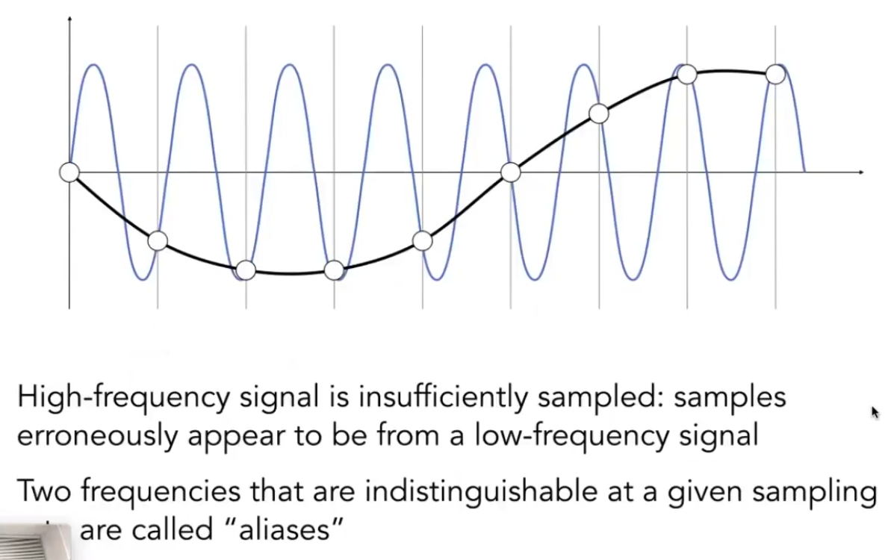

	**使用相同的采样频率去采样不同的信号函数，得到的采样结果相同，那么说明采样发生走样。**

- Filtering（滤波）

	去掉一些特定频率的信号

	- 图像转成信号表示：

		使用傅立叶变换，将信号从时域转到频域

		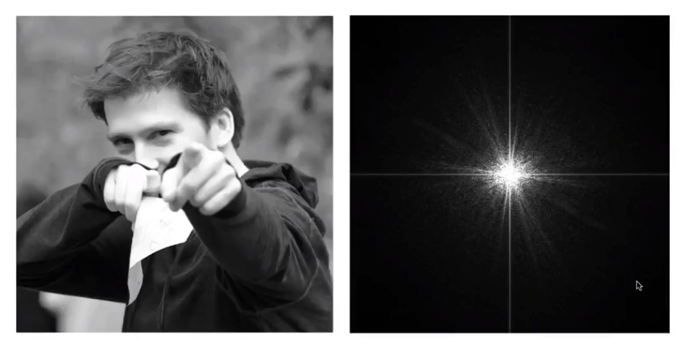

		右边图像，是左图的高低频展示，越靠近中心代表频率越低

	- 高通滤波

		只有高频信号可以通过

		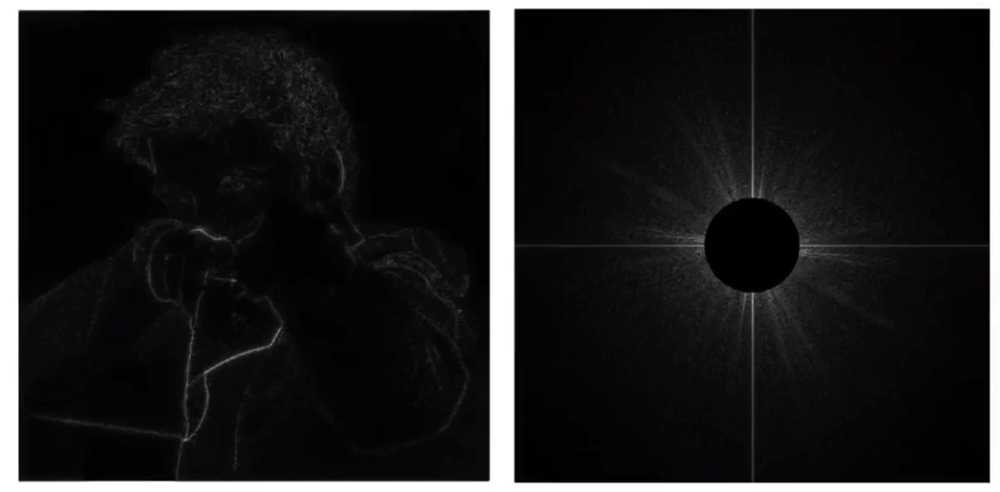

		中间的低频都被抹去了。

	- 低通滤波

		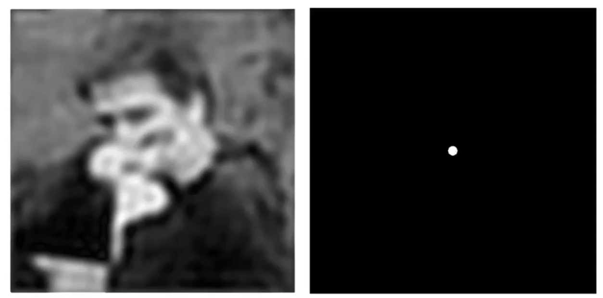

	- 滤波=卷积=平均

- 卷积

	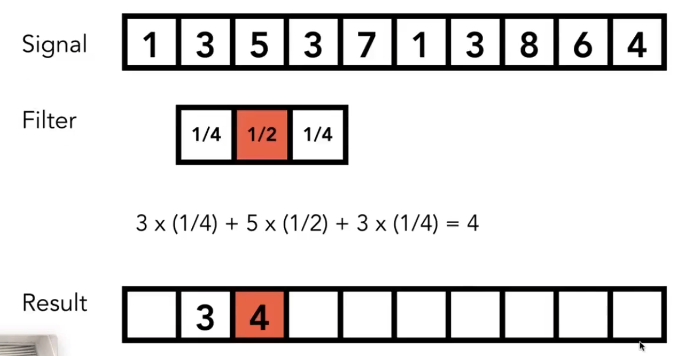

	移动，做周围几个数的加权平均。

	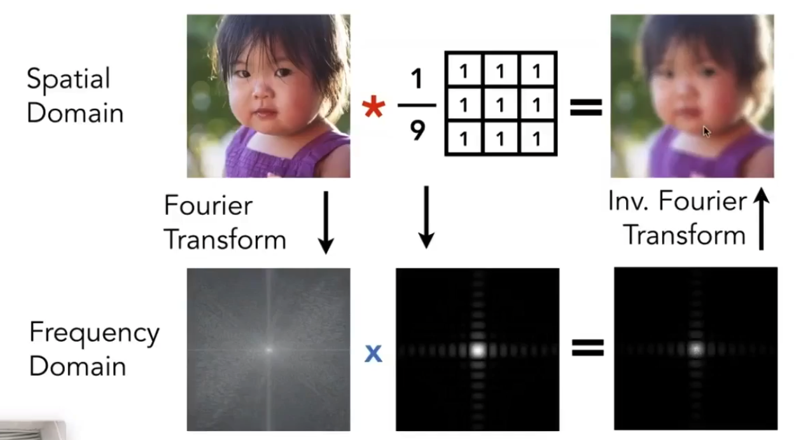

	**通过卷积使空间域（时域）与频域互换。空间域上的卷积操作转换为频域上的操作：**

	- 空间域上的卷积操作：

		将像素点周边9个点求平均

	- 转换为频域上的操作：
		- 将原图和3x3的矩阵通过傅立叶变换转换为频域上的表示
		- 再将转换后的两者相乘，得到的结果就是空间域变化后的结果在频域上的表示，此时通过逆傅立叶变换就可以转换为空间域上的图。

	*其中的3x3的频域谱相当于低通滤波器：*

	- Box Filter

		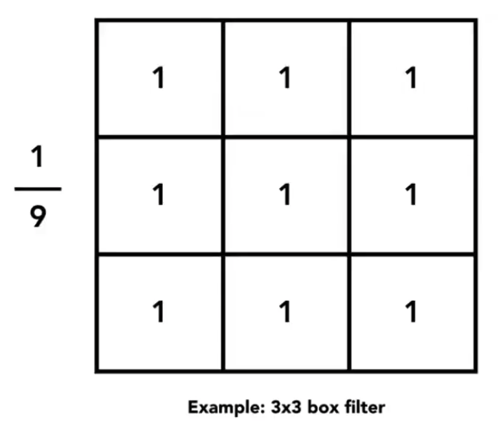

- 采样：即频域谱的重复：
	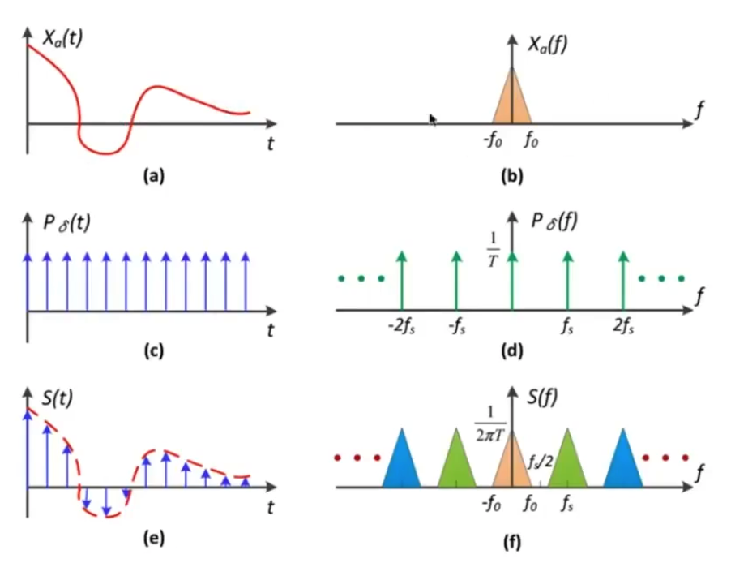

​	图c是冲激函数；图d由图c傅立叶变换得到，图b乘图d即得到图f——不断重复的频谱。

- 走样：采样频率不够，导致频谱发生混叠：

	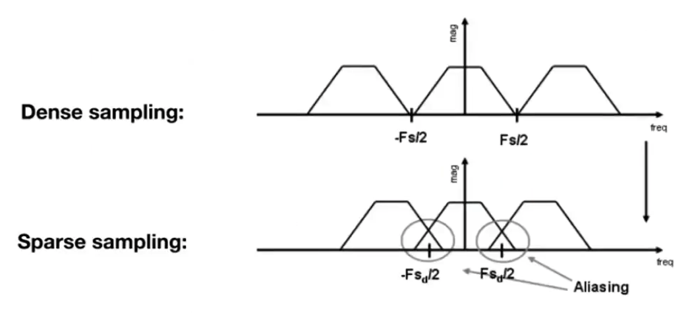

#### 反走样做法

> 高分辨率显示屏：像素密度更高，相同一个三角形，其采样频率就越大，频谱就越稀疏，走样就越小

##### 先模糊，使用低通滤波；然后，再采样：

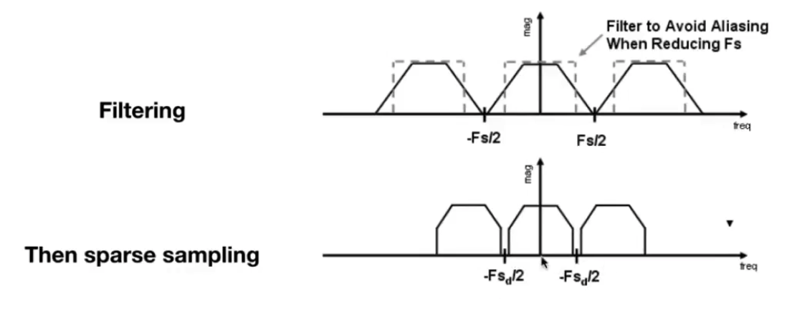

- 对每个频谱：使用一个box进行低通过滤，虚线外的为高频，去掉不要

- 在实际中，低通滤波器，可以选取每个像素，三角形覆盖每个像素的面积的百分比作为卷积值（或平均值），即对inside函数进行卷积化，返回的值不再仅仅是1或0，而是一个百分比区间`[0, 1]`：

	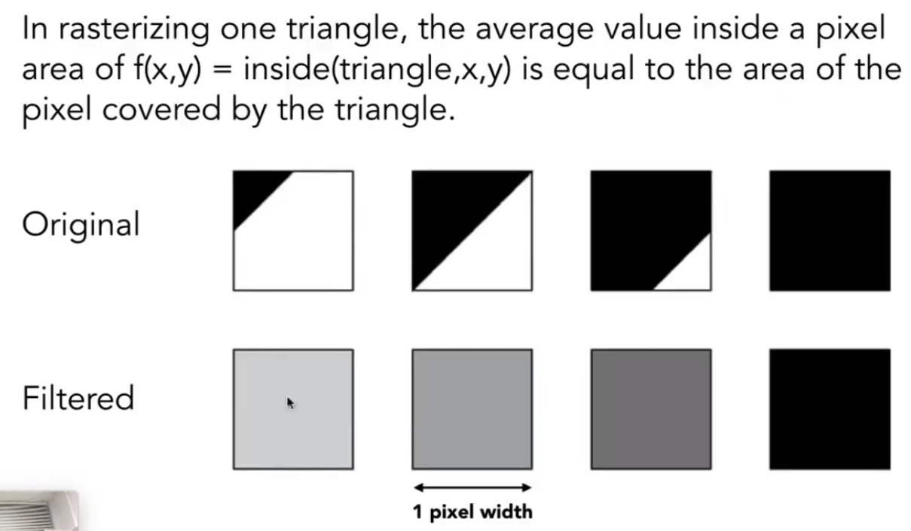

##### MSAA超采样（Supersampling）

精确计算像素内的覆盖面积百分比，太复杂，MSAA可得到近似效果：

即将一个像素细分为多个子像素点，比如2x2：

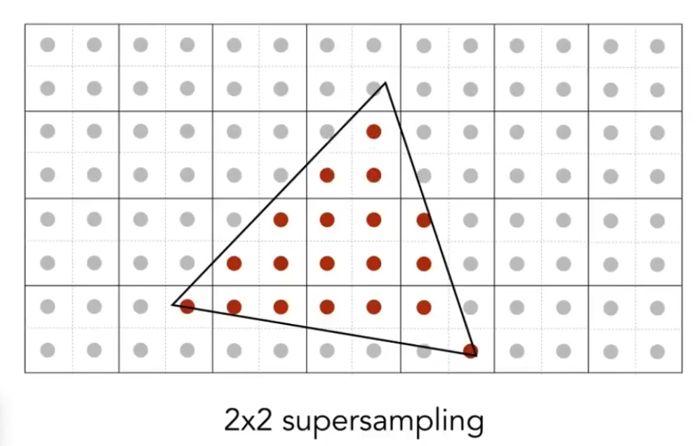

每个像素点的覆盖面积百分比就等于覆盖到的子像素点的百分比：

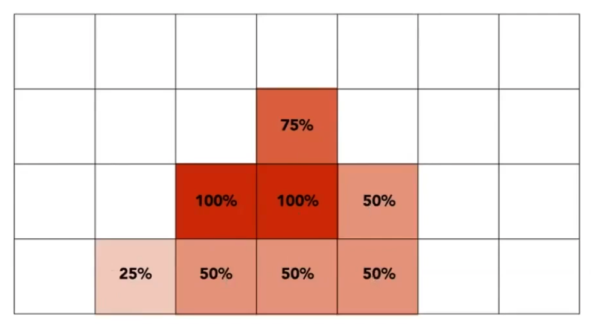

注意：MSAA只是提供了计算单个像素点覆盖面积的便利方法，并不等于提高像素，上图可见，实际采样的像素点没变多。

##### FXAA（Fast Approximate AA）

##### TAA（Temporal AA）

##### 超分辨率

小图变大图

- DLSS

### Z-buffering（深度测试）

#### 画家算法

由远至近来画

问题：下图，无法确定前后关系，相互覆盖了

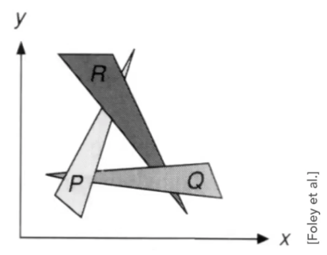

#### Z-buffering概念

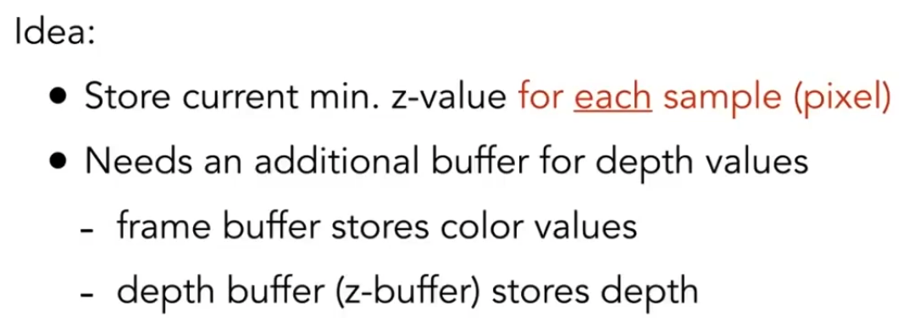
分别存每个像素的颜色和深度信息

如果是MSAA中，每个子像素要对应一个缓存——即每个采样点对应一个缓存

#### 代码

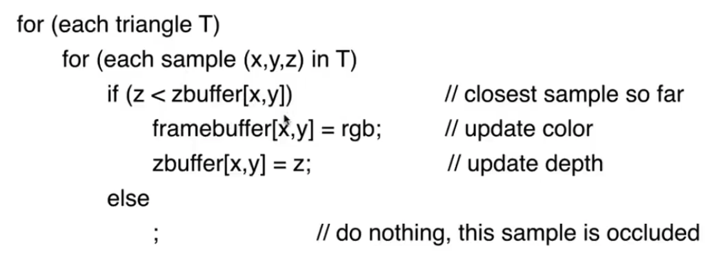