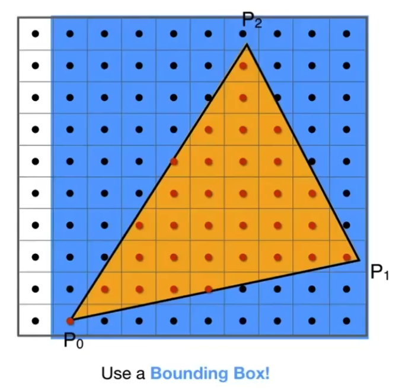
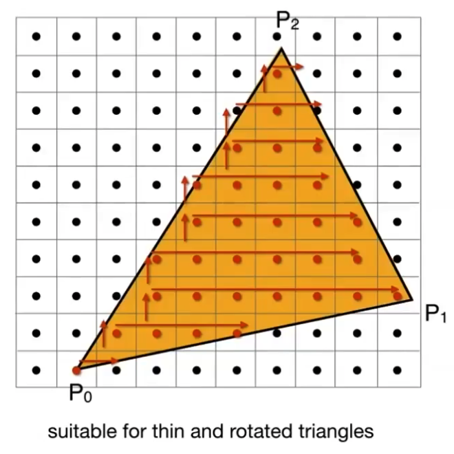

## Triangles

### 光栅化方法

#### 采样

##### 方法

- 判断像素中心点是否在三角形内部

上图是个坐标系，每个像素点都坐落在其内，一个像素点的中心点坐标等于`(像素点在水平轴上的的idx+0.5，像素点在垂直轴上的的idx+0.5)`:

- 暴力方法：

	伪代码：

	

	- 遍历屏幕中所有的像素点

	- `inside`函数返回0或1，1代表在三角形内部

		- 将三角形上的向量按照一定顺序差乘，例如：P~0~P~1~，P~1~P~2~，P~2~P~0~分别差乘P~0~P~Q~，P~1~P~Q~，P~2~P。
			通过得到z的正负值，来判断P~x~P~y~向P~x~P~Q~是顺时针还是逆时针旋转，从而判断Q是在P~x~P~y~的左边还是右边。三组差乘得到的结果都是相同方向的话，则Q在内部。

			- Edge Case：在边上：

			

			特殊处理

-  优化方法1：
	添加包围盒：

	

	

-  优化方法2：
	算出三角形的每一行中的Xmin和Xmax：
	

### 反走样

#### 走样：

- Artifacts（采样中会生的问题）

	- 例子

		

	- 原因：

		

		信号量太大，采样太慢。

#### 反走样思想：

- 在采样前使用滤波，即先模糊

- 在模糊后的图形基础上采样

#### 理论

##### Frequency Domain（频域）

- 频率

	

- 傅立叶级数展开：
	将任意周期函数变为：由若干三角函数组成的线性表达式。分解成频率由低到高的函数组合

	

- 傅立叶变换 
	

​	f(x)变换为F(w)，并且F(w)可以变换回来。