## 旋转矩阵

### 旋转矩阵求解方式

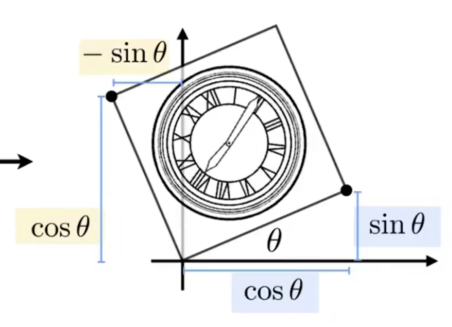

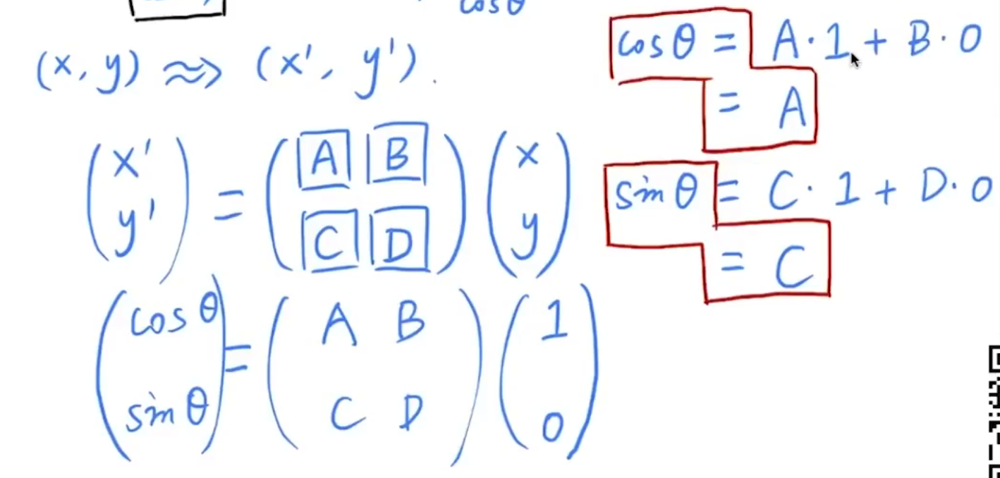

使用特解来求出ABCD，取两个点算出：

- 第一个点：`(cos𝛳, sin𝛳)`，其次矩形长宽分别为1，1。那么令`x'=cos𝛳, y'=sin𝛳`; `x=1, y=1`，得到图中红框中的等式
- 第二个点：`(-sin𝛳, cos𝛳)`，同理，也会得到等式
- 因为有四个解，应该至少取4个点，不过这里特殊，ABCD分别一个等式就可以求出。

**TIPS：**

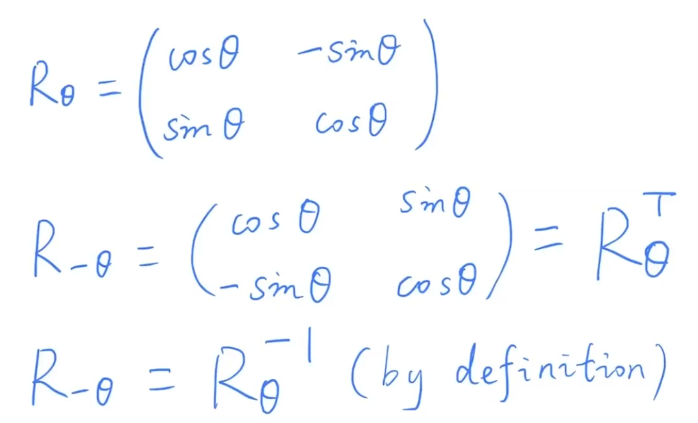

- R~𝛳~：旋转𝛳角度
- R~-𝛳~：反向旋转𝛳角度，
- R~-𝛳~ = R^T^~𝛳~
- R~-𝛳~ * R^T^~𝛳~ = E 。两者是正交矩阵
- R~-𝛳~ = R^-1^~𝛳~

## 齐次坐标

**为了表达平移，旋转矩阵表达不了，可以写成矩阵运算形式，但是是非齐次的。**

### 增加维度

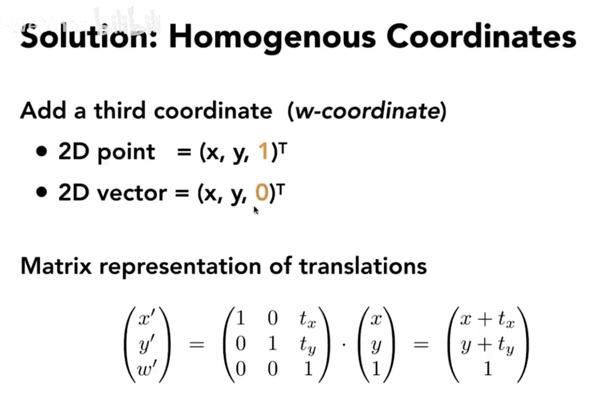

增加的一维，用于表示增加的平移量

- 对于点，增加一维，数字设为1
- 而对于向量，增加的一维，数字设为0

解释：之所以区分点和向量，是因为**向量的平移具有不变性**。而平移一个物体，图片，是点的平移。

### 齐次坐标对点和向量的计算表示

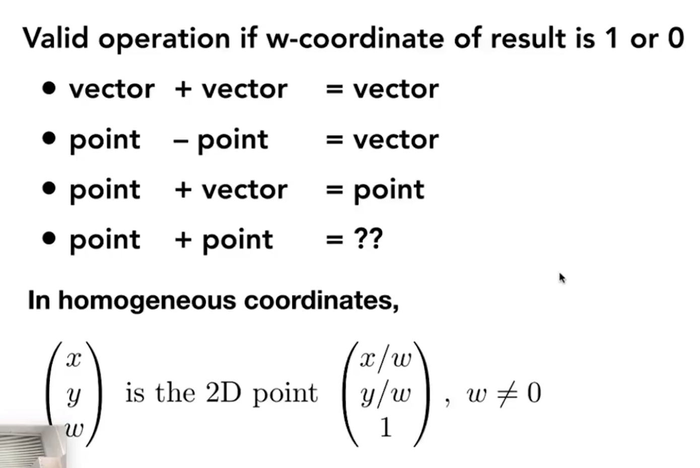

当第三维是0或1时，可以用以上计算：

- 向量+向量：w=0，还是向量

- 点-点：w=0，得到向量

- 点+向量：w=1，得到点

- 点+点：w=2，得到两点的中点：

	因为齐次坐标系中，`(x, y, w)`等于点`(x/w, y/w, 1)`。那么当w=2时，等于点`(x/2, y/2, 1)`，即等价于两点的中点。

## 逆变换

就是乘逆矩阵

## 构造变换矩阵

### 要点：

- 复杂的变换，可以拆分成多个矩阵计算来表示
	比如旋转，可以添加多个旋转矩阵相乘
- 先旋转，再平移
	用Affine(仿射)变换来解释：即`(x', y') = A(x, y) + (tx, ty)`，其中`(tx, ty)`是平移向量，如果先平移再旋转的话，会变成`A((x, y) + (tx, ty))`

### 齐次坐标计算表示

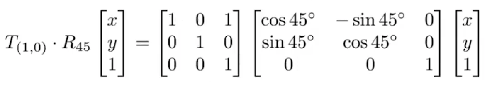

- T~(1,0)~：平移变换矩阵：x平移1个单位，y不动
	图中的矩阵可以理解为：是由单位向量变换得来的，在单位向量的基础上，第一行加上第三行乘1。那么当T~(1,0)~和R~45~相乘时，便会对R~45~起到相同的行计算操作。 
- R~45~：旋转变换矩阵：逆时针旋转45度
- 先旋转，再平移：R~45~放在最靠近坐标点的位置

## 分解复杂变换

#### 先变基，再TR

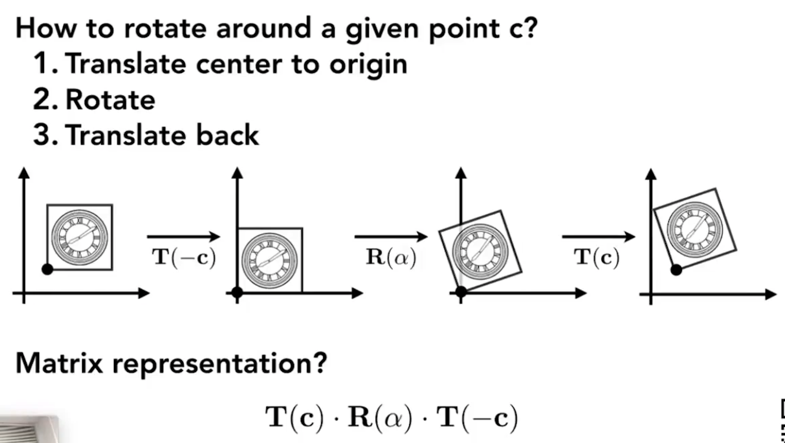

图例中，是以自身上的一点为旋转点，非原点，进行旋转。所以先变基，再旋转平移。

这里TRT应该不和“先旋转再变换”这条冲突，第一步的平移是变基操作，即在用矩阵变换之前，先移动到原点，再旋转平移。

## 3维变换

就是加一维

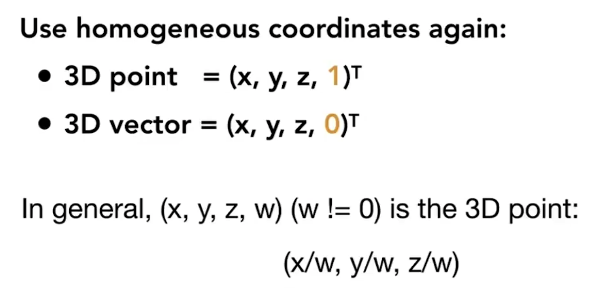

- 

### 3D旋转

#### 绕x,y,z旋转

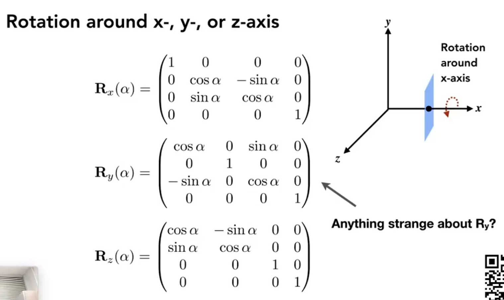

***绕y轴旋转，为什么是负的？***

- x、y、z轴分别利用两外两个轴差乘得到：即xy = z, yz = x, zx = y。即z差乘x得到正向的y轴，但是绕y轴旋转，这里计算是x向z旋转，差乘是xz = -y

#### Euler, Roll, Pitch, Yaw

- Roll：绕z
- Pitch：绕x
- Yaw：绕y

#### Rodrigues旋转公式

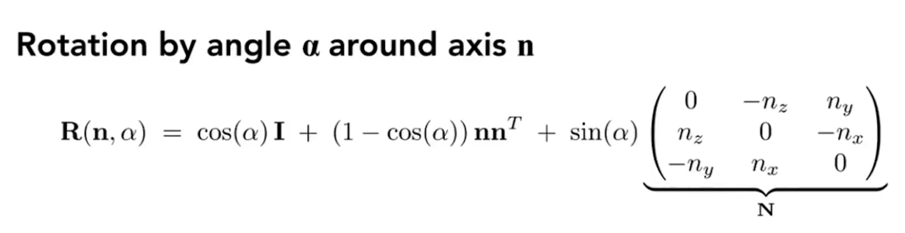

绕任意轴n旋转a角度

## 视图

### MVP变换 

### 

- 在世界中放置好模型
- 放置好摄像机
- 将视图投影成2D画面

 #### 摄像机的位置

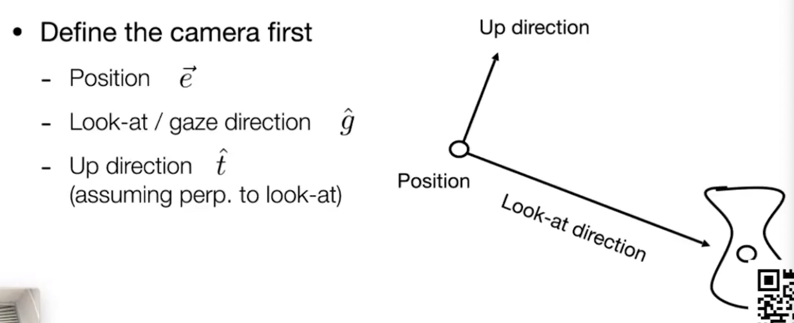

#### 摄像机规范化变换

相机和观察的物体一起移动，得到的画面是一样的，于是可以对相机进行移动和变换（就是将相机物体的坐标系移动到世界坐标系上）：

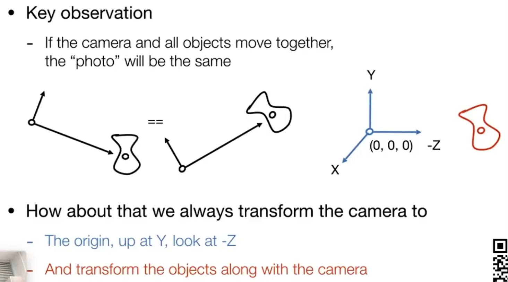

- 位置位于原点
- gaze朝向是沿着-z轴方向
- up方向为y轴

*gaze和up方向可以理解为相机物体坐标系上的两个轴。*

##### 变换方式

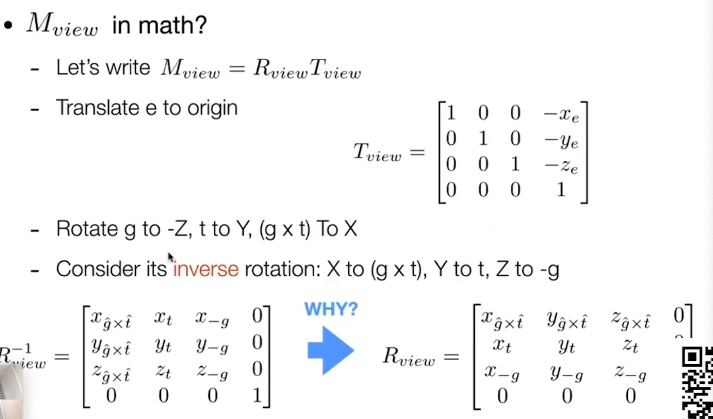

- 变换顺序：
	- 变基，位置移动到原点
	- g轴转到-Z轴上
	- t轴转到Y轴上
	- gxt（即垂直于g和t平面的轴，这里是差乘表示）转到X轴上

- 矩阵计算方法：

	- 先求逆矩阵：
		即从X，Y，-Z轴上变换到gxt，t，g上。
		以X轴上的一点（1，0，0）为例，其经过变换，变成点（x~gxt~, y~gxt~, z~gxt~）可以构造等式求解：

		

	- 将逆矩阵转置，即得到原矩阵
		因为旋转角度相反，所以两个旋转矩阵是正交矩阵（见前文中的TIPS）

## 投影

### 正交投影

#### 一般方式

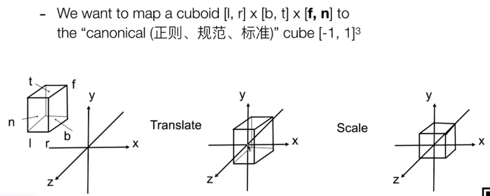

- 平移到中心点
- 缩放成标准正方体

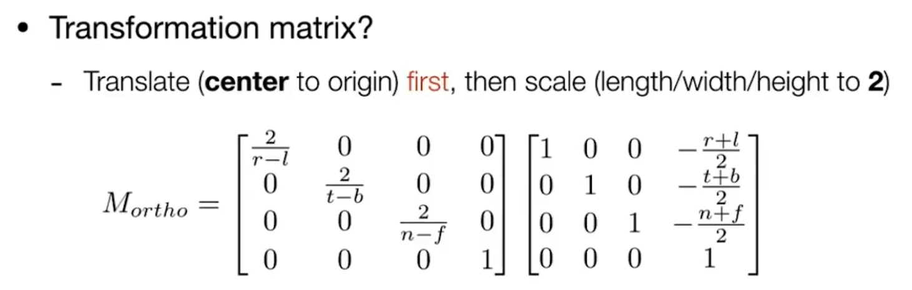

### 透视投影

#### 方式

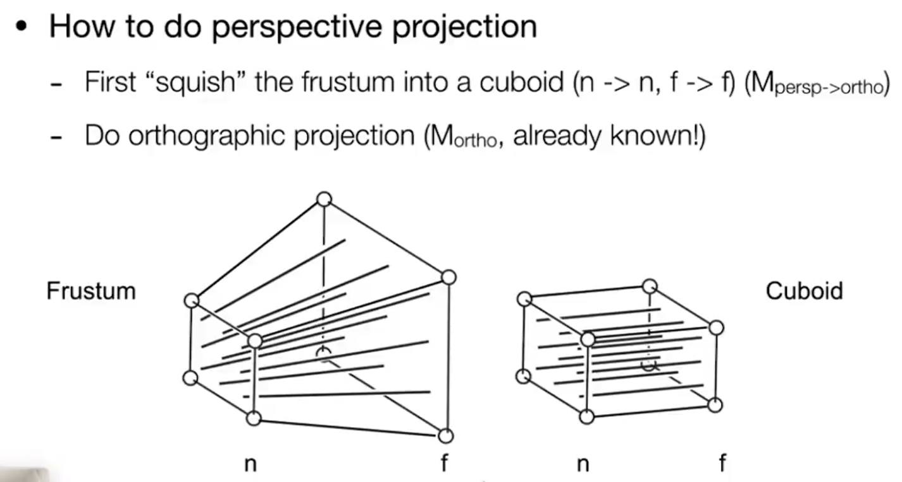

- 先压缩所有平面
	压缩后，x，y变化，z不变
	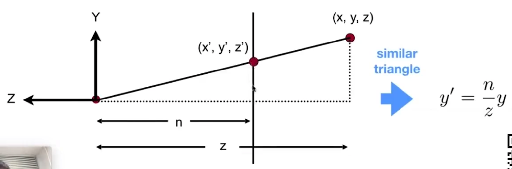
	将`(x,y,z)`压缩成为`(x',y',z)`

	根据相似三角形，得到变换关系：

	

	**变换矩阵的推导**

	压缩变换：由`(x,y,z)`变换为`(x',y',z')`

	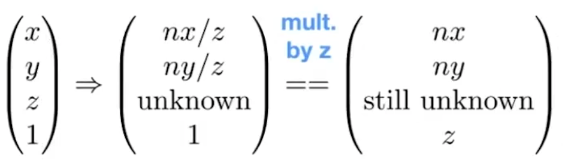

	带入上述的变换关系，表达x’和y’，再利用齐次矩阵的特性，都乘以z，依然表达的是点`(x',y',z')`

	通过最右边的矩阵，可以推算出M~persp->ortho~中的一些元素：

	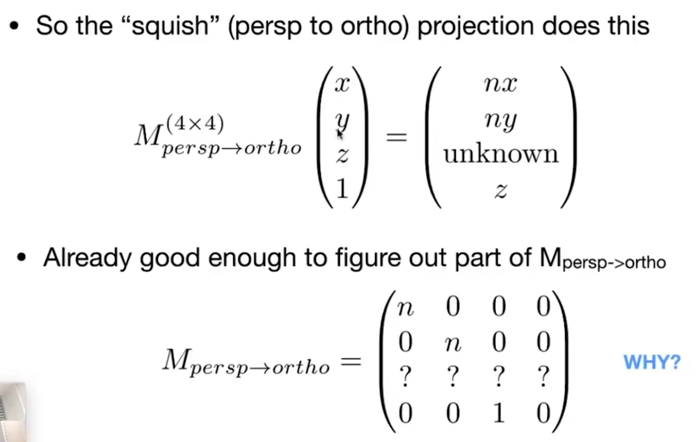

	此处是压缩远平面，所以z轴值是不变的：

	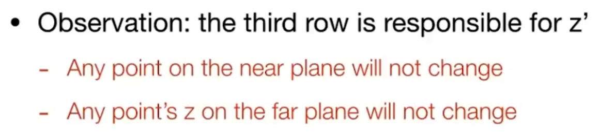

	- 即近平面上面的坐标点都不会变动

		***将z取值为n，即在近平面上取任一点（x,y,n）：***
		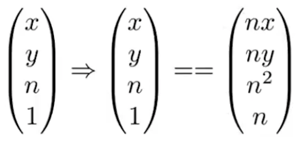

		**近平面上的点经过M~persp->ortho~变换后，不会变动，仍然等于它自身**。
		再同乘以n，构造出上述的向量，从而可以推算出unknown中的部分元素值：
		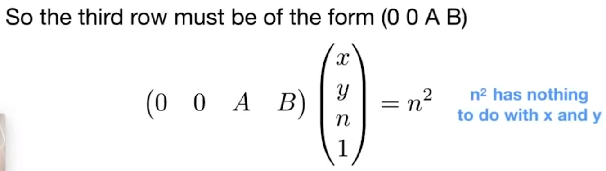
		`(0, 0, A, B)`是M~persp->ortho~的第三行。因为n与x，y无关，所以前两个元素为0；
		所以得到A,B满足：**An + B = n^2^  ①**

	- 远平面上的坐标点中的**z**值不会变动

		***取远平面的中心点，即点（0,0,f）：***
		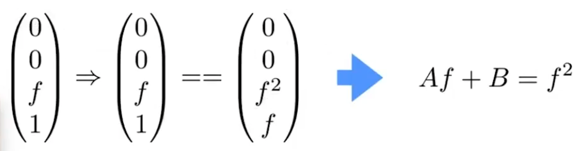

		同理得到：**Af + B = f^2^  ②**

	- 由①和②得到：
		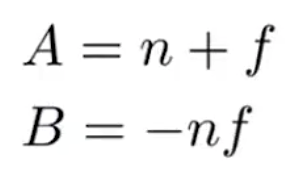

	最后得到M~persp->ortho~变换矩阵：

	$M_{persp\_to\_ortho} = \begin{pmatrix}n & 0 & 0 & 0 \\ 0 & n & 0 & 0 \\ 0 & 0 & n+f & -nf \\ 0 & 0 & 1 & 0 \end{pmatrix}$

- 再做正交
	压缩完所有平面后，对每个点进行正交投影

