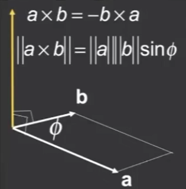
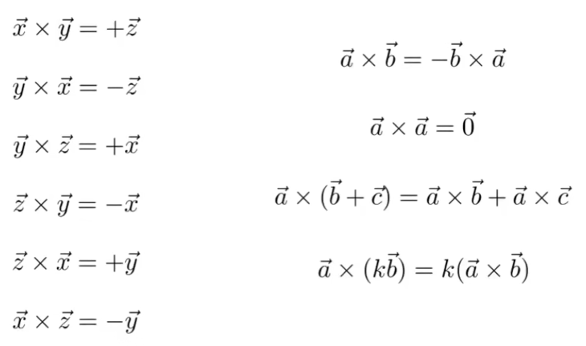
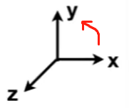
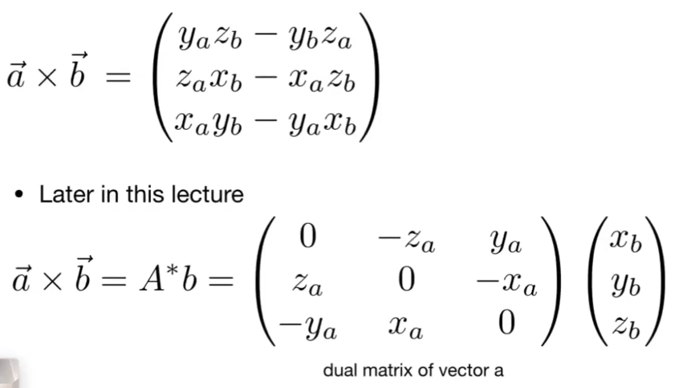
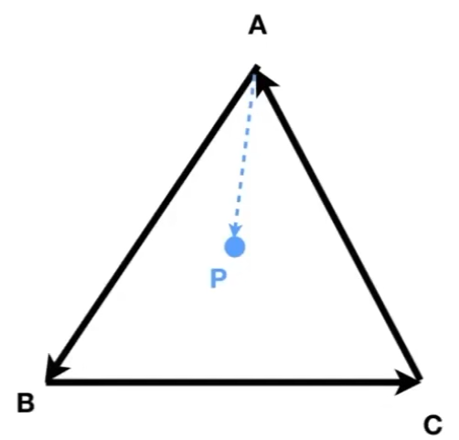
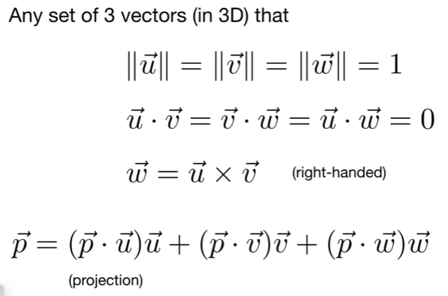

## 线性代数

### 点乘

### 差乘

#### 初步理解：

x向y旋转，得到z轴向量，并且是正方向。相当于右手坐标系，以x轴正方向为起点，逆时针旋转为正的旋转。所以y向x旋转，是顺时针的，即得到反方向的z轴。

#### 计算：

#### 实际运用：

确定向量**a**在另一个向量**b**的左边还是右边。
**`a x b = c`**，若c是同z的正方向（应该是看得到的向量的z值的正负），那么a在b的右边：即a旋转一个小于180°的角度，与b重合，这个旋转方向是a向左边旋转（逆时针）。

#### 解释：

**`a x b = c`**：

- 若c的z值为正
  - 则代表c与该坐标系的***Z轴***正方向一致
  - **a**向**b**的旋转方向与该坐标系的正向角度的**旋转方向**一致（例如，在右手坐标系中，即逆时针旋转，从而a在b的右边）

#### 举例

##### 一个点是否在三角形内部

- 逆时针构建三个向量：AB，BC，CA
- 连接AP
- 依次用AP与三个向量做差乘法。如果结果都是：AP在三角形向量的左边，那么P便在三角形内部

> 其运用在：三角形的格栅化中，确定其覆盖了哪些像素

### 坐标系

> u, v, w, p都为单位向量
>
> u, v, w分别为三个轴上的单位向量
>
> 三个向量点乘结果是0，即相互垂直

- 右手坐标系的表示，**`w = u x v`**：
  - 描述了u向v旋转是**逆时针**的，
  - 差乘得到的向量的z值是**正的**，其设为w轴正方向
- 任意一个坐标都可以分解到三个轴上：
  其中p **·** u是p在u上的投影，两者都为单位向量，所以点乘结果是cosx，x为p与u的夹角

### 矩阵

