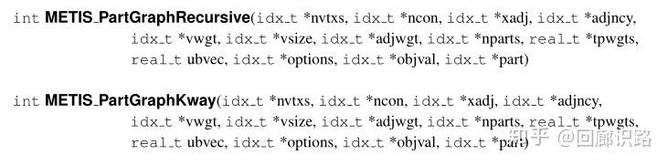

## 使用

### CSR

```bat
% fmt: 点个数, 边个数, b{维度,点权值,边权值}, 权值维度
nvtx, nedges, b011, ncon
% wx: ncon维度的权重; 相邻点编号,边的权值
w1 w2 .. wncon v1 e1 v2 e2 .. vk ek
..
```

### API



- **nvtxs:** 节点数目。
- **ncon:** 节点权重维度，默认1。
- **xadj,adjncy:** Metis使用压缩图(CSR)表示图的邻接关系，详情参考文档`Metis' API/Graph data structure`部分。
- **vwgt:** 节点权重列表，设为NULL表示节点无权重或所有节点权重相同，相当于按照子图中节点的数目平衡划分。
- **vsize:** The size of the vertices for computing the total communication volume as described in Section 5.7
- **adjwgt:** 边的权重列表，默认优化目标为切断边的权重之和最小，设为NULL则表示按照切边数最小划分。
- **nparts:** 要划分的子图数目。
- **objval:** 目标函数值。
- **part:** 保存划分结果。

#### 注意（参数）：

- nvtxs和vwget对应；
- xadj的size = nvtxs + 1
- xadj的值是对应于adjncy中的索引；在最后加上nvtxs.size()
- adjncy和adjwgt对应

#### 注意：

- 划分个数 > 8个，使用`METIS_PartGraphKway`；否则使用`METIS_PartGraphRecursive`

### 示例

```cpp
#include <metis.h>
#include <vector>
#include <iostream>
#include <fstream>
#include <string>
#include <sstream>

using namespace std;

vector<idx_t> func(vector<idx_t> &xadj, vector<idx_t> &adjncy,
                   vector<idx_t> &adjwgt,
                   decltype(METIS_PartGraphKway)*METIS_PartGraphFunc) {
    idx_t nVertices = xadj.size() - 1; // 节点数
    idx_t nEdges = adjncy.size() / 2;  // 边数
    idx_t nWeights = 1;                // 节点权重维数
    idx_t nParts = 2;                  // 子图个数≥2
    idx_t objval;                      // 目标函数值
    vector<idx_t> part(nVertices, 0);  // 划分结果

    int ret = METIS_PartGraphFunc(&nVertices,
                                  &nWeights,
                                  xadj.data(),
                                  adjncy.data(),
                                  NULL,
                                  NULL,
                                  adjwgt.data(),
                                  &nParts,
                                  NULL,
                                  NULL,
                                  NULL,
                                  &objval,
                                  part.data());

    if (ret != rstatus_et::METIS_OK) { 
        cout << "METIS_ERROR" << endl;
        return {};
    }
    cout << "METIS_OK" << endl;
    cout << "objval: " << objval << endl;
    for (unsigned part_i = 0; part_i < part.size(); part_i++) {
        cout << part_i + 1 << " " << part[part_i] << endl;
    }
    
	return part;
}

int main() {
    ifstream ingraph("graph.txt");

    int vexnum, edgenum;
    string line;
    getline(ingraph, line);
    istringstream tmp(line);
    tmp >> vexnum >> edgenum;	// 点个数和边个数
    vector<idx_t> xadj(0);	// 点的第一条边数据在adjncy中的index
    vector<idx_t> adjncy(0); // 压缩图表示
    vector<idx_t> adjwgt(0); // 边权重

    idx_t a, w;
    for (int i = 0; i < vexnum; i++) {
        xadj.push_back(adjncy.size());
        getline(ingraph, line);
        istringstream tmp(line);
        while (tmp >> a >> w) {
          adjncy.push_back(a - 1); // 点的id从0开始
          adjwgt.push_back(w);	// 与该点的连接的边的权值
        }
    }
    xadj.push_back(adjncy.size());
    ingraph.close();

    vector<idx_t> part = func(xadj, adjncy, adjwgt, METIS_PartGraphRecursive);
    //vector<idx_t> part = func(xadj, adjncy, adjwgt, METIS_PartGraphKway);

    ofstream outpartition("partition.txt");
    for (int i = 0; i < part.size(); i++) { 
        outpartition << i + 1 << " " << part[i] << endl; 
    }
    outpartition.close();

    return 0;
}
```

---

> [图划分软件Metis的使用](https://zhuanlan.zhihu.com/p/225724970)