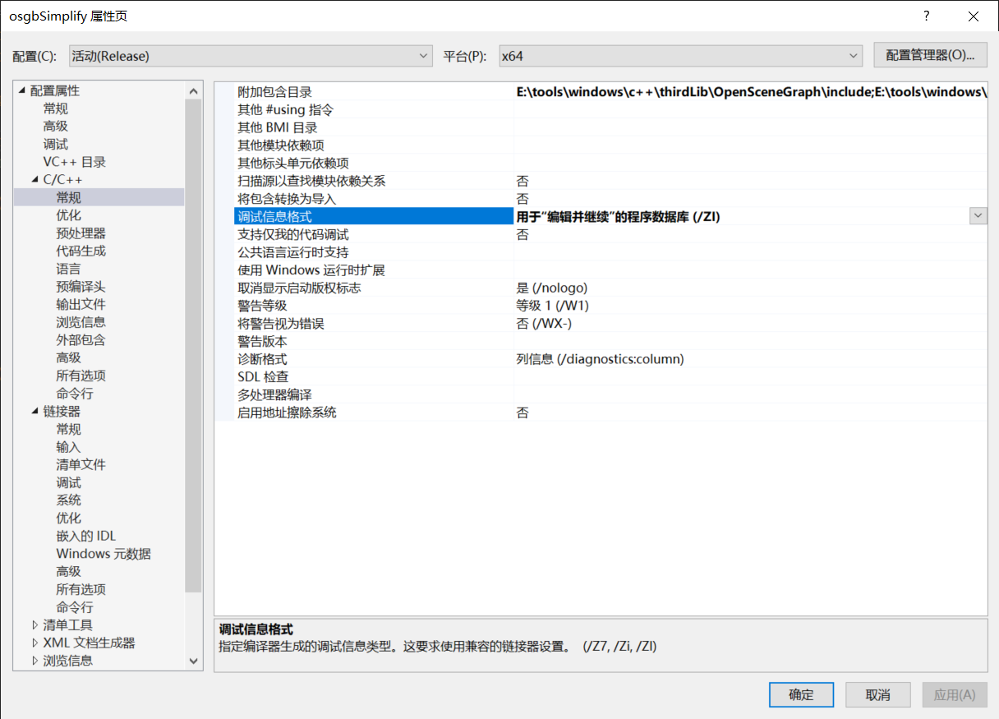
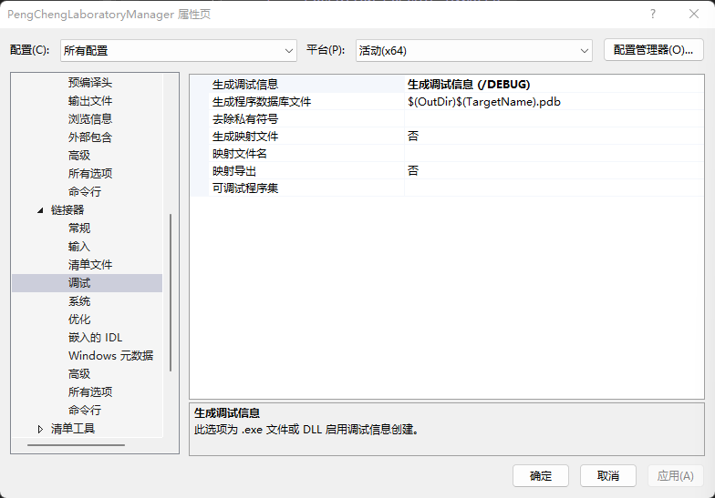
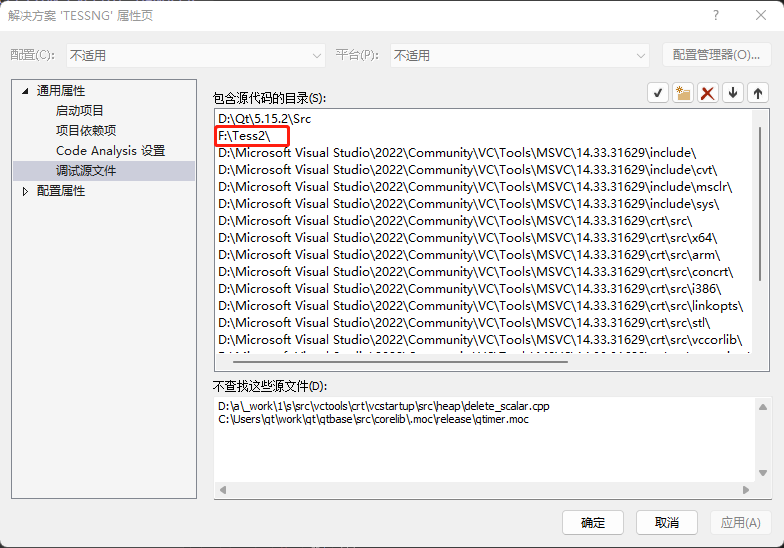

## 命令

### 比较文件不同

- `fc file1 file2`
- 软件：Beyond Compare

## 捕获错误信号

> [Windows下C++异常处理 - 啊毕 - 博客园 (cnblogs.com)](https://www.cnblogs.com/biyaxiong/archive/2013/03/28/2986777.html)
>
> [Windows异常捕获之VEH 和SEH - 知乎 (zhihu.com)](https://zhuanlan.zhihu.com/p/349519553)
>
> [Qt 使用DbgHelp和SetUnhandledExceptionFilter来获取Crash log/dump文件 - 一杯清酒邀明月 - 博客园 (cnblogs.com)](https://www.cnblogs.com/ybqjymy/p/13049295.html)
>
> [ windows系统利用vs 分析DMP文件、pdb文件定位异常崩溃_vs dmp文件_小飞侠hello的博客-CSDN博客](https://blog.csdn.net/baidu_16370559/article/details/121100979)

- 配置结构化异常处理(SEH)函数，生成dmp文件

  ```cpp
  #include <windows.h>
  #include <Minidumpapiset.h>
  
  typedef PVOID(NTAPI* FnAddVectoredExceptionHandler)(ULONG, _EXCEPTION_POINTERS*);
  FnAddVectoredExceptionHandler MyAddVectoredExceptionHandler;
  
  long __stdcall DBHelper::callback(_EXCEPTION_POINTERS* excp)
  {
      HANDLE lhDumpFile = CreateFile(L"tess.dmp", GENERIC_WRITE, 0, NULL, CREATE_ALWAYS, FILE_ATTRIBUTE_NORMAL, NULL);
      MINIDUMP_EXCEPTION_INFORMATION loExceptionInfo;
  
      loExceptionInfo.ExceptionPointers = excp;
  
      loExceptionInfo.ThreadId = GetCurrentThreadId();
  
      loExceptionInfo.ClientPointers = TRUE;
  
      // MiniDumpWithFullMemory包括所有内存数据，所以有堆数据
      MiniDumpWriteDump(GetCurrentProcess(), GetCurrentProcessId(), lhDumpFile, MiniDumpWithFullMemory, &loExceptionInfo, NULL, NULL);
  
      CloseHandle(lhDumpFile);
  
      return EXCEPTION_EXECUTE_HANDLER;
  }
  
  void DBHelper::setupDump() {
  	SetUnhandledExceptionFilter(callback);
  }
  ```

- VS配置

  - 对每个项目进行操作：

    - 属性页 -> C/C++ -> 常规 -> 调试信息格式 -> 用于”编辑并继续“ 的程序数据库

      

      > **用于“编辑并继续”的程序库**：vs就会在你修改过源文件，并且执行下一步（无论是单步还是运行） 的时候，重新编译你的程序，保证了你的调试过程不会中断。

    - 设置生成调试信息

      

- 使用dmp文件调试

  - 配置源码路径（方案路径）

    

  - 用VS打开dmp文件

    - 设置pdb符号文件路径

      

    - 点击“使用 仅限本机 进行调试”