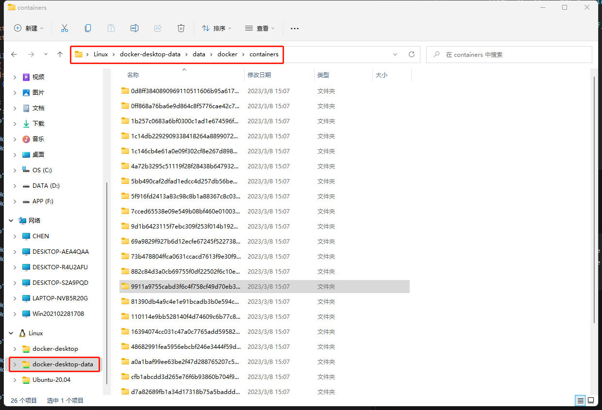

## 移动Docker的数据

### Win

- 关闭docker

- 导出、注销、导入

  ```sh
  # 查看
  wsl -l -v
  # 导出
  wsl --export docker-desktop-data D:\docker\docker-desktop-data.tar
  wsl --export docker-desktop D:\docker\docker-desktop.tar
  # 注销已有
  wsl --unregister docker-desktop-data
  wsl --unregister docker-desktop
  # 导入
  wsl --import docker-desktop-data D:\docker\data D:\docker\docker-desktop-data.tar
  wsl --import docker-desktop D:\docker\desktop D:\docker\docker-desktop.tar
  ```

  

## 修改已存在的容器

1. 修改config.v2.json和hostconfig.json

   - Windows下：

     

     - 例如：增加挂载

       

       

   - Linux下：

     在`/var/lib/docker/containers`下

2. 重启Docker

   `systemctl restart docker`

## 跨平台构建

> [Docker Buildx使用教程：使用Buildx构建多平台镜像_东北小狐狸-Hellxz的博客-CSDN博客](https://blog.csdn.net/u012586326/article/details/125589644)

- 先装好qemu-static

- 创建构建器

  `docker buildx create --use --name mybuilder`

- 启动构建器

  `docker buildx inspect mybuilder --bootstrap`

- 使用构建器创建镜像

  ` docker buildx build -t tessng --platform linux/arm64 .`

## 运行带GUI的docker

> https://blog.csdn.net/double_ZZZ/article/details/115404419

```sh
docker run -it \
  -v /etc/localtime:/etc/localtime:ro \
  -v /tmp/.X11-unix:/tmp/.X11-unix:rw \
  -e DISPLAY=$DISPLAY \
  -e GDK_SCALE \
  -e GDK_DPI_SCALE \
  -v $HOME/.Xauthority:/root/.Xauthority \
  -v /root/Tess_git:/root/Tess_git \
  -v /root/TessngPub_Win:/root/TessngPub_Win \
  -v /root/TessngPub_20230210:/root/TessngPub_20230210 \
  --net=host \
  -p 17788:7788 \
  -p 17777:7777 \
  --name qt-build \
  --privileged \
  qt-build:5.15.2 bash
```

#### 本地使用

```sh
docker run -it \
  -v /tmp/.X11-unix:/tmp/.X11-unix:rw \
  -e DISPLAY=$DISPLAY \
  -e GDK_SCALE \
  -e GDK_DPI_SCALE \
  -v /root/.Xauthority:/root/.Xauthority \
  -v /mnt/f/Tess_git:/root/Tess_git \
  -v /mnt/d/TessPub/TessngPub_20230210:/root/TessngPub_20230210 \
  --net=host \
  -p 17788:7788 \
  -p 17777:7777 \
  --name qt-pyside2-build \
  --privileged \
  qt-pyside2-build:5.15 bash
```

#### qt-build使用

```sh
// python
export LD_LIBRARY_PATH=$PWD:$PWD/lib:/root/miniconda3/envs/py3.8/lib:/usr/local/lib:/root/miniconda3/envs/py3.8/lib/:/usr/lib:/usr/lib/aarch64-linux-gnu/:/root/miniconda3/envs/py3.8/lib/python3.8/:$LD_LIBRARY_PATH

// tess win
export LD_LIBRARY_PATH=$PWD:$PWD/lib:/usr/local/lib:/usr/lib:/usr/lib/aarch64-linux-gnu/:/usr/host/lib64:$LD_LIBRARY_PATH
export Qt5_DIR=/usr/local/lib/cmake/Qt5
export LD_LIBRARY_PATH=$PWD:$PWD/lib:$LD_LIBRARY_PATH

export PATH=/usr/include:/usr/bin/:/root/miniconda3/envs/py3.8/bin/:/root/miniconda3/envs/py3.8/include:/usr/bin:$PATH

export CMAKE_CXX_COMPILER=/usr/bin/g++
```

## 搭建本地镜像库

> [docker学习之搭建自己的本地镜像仓库 - 知乎 (zhihu.com)](https://zhuanlan.zhihu.com/p/38533762)

```sh
docker run -d -p 5000:5000 -v /opt/docker/registry:/var/lib/registry --name jida-registry registry 
```


## Compose

> [Docker Compose | 菜鸟教程 (runoob.com)](https://www.runoob.com/docker/docker-compose.html)

### 示例说明


## Swarm

> [Docker Swarm介绍及使用入门 - 简书 (jianshu.com)](https://www.jianshu.com/p/edf6cdb4baa7)

### 示例说明

#### 创建初始化manager主节点

```sh
# 该指令会打印token
docker swarm init --advertise-addr 192.168.1.49
```

#### 添加label

```sh
docker node update --label-add role=manager vjri6nvl5l6rzqtx4xrzxgh15
```

#### worker node加入

```sh
# 在manager node获取token
docker swarm join-token -q worker
# 加入
docker swarm join --token xxx
```

#### manager node加入

```sh
# 获取下一步执行指令，执行该指令后，该节点将设置为manager从节点加入到这个swarm集群中
docker swarm join-token manager
```

> manager是我们管理集群的入口，我们的docker命令都是在manager上执行，node节点上是不能执行dockr命令的

#### 创建一个私有网络

```sh
docker network create -d overlay tess_ds_net
```

#### 在指定网络中部署

```sh
docker service create --replicas 1 --network tess_ds_net --name tess_ds_master -p 8899:7788 tessds:20230619

docker service create --replicas 3 --network tess_ds_net --name tess_ds_worker tessds:20230619
```

#### 使用docker-compose.yml部署

```sh
docker stack deploy --compose-file tess_ds_compose.yml
```

##### docker-compose.yml

```yaml
```

### 管理

#### 服务管理

```sh
# 查看
docker service ps tess_ds_worker --no-trunc
```

