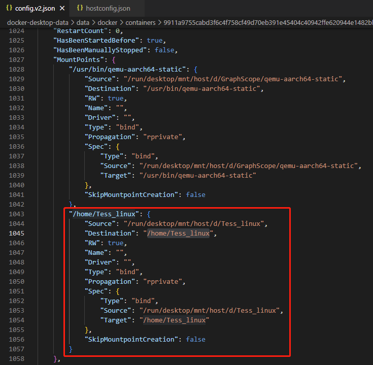
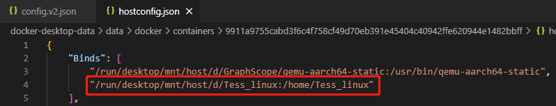

## 修改已存在的容器

1. 修改config.v2.json和hostconfig.json

   - Windows下：

     

     - 例如：增加挂载

       

       

2. 重启Docker

## 跨平台构建

> [Docker Buildx使用教程：使用Buildx构建多平台镜像_东北小狐狸-Hellxz的博客-CSDN博客](https://blog.csdn.net/u012586326/article/details/125589644)

- 先装好qemu-static

- 创建构建器

  `docker buildx create --use --name mybuilder`

- 启动构建器

  `docker buildx inspect mybuilder --bootstrap`

- 使用构建器创建镜像

  ` docker buildx build -t tessng --platform linux/arm64 .`