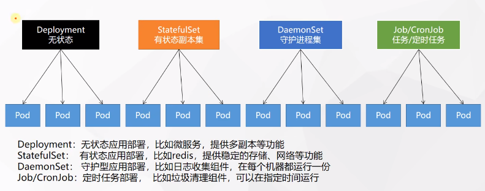
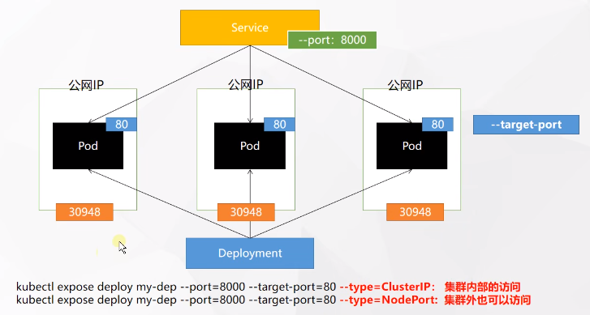

## 常用指令

### Kubectl

```sh
# 查看节点端口
kubectl get svc --namespace=kube-system

# 查看 pod 名称
kubectl get pod --namespace=kube-system -o wide
## -o wide: 更详细信息
## 所有命名空间下的pods；不带-A则是default下的pods
kubectl get pods -A
# 监控
kubectl get pod -w
# 查看label
kubectl get pod --show-labels
## 指定命名空间
kubectl get pods -n xxx
# 同理可get其它
kubectl get [deploy(ment)] xxx

# 命名空间
kubectl get ns
## 增删
kubectl create ns xxx
kubectl delete ns xxx
### 从文件，添加的，也可以-f删除（最好这样做）
kubectl delete -f xx.yaml
### 同理可以create/delete其它
kubectl create/delete [pod, deploy(ment)] pod_name

# 运用
kubectl apply -f xx.yaml

# 启动pod
kubectl run pod_name --image=xxx

# 描述
kubectl describe pod pod_name

# 日志
kubectl logs [-f] pod_name
## -f: 可热追踪日志

# 进入pod内执行
kubectl exec -it pod_name [-c 容器名] -- /bin/bash

# deploy 3副本启动
kubectl create deploy my_deploy --image=tessng --replicas=3

# deploy 扩缩容
kubectl scale deploy/my_deploy --replicas=5

# deploy滚动更新
kubectl set image deploy/my_deploy tessng=tessng:20230526 --record
## 将deploy/my_deploy中的tessng镜像更新为tessng:20230526

# 暴露端口
kubelet expose deploy my_deploy --port=8000 --target=80
## --port: 外界访问的端口
## --target: 暴露的端口
## --type默认是ClusterIP

# 创建config map
kubectl create cm tess-conf --from-file=./tess.conf

# dns查看
kubectl run curl --image=radial/busyboxplus:curl -i --tty
nslookup [service name]
```

### 其它

- statefulset，获取pod的id序号

  ```sh
  lifecycle:
    postStart:
      exec:
        command: ["/bin/sh", "-c", "export INDEX=${HOSTNAME##*-}"]
  ```

## 配置文件

### 基本Pod

```yaml
apiVersion: v1
kind: Pod
metadata:
    labels:			# 标签
	  run: tess
    name: tess		# pod名
spec:
    containers:
	# 容器1的配置
	- image: tessng:20230525	# 镜像名
	  name: tess			   # 容器名
  	# 容器2的配置
  	- image: tessng:20230525
	  name: tess2
      lifecycle:
        # 启动前，不保证在entrypoint之前执行，不确定顺序
        postStart:
          exec:
            # 该方法不生效
            command: ["/bin/bash", "-c", "export TESS_DS_POD_IDX=${HOSTNAME##*-}"]
        preStop:
          exec:
            command: ""
    
```

### 基本Deployment

```yaml
apiVersion: apps/v1
kind: Deployment
metadata:
  labels:
    app: my-dep
  name: my-dep
spec:
  replicas: 3
  selector:
    matchLabels:
      app: my-dep
  template:
    metadata:
      labels:
        app: my-dep
    spec:
      containers:
      - image: nginx
        name: nginx
```

### 基本Service

```yaml
apiVersion: v1
kind: Service
metadata:
  labels:
    app: my-dep
  name: my-dep
spec:
  selector:
    app: my-dep 	# 选择暴露的一组pod的 label
  ports:
  - port: 8000
    protocol: TCP
    targetPort: 80
```

###  基本ConfigMap

```yaml
apiVersion: v1
data:
  redis.conf: |
    appendonly yes
kind: ConfigMap
metadata:
  creationTimestamp: "2023-05-25T11:53:41Z"
  name: redis-config
  namespace: default
  resourceVersion: "53011"
  selfLink: /api/v1/namespaces/default/configmaps/redis-config
  uid: 02b0c22b-bbd2-4ab6-b206-9188d285b19c
```

### 给pod注入环境变量

```yaml
apiVersion: v1
kind: Pod
metadata:
  name: dapi-envars-fieldref
spec:
  containers:
    - name: test-container
      image: registry.k8s.io/busybox
      # 启动命令和参数
      command: [ "sh", "-c"]
      args:
      - while true; do
          echo -en '\n';
          printenv POD_NAME;
          printenv POD_ID;
          printenv POD_IP;
          printenv SVC_NAME;
          sleep 10;
        done;
      env:
        - name: MY_NODE_NAME
          valueFrom:
            fieldRef:
              fieldPath: spec.nodeName
        - name: MY_POD_NAME
          valueFrom:
            fieldRef:
              fieldPath: metadata.name
        - name: MY_POD_NAMESPACE
          valueFrom:
            fieldRef:
              fieldPath: metadata.namespace
        - name: MY_POD_IP
          valueFrom:
            fieldRef:
              fieldPath: status.podIP
        - name: MY_POD_SERVICE_ACCOUNT
          valueFrom:
            fieldRef:
              fieldPath: spec.serviceAccountName

  restartPolicy: Never
```

### Pod内容器的通信：共享卷

```yaml
apiVersion: v1
kind: Pod
metadata:
  name: two-containers
spec:
  restartPolicy: Never
  
  volumes:
  - name: shared-data
    emptyDir: {}

  containers:
  - name: nginx-container
    image: nginx
    volumeMounts:
    - name: shared-data
      mountPath: /usr/share/nginx/html

  - name: debian-container
    image: debian
    volumeMounts:
    - name: shared-data
      mountPath: /html
```


## 安装、搭建

### 安装

#### ubuntu安装

> https://developer.aliyun.com/article/906571
>
> [Ubuntu 18.04 搭建单节点 k8s 记录 (不需要科学上网的方案) | Server 运维论坛 (learnku.com)](https://learnku.com/articles/29209?spm=a2c6h.12873639.article-detail.6.4a8242498FesnG)

- 环境配置

  ```sh
  swapoff -a
  
  gedit /etc/fstab
  # 注释以下行：
  /swapfile none swap sw 0 0
  ```

- 安装

  ```sh
  # 追加k8s的包地址
  echo "deb https://mirrors.aliyun.com/kubernetes/apt kubernetes-xenial main" >> /etc/apt/sources.list
  # 添加key
  curl https://mirrors.aliyun.com/kubernetes/apt/doc/apt-key.gpg | sudo apt-key add
  # 更新apt
  apt-get update
  
  apt-get install -y apt-transport-https curl
  apt-get install -y kubelet kubeadm kubectl --allow-unauthenticated
  ```

### 搭建

#### 初始化kubeadm

```sh
kubeadm init \
  --apiserver-advertise-address=192.168.223.129 \
  --image-repository registry.aliyuncs.com/google_containers \
  --kubernetes-version v1.17.17 \
  --service-cidr=10.1.0.0/16 \
  --pod-network-cidr=10.244.0.0/16
## --pod-network-cidr：pod的网络地址空间

# 配置结点
mkdir -p $HOME/.kube
sudo cp -i /etc/kubernetes/admin.conf $HOME/.kube/config
sudo chown $(id -u):$(id -g) $HOME/.kube/config
```

#### 安装需要的镜像

```sh
kubeadm config images list
```

例如得到：

```sh
registry.k8s.io/kube-apiserver:v1.27.2
registry.k8s.io/kube-controller-manager:v1.27.2
registry.k8s.io/kube-scheduler:v1.27.2
registry.k8s.io/kube-proxy:v1.27.2
registry.k8s.io/pause:3.9
registry.k8s.io/etcd:3.5.7-0
registry.k8s.io/coredns/coredns:v2.0.0-rc7
```

一键脚本：

```sh
for  i  in  `kubeadm config images list`;  do
    imageName=${i#k8s.gcr.io/}
    docker pull registry.aliyuncs.com/google_containers/$imageName
    docker tag registry.aliyuncs.com/google_containers/$imageName k8s.gcr.io/$imageName
    docker rmi registry.aliyuncs.com/google_containers/$imageName
done;
```

#### 安装dashboard

> [Kubernetes基础概念 (yuque.com)](https://www.yuque.com/leifengyang/oncloud/ghnb83)

```sh
kubectl apply -f https://raw.githubusercontent.com/kubernetes/dashboard/v2.0.0-rc7/aio/deploy/recommended.yaml

docker pull registry.aliyuncs.com/google_containers/kubernetes-dashboard-amd64:v1.10.1
docker tag registry.aliyuncs.com/google_containers/kubernetes-dashboard-amd64:v1.10.1 k8s.gcr.io/kubernetes-dashboard-amd64:v1.10.1
docker rmi registry.aliyuncs.com/google_containers/kubernetes-dashboard-amd64:v1.10.1

kubectl create -f kubernetes-dashboard.yaml

# 查看安装结果
kubectl get pod --namespace=kube-system

# 改type为NodePort
kubectl edit svc kubernetes-dashboard -n kubernetes-dashboard

# 找到端口，在安全组放行
kubectl get svc -A |grep kubernetes-dashboard

# 创建访问账号，将配置内容写入dashboard-admin.yaml
apiVersion: v1
kind: ServiceAccount
metadata:
  name: admin-user
  namespace: kubernetes-dashboard
---
apiVersion: rbac.authorization.k8s.io/v1
kind: ClusterRoleBinding
metadata:
  name: admin-user
roleRef:
  apiGroup: rbac.authorization.k8s.io
  kind: ClusterRole
  name: cluster-admin
subjects:
- kind: ServiceAccount
  name: admin-user
  namespace: kubernetes-dashboard

# 安装
kubectl apply -f dashboard-admin.yaml

# 获取访问令牌
kubectl -n kubernetes-dashboard get secret $(kubectl -n kubernetes-dashboard get sa/admin-user -o jsonpath="{.secrets[0].name}") -o go-template="{{.data.token | base64decode}}"

# 编辑dashboard deploy的yaml，延迟超时，在args下添加：
- '--token-ttl=68400'
```

#### 生效主节点

```sh
# 添加环境变量
echo "export KUBECONFIG=/etc/kubernetes/admin.conf" >> ~/.bashrc
# 添加网络插件
kubectl apply -f https://raw.githubusercontent.com/coreos/flannel/master/Documentation/kube-flannel.yml
# 保存
kubeadm join

# 单节点使用：让master也参与调度
kubectl taint nodes --all node-role.kubernetes.io/master-
```

## 笔记

### 概念

#### pod

> pod包括一组容器，是k8s调度的最小单位

```sh
NAMESPACE              NAME                              READY   STATUS    RESTARTS   AGE
kube-flannel           kube-flannel-ds-xxhvv              1/1    Running     0          86m
kube-system            coredns-9d85f5447-kcrkz            1/1    Running     0          90m
kube-system            coredns-9d85f5447-m8p7b            1/1    Running     0          90m
```

- READY：运行容器数量 / pod容器总数

##### pod内的容器共享资源

包括存储，ip地址

##### 启动

```sh
# 启动了一个pod，不代表容器就运行了，可能镜像还需要下载
kubectl run pod_name --image=xxx
```



#### Deployment

> 控制Pod，使Pod拥有多副本，自愈，扩缩容等能力

- 多副本

  ```sh
  kubectl create deploy my_deploy --image=tessng --replicas=3
  ## 会启动3个pod
  ```

- 扩缩容

  ```yaml
  kubectl scale deploy/my_deploy --replicas=5
  
  # 编辑的方式
  kubectl edit deploy my_deploy
  ## 修改replicas后，wq保存即可
  ```

- 自愈，故障转移

- 滚动更新

   ```sh
   kubectl set image deploy/my_deploy tessng=tessng:20230526 --record
   ## 将deploy/my_deploy中的tessng镜像更新为tessng:20230526
   ## --record 记录更新
   ```

- 版本回滚

  ```sh
  #历史记录
  kubectl rollout history deployment/my_deploy
  
  #查看某个历史详情
  kubectl rollout history deployment/my_deploy --revision=2
  
  #回滚(回到上次)
  kubectl rollout undo deployment/my_deploy
  
  #回滚(回到指定版本)
  kubectl rollout undo deployment/my_deploy --to-revision=2
  ```

#### Service

> 将一组 [Pods](https://kubernetes.io/docs/concepts/workloads/pods/pod-overview/) 公开为网络服务的抽象方法

```yaml
apiVersion: v1
kind: Service
metadata:
  labels:
    app: my-dep
  name: my-dep
spec:
  selector:
    app: my-dep 	# 选择暴露的一组pod的 label
  ports:
  - port: 8000
    protocol: TCP
    targetPort: 80
```

- selector：根据标签选择相关的pod

  这里根据`app: my-dep`值来选择一组pod，这个是之前deployment中设置的pod的标签：

  ```yaml
  selector:
      matchLabels:
        app: my-dep
  ```

- 在k8s内部，容器里可用域名来访问service

  ```c
  ip = 服务名.命名空间.svc
  ```

​		在宿主机内不可这么用

##### ClusterIP

##### NodePort

```sh
kubelet expose deploy my_deploy --port=8000 --target=80 --type=NodePort
```

在ClusterIp的基础上，将pod在其所在的机器上暴露一个端口，供公网访问：



- 30948是pod的80映射过来的，并且每台机器上都做了这样的映射，公网可通过NodeIP:30948来访问

#### ConfigMap

